# 1. Bu dosyanın amacı

Bu belge, **Amazon** ve **eBay** satış kanallarını NivaDesk'in mevcut Commerce Core, Orders, Customers, Inventory, Shipping, Finance, Banking, Accounting ve ChatGPT/MCP katmanlarına güvenli ve ölçeklenebilir biçimde bağlamak için hazırlanmış uygulama sözleşmesidir.

Bu dosyanın amacı yeni iki bağımsız mini-sistem kurmak değildir.

Amaç:

- Amazon ve eBay'i mevcut **Commerce Core** içine yeni provider adapter'ları olarak eklemek;
- Shopify, Etsy, WooCommerce ve Faire davranışlarını bozmamak;
- tüm kanallardan gelen siparişleri ortak NivaDesk Order modelinde yönetmek;
- merkezi stok mantığını korumak;
- Amazon FBA stoklarını NivaDesk deposuyla karıştırmamak;
- eBay listing ownership sorunlarını açık biçimde yönetmek;
- marketplace fees, refunds, taxes ve payouts verilerini ortak Finance Ledger'a normalize etmek;
- banka hareketlerini settlement/payout kayıtlarıyla eşleştirmek;
- QuickBooks, Xero veya Pandle'a ikinci kez gelir yazılmasını engellemek;
- ChatGPT'nin güvenli sorgular yapmasına ve onay gerektiren işlemleri proposal olarak hazırlamasına izin vermek;
- kullanıcıya her bağlantının gerçek sağlık, senkronizasyon ve hata durumunu görünür kılmak.

Bu dosyada geçen ifadeler:

- **MUST / ZORUNLU:** Uygulanmadan özellik tamamlanmış sayılmaz.
- **SHOULD / ÖNERİLEN:** Güçlü teknik gerekçe yoksa uygulanmalıdır.
- **MAY / OPSİYONEL:** Sonraki faza bırakılabilir.

> **Temel ürün kararı:** Amazon ve eBay, NivaDesk içinde ayrı operasyon sistemleri değildir. Bunlar NivaDesk'in merkezi operasyon sistemine bağlanan **sales channel connectors** olacaktır.

---

# 2. NivaDesk'in genel rolü değişmeyecek

NivaDesk'in temel ürün konumu korunmalıdır:

> **NivaDesk = operational source of truth.**

Muhasebe sistemleri:

- QuickBooks;
- Xero;
- Pandle;
- FreshBooks benzeri accounting/invoicing sistemleri

NivaDesk'in yerine geçmez.

Doğru ayrım:

```text
Amazon / eBay / Shopify / Etsy / WooCommerce / Faire
                       ↓
                 Commerce Core
                       ↓
      Orders / Customers / Inventory / Workflow
                       ↓
                 Finance Ledger
                       ↓
                Bank Matching
                       ↓
                Accounting Core
                       ↓
          QuickBooks OR Xero OR Pandle
```

Buna göre:

- satış kanalının dış kimliği provider'da kalır;
- operasyonel kayıt NivaDesk'te normalize edilir;
- gerçek banka hareketi bank feed'den gelir;
- resmi bookkeeping/accounting kaydı seçilen accounting provider'a gider;
- hiçbir marketplace adapter muhasebe sistemine doğrudan yazmaz.

---

# 3. Kısa ürün özeti

Kullanıcı Amazon ve/veya eBay hesabını bağladığında NivaDesk aşağıdakileri yapabilmelidir:

1. Seller hesabını ve yetkileri doğrular.
2. Marketplace/store kapsamını gösterir.
3. Mevcut ürün/listing'leri NivaDesk ürünleriyle eşleştirir.
4. Yeni ve güncellenmiş siparişleri canonical NivaDesk Orders modeline alır.
5. Buyer/customer kimliklerini güvenli biçimde saklar.
6. Central Inventory ile marketplace stoklarını doğru policy üzerinden bağlar.
7. Amazon FBA ve merchant-fulfilled stoku birbirinden ayırır.
8. eBay listing ownership modunu açıkça belirler.
9. Fulfilment ve tracking işlemlerini desteklenen provider capability'leri üzerinden gönderir.
10. Refund/return/dispute olaylarını sipariş ve Finance Ledger'a bağlar.
11. Marketplace fees, promotions, taxes, shipping ve adjustments kalemlerini ayrı kaydeder.
12. Marketplace settlement/payout'unu banka hareketiyle eşleştirir.
13. Accounting Core üzerinden kontrollü export hazırlar.
14. Sync Health ve Activity üzerinden tüm akışı görünür yapar.
15. ChatGPT'nin veri sorgulamasına ve güvenli proposal işlemlerine izin verir.

Kullanıcı açısından basit değer önerisi:

> **Amazon ve eBay satışlarınızı diğer kanallarınızdan ayrı yönetmeyin. Sipariş, stok, fulfilment, fees, payout, banka ve muhasebeyi NivaDesk'te tek operasyon zincirinde yönetin.**

---

# 4. Amazon ve eBay neden Shopify/Etsy'nin kopyası olarak uygulanmamalıdır?

| Konu | Shopify / WooCommerce | Etsy | Amazon | eBay |
|---|---|---|---|---|
| Platform tipi | Merchant store | Marketplace | Marketplace + fulfilment network | Marketplace |
| Ürün kimliği | Merchant product | Listing | Seller SKU + ASIN + offer/listing | SKU + inventory item + offer + listing |
| Stok | Merchant inventory | Listing inventory | MFN + ayrı FBA inventory | Listing/inventory location |
| Fulfilment | Merchant | Merchant | MFN veya Amazon/FBA | Seller fulfilment |
| Finans | Store payment/provider | Marketplace ledger | Marketplace financial transactions/settlements | Marketplace transactions/payouts |
| Fees | Payment/app dependent | Marketplace fees | Amazon fees/adjustments | eBay fees/credits/shipping labels |
| Customer | Merchant customer | Buyer | Buyer; PII/role restrictions | Buyer |
| Listing ownership | Merchant | Marketplace | Amazon catalog/listing rules | Seller Hub vs Inventory API ownership önemli |
| Provider warehouse | Hayır | Hayır | Evet — FBA | Normalde hayır |

Bu nedenle Amazon veya eBay siparişi:

```text
Amazon → Shopify → NivaDesk
```

veya:

```text
eBay → Shopify → NivaDesk
```

yoluyla alınmamalıdır.

**ZORUNLU karar:**

Her provider doğrudan Commerce Core'a bağlanacaktır.

---

# 5. Hedef mimari haritası

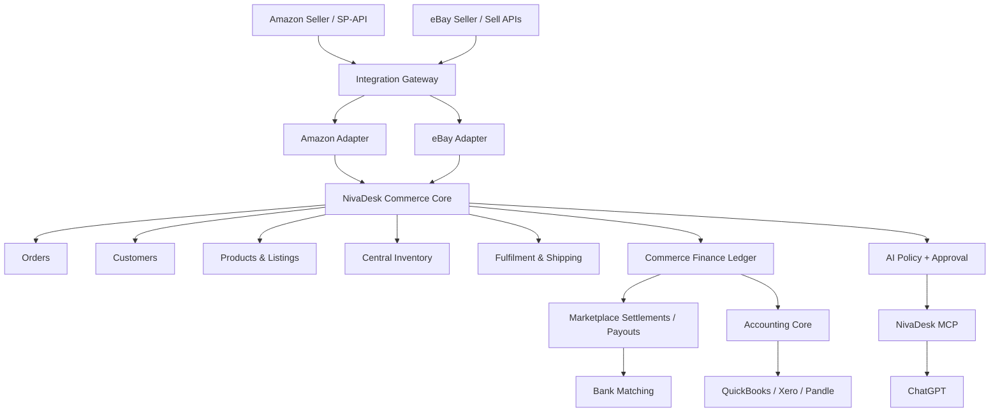

Temel kurallar:

1. Amazon API'si doğrudan Orders UI tarafından çağrılmaz.
2. eBay API'si doğrudan Inventory UI tarafından çağrılmaz.
3. Tüm provider çağrıları kendi adapter'ından geçer.
4. Tüm provider verileri önce canonical NivaDesk modeline normalize edilir.
5. UI hiçbir zaman raw marketplace JSON'una bağımlı olmaz.
6. ChatGPT marketplace API token'ına erişmez.
7. Marketplace payout'u doğrudan gelir olarak kaydedilmez.
8. Provider-specific hata Commerce Core'un diğer kanallarını durdurmaz.

---

# 6. Diğer uygulamalarla çalışma haritası

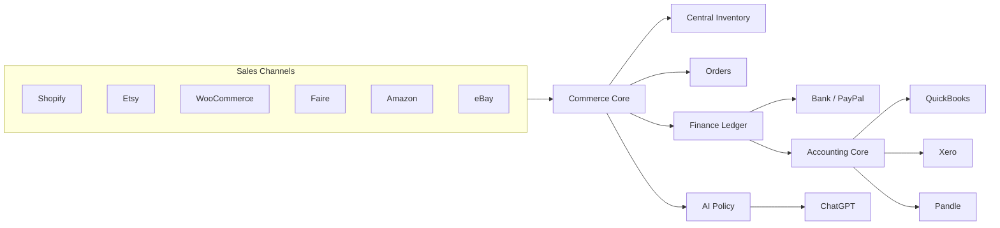

| Bağlantı | Amazon/eBay ile çalışma biçimi | Ana güvenlik kuralı |
|---|---|---|
| Shopify | Aynı NivaDesk ürünü farklı channel listing olarak satılabilir | Sipariş kimlikleri birleşmez |
| Etsy | Ortak fiziksel stok kullanılabilir | Origin korunur |
| WooCommerce | Ortak product/variant kullanılabilir | Provider order ID canonical order ID değildir |
| Faire | Wholesale rezervasyon merkezi stoğu etkileyebilir | Faire retailer modeli kaybolmaz |
| Amazon | FBA veya MFN olarak ayrı fulfilment kaynağı taşır | FBA stoğu NivaDesk fiziksel stoğu gibi yazılmaz |
| eBay | Aynı master product ayrı eBay offer/listing olabilir | Listing ownership açıkça seçilir |
| PayPal | Gerçek ödeme veya payout görülebilir | Aynı satış ikinci kez revenue olmaz |
| Banka | Amazon/eBay settlement ile eşleştirilir | Bank transaction yeni marketplace sale yaratmaz |
| QuickBooks | Approved accounting output alır | Tek primary writer |
| Xero | Approved accounting output alır | Aynı ledger scope ikinci kez yazılmaz |
| Pandle | Capability dahilinde bookkeeping output alır | Adapter capability dışına çıkmaz |
| ChatGPT | Read + proposal + approval akışı | Doğrudan provider write yok |

---

# 7. Mevcut durum ve hedef durum

## CURRENT

NivaDesk'te mevcut temel yapı:

- Commerce Core yaklaşımı;
- Shopify;
- Etsy;
- WooCommerce;
- Orders;
- Customers;
- Inventory;
- Shipping/Fulfilment;
- Banking;
- Receipts;
- Finance/Accounting entegrasyon katmanı;
- ChatGPT/MCP yaklaşımı;
- ortak connector envelope;
- idempotency;
- stale-data guard;
- field ownership;
- queue/retry/DLQ;
- reconciliation;
- Sync Health / Activity yaklaşımı.

Amazon mevcut ürün roadmap'inde `Coming soon` olarak kabul edilmelidir.

eBay bu spesifikasyonla yeni resmi sales-channel hedefi olur.

## TARGET

- Amazon kartı `Marketplace` kategorisinde görünür.
- eBay kartı `Marketplace` kategorisinde görünür.
- İkisi de production acceptance geçene kadar `Coming soon` kalır.
- Authentication tamamlanınca `Connect` olur.
- Bağlı durumda `Connected` görünür.
- Yetki/token/sync problemi varsa `Needs attention` olur.
- Siparişler ortak NivaDesk Orders ekranına gelir.
- Channel details kaybolmaz.
- Amazon FBA ve MFN ayrımı görünür kalır.
- eBay listing management ownership görünür kalır.
- Mevcut Shopify/Etsy/Woo/Faire davranışları değişmez.

---

# 8. Integrations sayfası kartları

## Amazon

**Amazon**  
Marketplace

> Unify Amazon orders, FBA and merchant-fulfilled stock, fulfilment, fees and settlements without losing marketplace detail.

Capability chips:

- Orders
- Listings
- FBA / MFN
- Inventory
- Fulfilment
- Fees
- Settlements
- ChatGPT

Status:

```text
coming_soon
```

Production kabulü sonrası:

```text
connect
```

Bağlı:

```text
connected
```

Problem:

```text
needs_attention
```

## eBay

**eBay**  
Marketplace

> Bring eBay orders, listings, inventory, fulfilment, fees and payouts into the same NivaDesk workflow.

Capability chips:

- Orders
- Listings
- Inventory
- Fulfilment
- Refunds
- Fees
- Payouts
- ChatGPT

## Kullanıcıya verilmeyecek garanti

Aşağıdaki ifadeler ilgili capability gerçek üretim testinde kanıtlanmadan kullanılmamalıdır:

- “real-time sync”
- “fully automatic accounting”
- “all Amazon marketplaces”
- “all eBay listing types”
- “zero manual reconciliation”

---

# 9. Shared Commerce Connector interface

Amazon ve eBay yeni bir core pathway oluşturmamalıdır.

Her ikisi mevcut ortak interface'i implement etmelidir.

```ts
interface CommerceConnector {
  provider: "shopify" | "etsy" | "woocommerce" | "faire" | "amazon" | "ebay";

  connect(input: ConnectInput): Promise<ConnectionResult>;
  disconnect(connectionId: string): Promise<void>;
  verifyConnection(connectionId: string): Promise<ConnectionHealth>;

  capabilities(connectionId: string): Promise<CapabilityMap>;

  listOrders(input: OrderSyncInput): Promise<ExternalPage<ExternalOrder>>;
  getOrder(input: ExternalEntityRef): Promise<ExternalOrder>;

  listProducts?(input: ProductSyncInput): Promise<ExternalPage<ExternalProduct>>;
  getProduct?(input: ExternalEntityRef): Promise<ExternalProduct>;

  listListings?(input: ListingSyncInput): Promise<ExternalPage<ExternalListing>>;
  getListing?(input: ExternalEntityRef): Promise<ExternalListing>;

  getInventory?(input: InventoryReadInput): Promise<ExternalInventorySnapshot>;
  publishInventory?(input: InventoryWriteIntent): Promise<ExternalWriteResult>;

  publishPrice?(input: PriceWriteIntent): Promise<ExternalWriteResult>;

  createOrUpdateListing?(input: ListingWriteIntent): Promise<ExternalWriteResult>;

  publishFulfilment?(input: FulfilmentWriteIntent): Promise<ExternalWriteResult>;

  issueRefund?(input: RefundIntent): Promise<ExternalWriteResult>;

  listFinancialTransactions?(
    input: FinanceSyncInput
  ): Promise<ExternalPage<ExternalFinancialTransaction>>;

  listSettlements?(input: SettlementSyncInput): Promise<ExternalPage<ExternalSettlement>>;
}
```

Connector interface provider API path'lerini core katmana sızdırmamalıdır.

---

# 10. Canonical event envelope

Tüm Amazon/eBay webhook, notification, polling ve manual sync sonuçları ortak envelope'a girmelidir.

```json
{
  "event_id": "evt_...",
  "provider": "amazon",
  "connection_id": "con_...",
  "stream": "orders",
  "external_entity_type": "order",
  "external_entity_id": "external-id",
  "event_type": "updated",
  "provider_updated_at": "ISO-8601|null",
  "observed_at": "ISO-8601",
  "correlation_id": "corr_...",
  "causation_id": "cause_...",
  "payload_hash": "sha256:...",
  "schema_version": 1
}
```

Aynı pipeline:

```text
Notification / Poll / Manual Sync
        ↓
Provider Adapter
        ↓
Canonical Envelope
        ↓
Raw Snapshot
        ↓
Validation
        ↓
External Identity
        ↓
Stale Guard
        ↓
Idempotent Apply
        ↓
Orders / Inventory / Finance
        ↓
Audit Event
```

---

# 11. Shared connection modeli

```ts
type CommerceConnectionStatus =
  | "draft"
  | "connecting"
  | "connected_read_only"
  | "connected"
  | "degraded"
  | "reauthorization_required"
  | "suspended"
  | "disconnected";
```

```json
{
  "provider": "amazon",
  "connection_id": "con_123",
  "display_name": "Example Seller",
  "status": "connected_read_only",
  "capabilities": {},
  "marketplaces": [],
  "last_verified_at": "ISO-8601",
  "last_successful_sync_at": "ISO-8601",
  "created_by": "user_id"
}
```

**ZORUNLU:**

Token/secret bu JSON içinde tutulmaz.

Credentials:

```text
commerce-secrets/
  amazon/
    <tenant>/<connection>
  ebay/
    <tenant>/<connection>
```

gibi ayrı secure-secret namespace kullanmalıdır.

---

# 12. Amazon authentication ve public-app modeli

Amazon entegrasyonu **Selling Partner API (SP-API)** üzerinden kurulmalıdır.

NivaDesk genel müşterilere sunulan SaaS olduğu için production hedefi:

```text
Public seller application
```

olmalıdır.

Amazon developer/SP-API onboarding ve gerekli application/role approval süreçleri tamamlanmalıdır.

## Authorization

Amazon authorization modeli Login with Amazon (LWA) / OAuth tabanlıdır.

Temel bağlantı akışı:

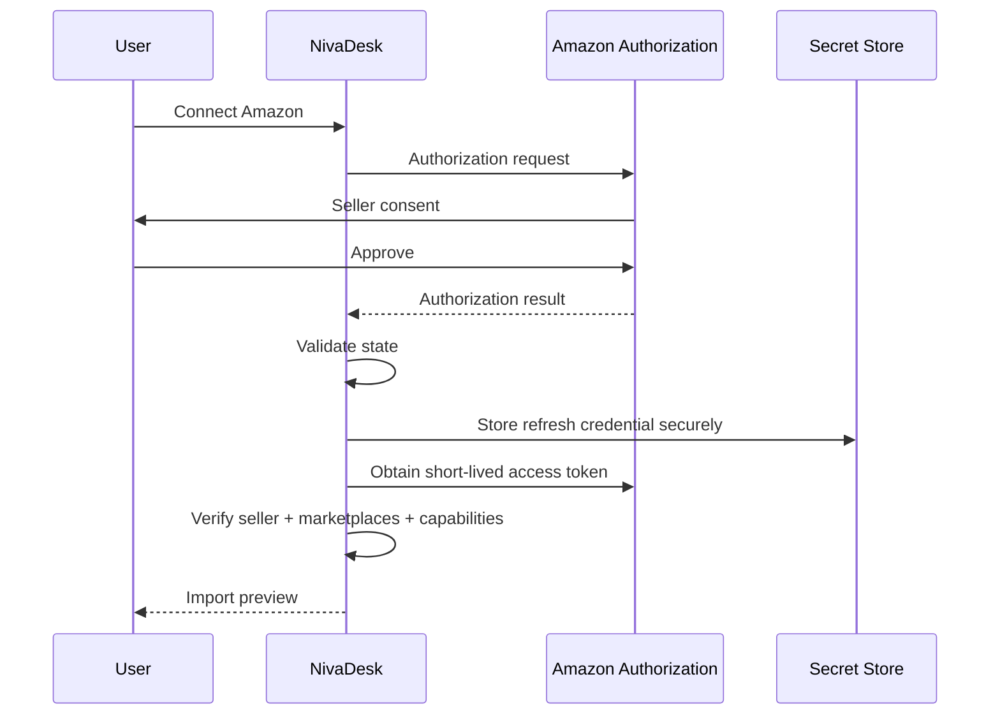

## Amazon security requirements

- OAuth `state` ZORUNLUDUR.
- LWA client secret yalnız server-side tutulur.
- Refresh credential şifrelenmiş secret store'da tutulur.
- Access tokens loglanmaz.
- Token UI'ya gönderilmez.
- Reauthorization state desteklenir.
- Disconnect background jobs'u kapatır.
- Least-privilege role yaklaşımı kullanılmalıdır.
- Public app requirements, Amazon security/policy review ve Appstore gereksinimleri release blocker'dır.

## Gerekli rol alanları

Exact role set production app registration sırasında doğrulanmalıdır.

Muhtemel kapsam:

- Inventory and Order Tracking;
- Product Listing;
- Finance and Accounting;
- Amazon Fulfillment;
- Direct-to-Consumer Shipping Restricted — yalnız gerekli shipping/PII use case'lerinde.

**Kural:** Gereksiz restricted role istenmemelidir.

---

# 13. Amazon marketplace modeli

Bir Amazon seller authorization birden fazla marketplace'i kapsayabilir.

Bu nedenle bağlantı modeli:

```json
{
  "provider": "amazon",
  "seller_external_id": "seller-id",
  "region": "EU",
  "marketplaces": [
    {
      "marketplace_id": "amazon-marketplace-id",
      "country": "GB",
      "currency": "GBP",
      "enabled": true
    }
  ]
}
```

NivaDesk order unique key:

```text
provider
+ connection_id
+ marketplace_id
+ external_order_id
```

Amazon marketplace kimliği order'da her zaman korunmalıdır.

Bir UK seller'ın Amazon UK, DE, FR gibi farklı marketplaces'te aynı SKU'yu satması canonical SKU merge için tek başına yeterli değildir.

---

# 14. Amazon güncel Orders API kararı

Yeni entegrasyon order read tarafında:

```text
Orders API v2026-01-01
```

kullanmalıdır.

Yeni implementation:

```text
Orders API v0
```

üzerine kurulMAMALIDIR.

Amazon v2026-01-01 order read için ana operations:

- `searchOrders`
- `getOrder`

kullanmalıdır.

`includedData` yalnız gerekli dataset'leri istemelidir.

Örnek internal policy:

```json
{
  "base_sync": [
    "FULFILLMENT",
    "PROCEEDS",
    "EXPENSE",
    "PROMOTION",
    "CANCELLATION",
    "PACKAGES",
    "TAX",
    "PAYMENT"
  ],
  "pii_on_demand": [
    "BUYER",
    "RECIPIENT"
  ]
}
```

Amaç:

- gereksiz PII çekmemek;
- throttling azaltmak;
- order financial breakdown'u korumak;
- fulfilment channel'ı doğru tanımak.

---

# 15. Amazon order modeli

Amazon siparişi canonical order'a çevrilirken provider semantics korunmalıdır.

```json
{
  "order_id": "ord_1001",
  "order_source": "amazon",
  "source_connection_id": "con_amz_1",
  "source_marketplace_id": "amz_marketplace_uk",
  "external_order_id": "amazon-order-id",
  "channel_status": "UNSHIPPED",
  "workflow_status": "production",
  "fulfilment_source": "merchant",
  "currency": "GBP",
  "programs": ["PRIME"],
  "created_at_provider": "ISO-8601",
  "last_updated_at_provider": "ISO-8601"
}
```

## Fulfilment source mapping

Amazon v2026-01-01 semantics'e göre:

```text
AMAZON   → Amazon fulfilled / FBA-like provider fulfilment
MERCHANT → merchant fulfilled / MFN-FBM
```

Canonical NivaDesk:

```ts
type FulfilmentSource =
  | "merchant"
  | "marketplace_fulfilled"
  | "third_party"
  | "pickup"
  | "unknown";
```

## Korunması gereken Amazon alanları

- Amazon order ID;
- marketplace;
- seller order alias varsa;
- order creation/update timestamps;
- order programs;
- fulfilment channel;
- buyer ve recipient yalnız yetki/use-case ölçüsünde;
- item seller SKU;
- ASIN;
- quantity;
- unit price;
- proceeds breakdown;
- expenses;
- promotion;
- tax;
- payment;
- cancellation;
- packages;
- tracking;
- Amazon Business gibi program flag'leri;
- provider raw snapshot.

---

# 16. Amazon order import akışı

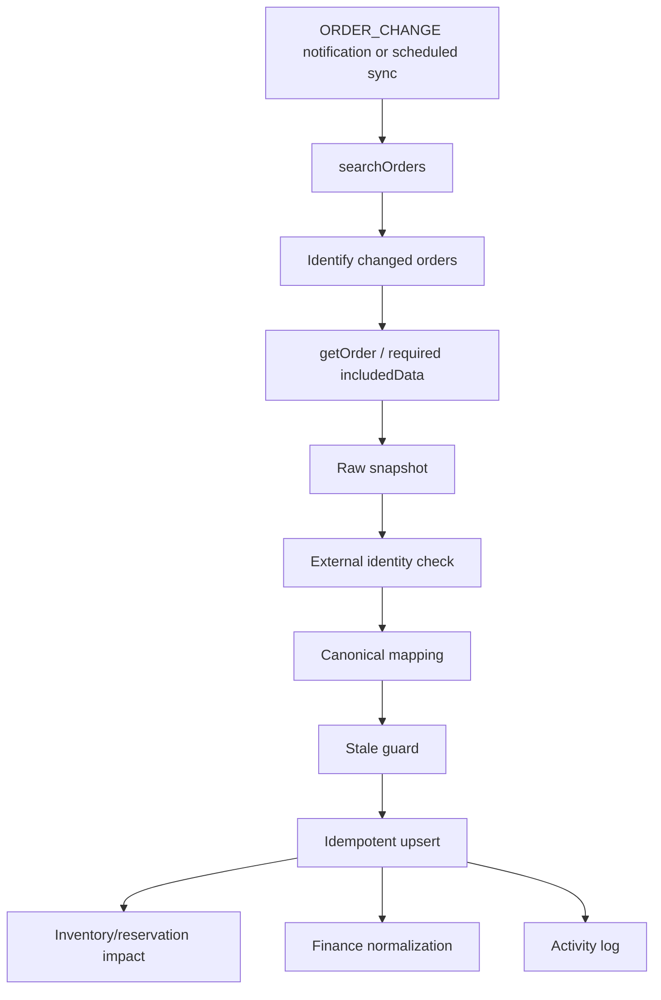

Kurallar:

1. Notification payload tek başına source of truth değildir.
2. Gerekirse provider'dan güncel order fetch edilir.
3. External identity ile duplicate engellenir.
4. Eski event yeni order state'i overwrite edemez.
5. FBA order merchant warehouse rezervasyonu yaratmaz.
6. MFN order central inventory policy'ye göre rezervasyon yaratabilir.
7. Financial breakdown order state'inden ayrı ledger'a yazılır.
8. Order import failure tüm Amazon connection'ı durdurmamalıdır.

---

# 17. Amazon product / listing modeli

Amazon tarafında üç farklı kavram ayrılmalıdır:

```text
NivaDesk Product / Variant
Amazon Catalog Product (ASIN)
Amazon Seller Listing (Seller SKU)
Amazon Marketplace offer state
```

Canonical ilişki:

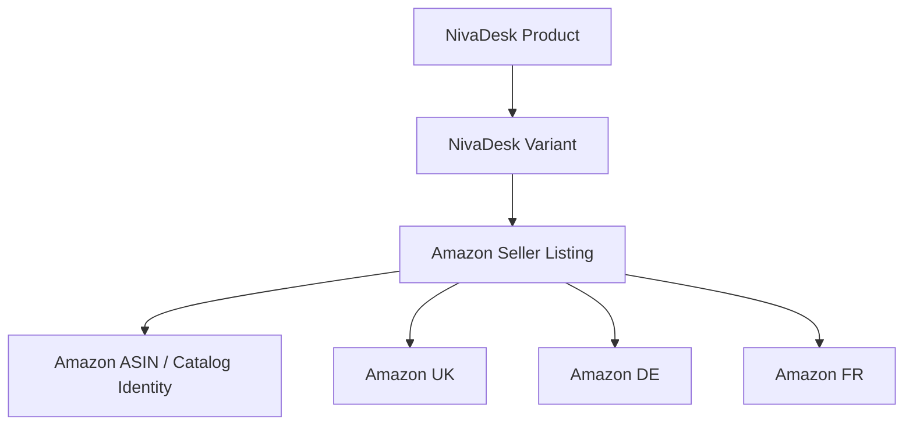

## External listing identity

```json
{
  "provider": "amazon",
  "connection_id": "con_amz_1",
  "marketplace_id": "marketplace-id",
  "seller_sku": "SKU-001",
  "asin": "ASIN...",
  "nivadesk_variant_id": "var_123",
  "management_mode": "external|nivadesk",
  "status": "active"
}
```

## Mapping kuralları

1. Seller SKU güçlü eşleştirme sinyalidir ama tek kesin kimlik kabul edilmez.
2. ASIN external catalog identity olarak korunur.
3. Aynı seller SKU farklı marketplace'lerde ayrı listing state taşıyabilir.
4. Amazon listing NivaDesk master product'u kullanıcı onayı olmadan overwrite etmez.
5. Amazon attribute issues ayrı listing issue kaydı olur.
6. Amazon catalog verisi NivaDesk custom/bespoke product metadata'sını silmez.
7. Listing silinirse NivaDesk Product silinmez.
8. Marketplace restriction veya suppressed listing product deletion anlamına gelmez.

---

# 18. Amazon listing API kararı

Individual listing read/write için güncel yaklaşım:

```text
Listings Items API v2021-08-01
```

Ürün şemaları için:

```text
Product Type Definitions API
```

Bulk listing updates için:

```text
JSON_LISTINGS_FEED
```

kullanılabilir.

**ZORUNLU karar:**

Legacy XML/flat-file listing feeds üzerine yeni NivaDesk implementation kurulmaz.

Amazon Product Type Definition'ları zamanla değişebildiği için schema sabit kodlanmamalıdır.

NivaDesk:

```text
provider schema
→ versioned schema cache
→ validation
→ preview
→ write
→ processing/result validation
```

akışını kullanmalıdır.

---

# 19. eBay authentication

eBay seller-owned data ve write operations için **OAuth 2.0 User access token** kullanılmalıdır.

Bağlantı akışı:

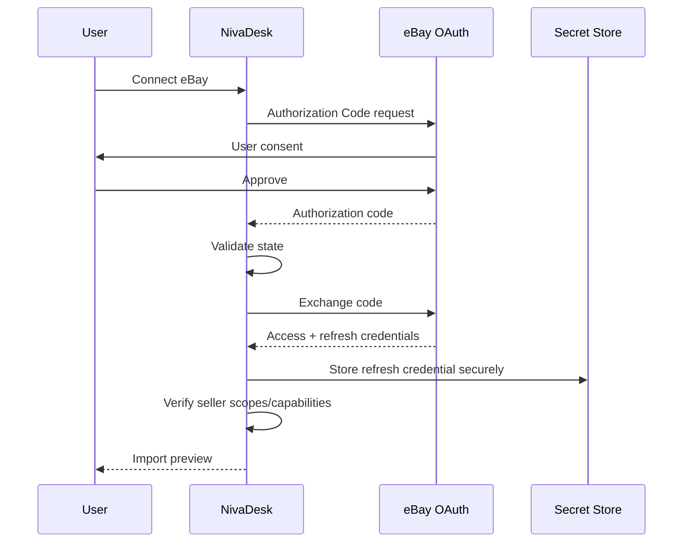

Kurallar:

- `state` validation ZORUNLU;
- client secret server-side;
- refresh credential encrypted;
- OAuth scopes minimum gerekli kapsam;
- reauthorization flow;
- revoked permission → `reauthorization_required`;
- token hiçbir log/analytics/AI prompt içine girmez.

---

# 20. eBay account / marketplace modeli

eBay connection seller hesabını temsil eder.

Listing/offer farklı eBay marketplaces için ayrı state taşıyabilir.

```json
{
  "provider": "ebay",
  "connection_id": "con_ebay_1",
  "seller_external_id": "seller-id",
  "marketplaces": [
    {
      "marketplace": "EBAY_GB",
      "enabled": true,
      "currency": "GBP"
    }
  ]
}
```

Unique external identity:

```text
provider
+ connection_id
+ entity_type
+ external_id
```

Listing için ek identity:

- listing ID;
- inventory item SKU;
- offer ID;
- inventory item group key varsa;
- merchant location key.

---

# 21. eBay product/listing modeli

eBay Inventory API modelinde aşağıdakiler ayrılmalıdır:

```text
Inventory Location
Inventory Item
Inventory Item Group
Offer
Published Listing
```

Canonical ilişki:

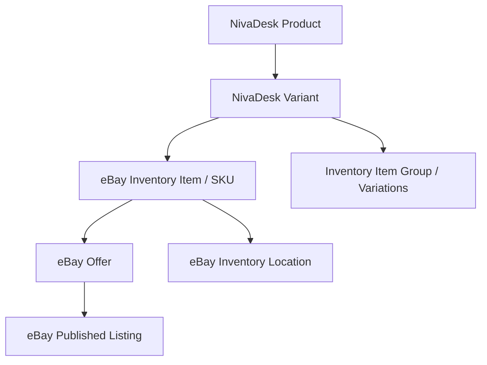

## NivaDesk mapping

```json
{
  "provider": "ebay",
  "connection_id": "con_ebay_1",
  "nivadesk_variant_id": "var_123",
  "seller_sku": "SKU-001",
  "offer_id": "offer-id|null",
  "listing_id": "listing-id|null",
  "inventory_item_group_key": null,
  "merchant_location_key": "location-key|null",
  "management_mode": "external|nivadesk_inventory_api",
  "status": "active"
}
```

---

# 22. eBay listing ownership — kritik karar

eBay için listing ownership açıkça modellenmelidir.

```ts
type EbayListingManagementMode =
  | "external"
  | "nivadesk_inventory_api";
```

## `external`

Listing:

- Seller Hub;
- Trading API tabanlı başka sistem;
- başka listing manager

tarafından yönetiliyor olabilir.

NivaDesk:

- order'ı okuyabilir;
- mapping yapabilir;
- finansı okuyabilir;
- stok önerisi oluşturabilir;
- listing'i otomatik olarak Inventory API ownership'e taşımaz.

## `nivadesk_inventory_api`

Listing NivaDesk/eBay Inventory API modeline alınmıştır.

NivaDesk:

- inventory item;
- offer;
- quantity;
- price;
- listing publish/update

işlemlerini capability dahilinde yapabilir.

## ZORUNLU kullanıcı uyarısı

eBay'in güncel dokümantasyonuna göre Inventory API ile oluşturulan listing'ler Seller Hub veya başka listing platformlarından normal biçimde düzenlenemez; revisions Inventory API üzerinden yapılmalıdır.

Bu nedenle:

> **NivaDesk hiçbir mevcut eBay listing'ini kullanıcı açıkça onaylamadan Inventory API ownership'e migrate etmemelidir.**

## İlk release varsayılanı

```text
Existing eBay listings = external / read-first
```

## Phase 2

Eligible listing'ler için:

```text
preview migration
→ impact warning
→ explicit approval
→ migrate
→ refetch
→ verify
→ management_mode = nivadesk_inventory_api
```

---

# 23. eBay order modeli

eBay Fulfillment API checkout'u tamamlanmış order'ları sağlar.

Canonical mapping:

```json
{
  "order_id": "ord_2001",
  "order_source": "ebay",
  "source_connection_id": "con_ebay_1",
  "external_order_id": "ebay-order-id",
  "channel_status": "provider-reported",
  "workflow_status": "production",
  "currency": "GBP",
  "fulfilment_source": "merchant",
  "payment_state": "provider-reported"
}
```

Korunması gereken provider alanları:

- eBay order ID;
- line item IDs;
- listing IDs;
- SKU;
- buyer identity fields allowed by provider;
- checkout/payment state;
- fulfilment status;
- shipping address/use-case data;
- shipping fulfilments;
- package/tracking;
- totals;
- taxes;
- discounts;
- refunds;
- disputes;
- fees/earnings relation;
- raw snapshot.

**Not:** Pending-payment purchase davranışı provider semantics olarak korunmalıdır; Fulfillment API yalnız checkout'u tamamlanmış order'lar için ana order kaynağı olarak ele alınmalıdır.

---

# 24. eBay order import akışı

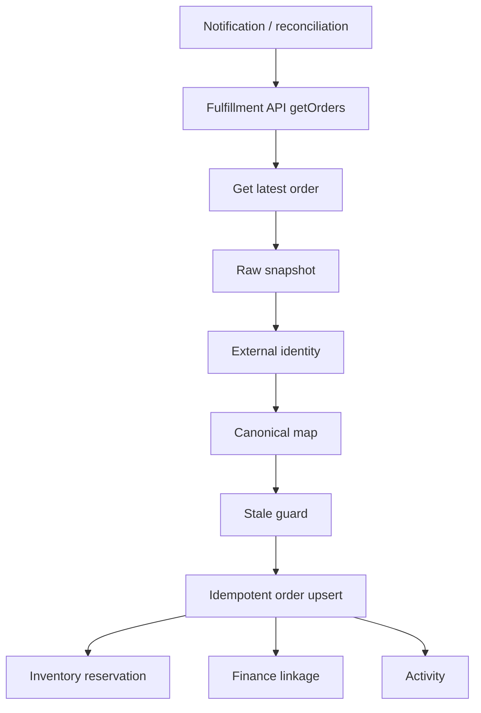

Kurallar:

- Notification event latest state yerine geçmez.
- Aynı order tekrar gelirse duplicate oluşmaz.
- Partial fulfilment ayrı package/fulfilment olarak modellenir.
- Refund order total'i sessizce overwrite etmez; ayrı financial adjustment yaratır.
- eBay order yalnız kendi connection'ına write yapabilir.

---

# 25. Customer / buyer ve PII modeli

Marketplace buyer data sıradan CRM customer datası gibi sınırsız kullanılmamalıdır.

Canonical customer:

```ts
interface MarketplaceCustomerProfile {
  customerId: string;
  customerType: "person" | "business" | "unknown";
  externalIdentities: ExternalIdentity[];
  displayName?: string;
  email?: string;
  phone?: string;
  addresses: Address[];
  dataOrigin: "amazon" | "ebay";
  piiPolicy: "provider_restricted";
  mergeStatus: "unreviewed" | "matched" | "possible_duplicate";
}
```

## Merge kuralları

- Sadece isim benzerliği ile merge YASAK.
- Provider external buyer identity güçlü sinyaldir.
- Marketplace-masked email kalıcı universal identity kabul edilmez.
- Amazon buyer ile Shopify customer otomatik birleştirilmez.
- eBay buyer ile Etsy buyer sadece isim üzerinden birleştirilmez.
- Belirsiz eşleşme `Possible duplicate` olarak kullanıcıya gösterilir.
- Customer merge finansal geçmişi etkilediği için açık onay gerekir.

## PII data minimization

- Base order sync gerekli olmayan PII'ı çekmez.
- Shipping için gerekliyse gerekli data on-demand alınır.
- Retention provider policy ve hukuk gereksinimlerine göre uygulanır.
- AI sonuçları minimum gerekli PII ile döndürülür.

---

# 26. Shared Inventory modeli

Merkezi stok modeli:

```text
NivaDesk Inventory Item
        ↓
Inventory Locations
        ↓
Sellable On Hand
        ↓
Reservations
        ↓
Channel Availability Policies
        ↓
Shopify / Etsy / Woo / Faire / Amazon / eBay
```

## Ana denklem

```text
sellable_available =
  on_hand
  - committed_orders
  - safety_stock
  - quarantined
  - damaged
  - channel_reservations
```

Kanal publish quantity:

```text
channel_publishable =
  min(
    sellable_available,
    channel_allocation
  )
```

Channel allocation yoksa policy'ye göre tüm uygun sellable quantity kullanılabilir.

---

# 27. Inventory Source of Truth modeli

Her listing/variant için aşağıdakiler saklanmalıdır:

```ts
type InventorySourceOfTruth =
  | "nivadesk"
  | "provider"
  | "external_warehouse"
  | "no_sync";
```

İlk bağlantıda varsayılan:

```text
read-only / review-first
```

İki yönlü stok:

```text
mapping preview
→ conflict check
→ dry-run
→ explicit enable
```

sonrasında açılmalıdır.

---

# 28. Amazon FBA ve MFN stok ayrımı

Bu entegrasyonun en önemli kurallarından biridir.

## MFN / merchant-fulfilled

Merchant fulfilled ürün:

```text
NivaDesk / merchant warehouse stock
```

üzerinden satılıyorsa NivaDesk merkezi stok source of truth olabilir.

Örnek:

```text
NivaDesk London Stock: 8
Amazon MFN reserved: 1
Shopify reserved: 2
Safety stock: 1

publishable = 8 - 1 - 2 - 1 = 4
```

Amazon MFN'ye gönderilebilecek quantity:

```text
4
```

policy izin veriyorsa.

## FBA / Amazon-fulfilled

FBA stoğu Amazon fulfillment network içindedir.

NivaDesk bunu ayrı inventory location olarak modellemelidir.

Örnek:

```text
LOC-LONDON-STUDIO
LOC-AMAZON-FBA-UK
LOC-AMAZON-FBA-DE
```

FBA inventory read için Amazon FBA Inventory API kullanılabilir.

FBA quantity örnek state:

```json
{
  "location_type": "amazon_fba",
  "fulfillable": 10,
  "reserved": 2,
  "inbound": 5,
  "unfulfillable": 1,
  "researching": 0
}
```

## ZORUNLU kurallar

1. FBA `fulfillable` NivaDesk London `on_hand` alanına eklenmez.
2. Amazon FBA sale NivaDesk merchant warehouse stock'u düşürmez.
3. FBA transfer/inbound ayrı inventory movement olur.
4. FBA reserved Amazon tarafından raporlanan state olarak korunur.
5. FBA inventory provider source of truth'tur.
6. NivaDesk FBA quantity'yi merchant-stock publish işlemi gibi overwrite etmez.
7. FBA ve MFN aynı Seller SKU olsa bile inventory location ayrımı korunur.

---

# 29. Amazon listing inventory write

MFN listing quantity write:

- listing management capability;
- inventory source-of-truth policy;
- mapping;
- marketplace;
- listing issue state

kontrol edilmeden yapılmamalıdır.

Akış:

```text
NivaDesk inventory change
→ inventory policy
→ Amazon listing mapping
→ calculate publishable quantity
→ proposal/dry-run
→ provider write
→ processing result
→ refetch
→ verify
```

FBA inventory write aynı akış değildir.

FBA inventory provider-warehouse state olarak ele alınmalıdır.

---

# 30. eBay inventory policy

eBay quantity write yalnız:

```text
management_mode = nivadesk_inventory_api
```

ve:

```text
inventory.source_of_truth = nivadesk
```

ise otomatik olabilir.

External-managed listing için:

```text
Read
→ Compare
→ Suggest
```

varsayılan olmalıdır.

## eBay location mapping

```json
{
  "nivadesk_location_id": "loc_london",
  "provider": "ebay",
  "merchant_location_key": "london-studio",
  "marketplace": "EBAY_GB"
}
```

## Quantity update

NivaDesk bulk update yapabiliyorsa aynı inventory change batch'i tek correlation ID ile izlenmelidir.

---

# 31. Inventory fan-out ve loop prevention

Örnek:

eBay'de 1 ürün satıldı.

```text
eBay order
→ NivaDesk reservation
→ central available decreases
→ Shopify quantity recalculated
→ Etsy quantity recalculated
→ Amazon MFN quantity recalculated
→ Woo quantity recalculated
```

Aynı değişiklik geri geldiğinde loop oluşmamalıdır.

```json
{
  "inventory_change_id": "ich_123",
  "origin": "ebay",
  "source_connection_id": "con_ebay_1",
  "causation_id": "evt_123",
  "product_variant_id": "var_123",
  "delta": -1,
  "published_targets": [
    "shopify:con_2",
    "etsy:con_3",
    "amazon:con_4"
  ]
}
```

## Loop guard

Bir inbound quantity event:

```text
same inventory_change_id
OR
same provider state hash caused by our prior write
```

ise yeni business change yaratmaz.

---

# 32. Made-to-order / custom product kuralı

NivaDesk custom-order businesses için geliştirildiğinden her ürün klasik stok ürünü değildir.

Ürün inventory mode:

```ts
type InventoryMode =
  | "stocked"
  | "made_to_order"
  | "capacity_based"
  | "non_stock";
```

`made_to_order` ürünlerde:

- quantity yerine capacity;
- lead time;
- material availability;
- production slots

önemli olabilir.

Amazon/eBay connector:

```text
made_to_order = true
```

ürünlerde kör two-way stock sync açmamalıdır.

Provider listing quantity sınırlaması gerekiyorsa ayrı publish policy kullanılmalıdır.

---

# 33. Fulfilment ortak modeli

```ts
interface Shipment {
  shipmentId: string;
  orderId: string;
  provider: string;
  externalFulfilmentId?: string;
  carrier?: string;
  trackingCode?: string;
  trackingUrl?: string;
  shippedAt?: string;
  items: ShipmentItemAllocation[];
  status: string;
}
```

Bir order birden fazla shipment içerebilir.

`order.shipped = true` tek başına yeterli değildir.

---

# 34. Amazon fulfilment

Amazon siparişleri iki ana gruba ayrılmalıdır.

## Amazon-fulfilled

Amazon fulfilment yapıyorsa NivaDesk:

- shipment state'i okur;
- packages/tracking görür;
- NivaDesk production/financial workflow ile ilişkilendirir;
- seller-side shipment write göndermez.

## Merchant-fulfilled

NivaDesk:

- shipment oluşturabilir;
- carrier/tracking kaydedebilir;
- provider capability doğrulanmışsa Amazon'a shipment confirmation gönderebilir.

Amazon order read v2026-01-01 olacaktır.

Shipment write capability implementation sırasında güncel SP-API contract'ı ile doğrulanmalıdır.

Desteklenen current path account/role/use-case'e göre:

- Orders shipment confirmation operation;
- veya desteklenen Order Fulfillment feed workflow

olabilir.

**ZORUNLU:** Yeni kod eski bir API versiyonuna kör biçimde bağlanmamalıdır. Capability registry gerçek production contract'ını seçmelidir.

## Write akışı

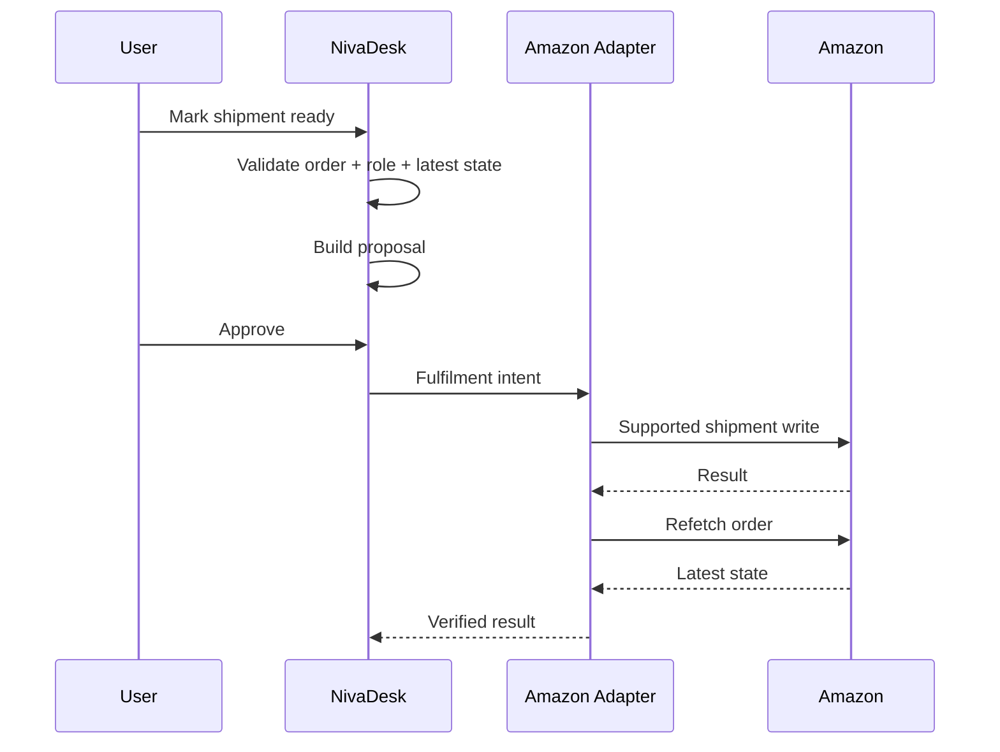

---

# 35. eBay fulfilment

eBay Fulfillment API üzerinden:

- order read;
- shipping fulfillment read;
- shipping fulfillment create;
- refund;
- dispute data/actions supported olduğu ölçüde

kullanılabilir.

Shipment write öncesi:

1. latest eBay order fetch;
2. already fulfilled quantity check;
3. payment/checkout state check;
4. item allocation validation;
5. role/permission validation;
6. tracking duplicate check;
7. explicit approval policy;
8. write;
9. refetch/verify.

## Partial shipment

Her shipment:

- line item;
- quantity;
- tracking;
- carrier;
- external fulfilment ID

taşır.

---

# 36. Returns, refunds ve disputes

Returns/refunds tek bir `order_status` alanına sıkıştırılmamalıdır.

Canonical models:

```text
returns
refunds
payment_disputes
financial_adjustments
```

## Refund

```json
{
  "refund_id": "ref_123",
  "order_id": "ord_123",
  "provider": "ebay",
  "external_refund_id": "external-id",
  "amount": {
    "value": "100.00",
    "currency": "GBP"
  },
  "reason": "provider-reported",
  "status": "completed"
}
```

## Amazon

Amazon returns capability ilgili Reports/API coverage'a göre runtime'da doğrulanmalıdır.

Finances transactions refund/adjustment etkisini Finance Ledger'a yansıtabilir.

## eBay

eBay Fulfillment/Finances kaynakları:

- buyer refunds;
- order adjustments;
- payment disputes;
- seller credits

gibi state'leri sağlayabilir.

## Ana muhasebe kuralı

Refund:

```text
new negative sale
```

olarak rastgele oluşturulmamalıdır.

Doğru:

```text
original order
→ refund/credit relation
→ financial adjustment
→ settlement impact
→ accounting credit/refund policy
```

---

# 37. Shared Finance Ledger

Marketplace financial events ortak ledger'a normalize edilir.

```ts
type CommerceFinancialEntryType =
  | "gross_sale"
  | "item_revenue"
  | "shipping_income"
  | "promotion_discount"
  | "marketplace_fee"
  | "payment_processing_fee"
  | "fulfilment_fee"
  | "storage_fee"
  | "shipping_label_fee"
  | "advertising_fee"
  | "tax_collected"
  | "tax_withheld"
  | "refund"
  | "refund_fee_credit"
  | "seller_credit"
  | "chargeback"
  | "dispute"
  | "currency_adjustment"
  | "other_adjustment"
  | "settlement_transfer";
```

Provider yeni fee type gönderirse:

```text
unknown_provider_fee
```

olarak kaybolmamalı.

Raw subtype korunmalıdır.

---

# 38. Amazon finans modeli

Amazon Finance source:

```text
Finances API v2024-06-19
```

olmalıdır.

`listTransactions` ve güncel Finances contract'ı üzerinden seller financial transactions alınabilir.

## Amazon financial ownership

| Veri | Yetkili kaynak |
|---|---|
| Order gross/proceeds | Amazon Orders current snapshot |
| Order-level proceeds/expenses | Amazon Orders current breakdown |
| Financial transactions | Amazon Finances |
| Marketplace fees | Amazon Finances |
| Refund/adjustment | Amazon Finances / related order state |
| FBA-specific costs | Amazon financial transaction/report source |
| Actual bank deposit | Bank feed |
| Formal accounting | Selected accounting provider |

## Amazon transaction lag

Finances data order ile aynı anda gelmeyebilir.

Bu nedenle:

```text
order imported
≠
finance complete
```

state'i desteklenmelidir.

Örnek:

```json
{
  "finance_completeness": "pending",
  "order_imported_at": "ISO-8601",
  "last_finance_sync_at": "ISO-8601"
}
```

---

# 39. eBay finans modeli

eBay Finances API aşağıdaki finansal verileri sağlayabilir:

- seller payouts;
- order earnings;
- seller expenses;
- fees;
- credits;
- buyer refunds;
- shipping label purchases;
- listing-related fees;
- transfers;
- transaction summaries.

NivaDesk bunları ayrı ledger kalemleri olarak saklamalıdır.

## eBay financial ownership

| Veri | Yetkili kaynak |
|---|---|
| Order total | eBay order |
| Order earnings | eBay Finances |
| Selling fees | eBay Finances |
| Shipping label charge | eBay Finances |
| Refund | eBay Fulfillment/Finances |
| Seller credit | eBay Finances |
| Payout | eBay Finances |
| Bank received | Bank feed |
| Formal accounting | Selected accounting provider |

---

# 40. Payout / settlement ikinci gelir değildir

Bu kural Amazon ve eBay için değişmezdir.

Yanlış:

```text
Order sale = £1,000 revenue
Bank payout = £850 revenue
Total revenue = £1,850
```

Doğru:

```text
Gross sale                    £1,000
Marketplace fees              -£100
Refunds/adjustments             -£20
Other provider costs            -£30
Expected settlement             £850
Bank transfer                   £850
```

Revenue:

```text
£1,000
```

Payout:

```text
clearing/settlement transfer
```

olarak modellenir.

---

# 41. Settlement modeli

```json
{
  "settlement_id": "set_123",
  "provider": "amazon",
  "connection_id": "con_amz_1",
  "marketplace_scope": ["GB"],
  "external_settlement_id": "provider-id",
  "currency": "GBP",
  "gross_earnings": "1000.00",
  "fees": "-100.00",
  "refunds": "-20.00",
  "other_adjustments": "-30.00",
  "expected_net": "850.00",
  "bank_received": null,
  "status": "pending_bank_match"
}
```

Provider structure farklıysa canonical settlement birden fazla transaction/group'tan oluşturulabilir.

---

# 42. Banka eşleştirme

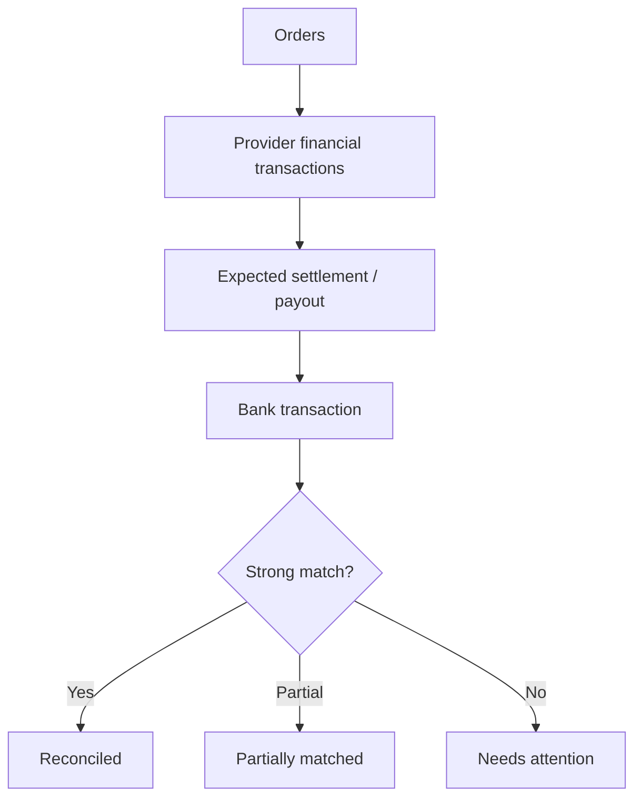

## Matching sinyalleri

- provider;
- seller account;
- marketplace region;
- external payout/settlement reference;
- amount;
- currency;
- expected date window;
- bank description;
- allocation total;
- fee/refund timing;
- prior unmatched settlement.

## Auto-match

Yalnız tek güçlü aday varsa otomatik eşleşir.

Birden fazla candidate varsa:

```text
Suggested match
```

olarak kullanıcıya gösterilir.

---

# 43. Multi-currency

Amazon/eBay farklı marketplaces farklı currencies üretebilir.

Her financial entry:

```json
{
  "amount_original": "100.00",
  "currency_original": "EUR",
  "base_amount": null,
  "base_currency": "GBP",
  "fx_rate": null,
  "fx_source": null
}
```

saklamalıdır.

Provider conversion varsa ayrıca:

```text
provider_fx
```

olarak kaydedilir.

Banka gerçek GBP settlement getirirse original EUR sale silinmez.

FX difference ayrı financial adjustment olabilir.

---

# 44. Tax modeli

Marketplace-collected tax ile seller revenue aynı alan değildir.

Canonical:

```ts
type TaxResponsibility =
  | "seller"
  | "marketplace"
  | "unknown";
```

```json
{
  "tax_type": "provider-reported",
  "amount": "20.00",
  "currency": "GBP",
  "responsibility": "marketplace",
  "jurisdiction": "provider-reported"
}
```

NivaDesk ülkeye göre kendi başına hukuki vergi yorumu üretmez.

Accounting export policy:

- provider evidence;
- accounting configuration;
- user/accountant decision

üzerinden belirlenir.

---

# 45. QuickBooks / Xero / Pandle ile çalışma

AmazonAdapter ve eBayAdapter doğrudan accounting provider'a yazamaz.

Doğru akış:

```text
Amazon/eBay Adapter
→ Commerce Financial Ledger
→ Accounting Policy
→ Review / Approval
→ Accounting Outbox
→ QuickBooks OR Xero OR Pandle Adapter
```

## Primary writer

Her:

```text
legal entity
+ ledger scope
+ effective date range
```

için tek primary accounting writer.

Örnek:

```json
{
  "legal_entity_id": "le_1",
  "ledger_scope": "commerce_marketplace_sales",
  "primary_accounting_provider": "pandle",
  "effective_from": "2026-09-01"
}
```

Pandle primary ise aynı Amazon/eBay sale QuickBooks ve Xero'ya aynı anda write edilmez.

---

# 46. Accounting mapping

| NivaDesk event | Accounting hedefi |
|---|---|
| Marketplace gross sale | Sales invoice / sales journal policy |
| Marketplace customer | Contact veya marketplace clearing customer |
| Marketplace fee | Marketplace fees expense |
| FBA fulfilment fee | Fulfilment expense |
| eBay shipping label fee | Shipping/courier expense |
| Shipping income | Shipping income |
| Refund | Credit note/refund |
| Tax collected | Tax policy |
| Tax withheld | Tax withheld/clearing policy |
| Expected settlement | Marketplace clearing |
| Bank payout | Clearing → bank |
| Advertising fee | Advertising expense policy |
| Storage fee | Storage/FBA expense policy |

Provider subtype kaybolmamalıdır.

---

# 47. Accounting contact granularity

İki temel çalışma modu desteklenmelidir:

## Per buyer/customer

Her marketplace buyer ayrı accounting contact olabilir.

Bu bazı işletmeler için gereksiz ve PII açısından ağır olabilir.

## Marketplace clearing customer

Operasyon NivaDesk'te buyer bazlı kalır.

Accounting sistemine:

```text
Amazon Marketplace Customer
eBay Marketplace Customer
```

gibi clearing contact yaklaşımı gönderilebilir.

Varsayılan:

```text
review-required
```

olmalıdır.

NivaDesk ülkeye göre otomatik hukuki/accounting varsayım yapmaz.

---

# 48. ChatGPT / MCP güvenli mimarisi

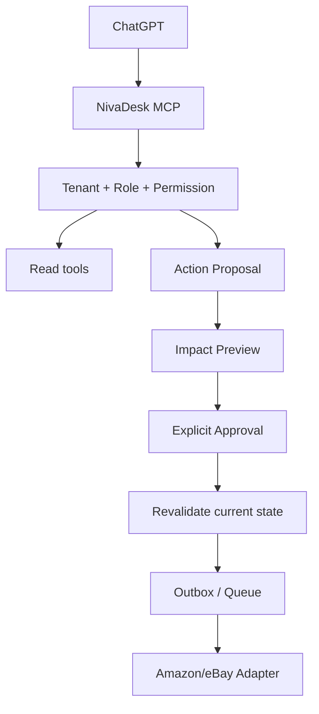

ChatGPT:

- provider credential görmez;
- raw secret okuyamaz;
- doğrudan Amazon/eBay API çağırmaz;
- kullanıcı onayı gerektiren write'ı kendi başına execute etmez.

---

# 49. Amazon AI read tools

Önerilen MCP/read tools:

```text
amazon_list_orders
amazon_get_order
amazon_list_unfulfilled_orders
amazon_list_fba_inventory
amazon_list_mfn_inventory_risks
amazon_list_unmapped_listings
amazon_get_listing_issues
amazon_finance_summary
amazon_fee_and_margin_report
amazon_list_unmatched_settlements
amazon_sync_health
```

Örnek sorular:

- “Bugünkü Amazon siparişlerini göster.”
- “FBA ve kendi depomdaki stok farklarını göster.”
- “Amazon UK'de stoğu bitecek ürünleri listele.”
- “Amazon fees sonrası gerçek margin ne?”
- “Bu banka ödemesi hangi Amazon settlement'a ait?”
- “Amazon'da listing issue olan ürünleri göster.”
- “Gönderilmesi gereken merchant-fulfilled siparişleri sırala.”

---

# 50. eBay AI read tools

```text
ebay_list_orders
ebay_get_order
ebay_list_unfulfilled_orders
ebay_list_unmapped_listings
ebay_inventory_risk_report
ebay_listing_management_report
ebay_fee_and_margin_report
ebay_list_payouts
ebay_list_unmatched_payouts
ebay_list_refunds
ebay_list_disputes
ebay_sync_health
```

Örnek:

- “eBay'de bugün ne satıldı?”
- “Seller Hub tarafından yönetilen listing'leri göster.”
- “NivaDesk tarafından yönetilebilecek eBay listing'lerini göster.”
- “Bu eBay payout'unu banka hareketiyle eşleştir.”
- “eBay fees sonrası ürün bazında margin göster.”
- “Refund veya dispute bekleyen order'ları göster.”

---

# 51. AI proposal tools

Amazon:

```text
amazon_propose_product_mapping
amazon_propose_inventory_policy
amazon_propose_mfn_quantity_update
amazon_propose_listing_update
amazon_propose_shipment
amazon_propose_accounting_export
```

eBay:

```text
ebay_propose_product_mapping
ebay_propose_inventory_policy
ebay_propose_listing_migration
ebay_propose_quantity_update
ebay_propose_price_update
ebay_propose_shipment
ebay_propose_refund
ebay_propose_accounting_export
```

---

# 52. Açık onay gerektiren işlemler

Varsayılan olarak:

- listing migration;
- listing creation;
- product master mapping conflict resolution;
- inventory source-of-truth değişikliği;
- bulk quantity update;
- price update;
- shipment/tracking write;
- refund;
- dispute action;
- accounting export;
- customer merge;
- bulk action;
- connection marketplace scope değişikliği

explicit approval gerektirir.

Gelecekte kullanıcı kontrollü automation policy oluşturursa bazı düşük-riskli writes önceden yetkilendirilebilir.

Ama ilk release:

```text
review-first
```

olmalıdır.

---

# 53. Approval revalidation

Onay verildiği anda provider state tekrar kontrol edilmelidir.

Örnek:

```json
{
  "proposal_id": "prop_123",
  "based_on_provider_hash": "hash_old",
  "approved_at": "ISO-8601"
}
```

Execution öncesi:

```text
latest provider hash != approved hash
```

ise:

```json
{
  "status": "approval_stale",
  "reason": "provider_record_changed",
  "required_action": "review_again"
}
```

---

# 54. Notifications / webhooks

## Amazon

Amazon Notifications API:

- destination oluşturma;
- subscription;
- notification delivery

mekanizmasını sağlar.

Order değişiklikleri için uygun current notification type örneği:

```text
ORDER_CHANGE
```

Amazon integration:

```text
notifications + reconciliation
```

kullanmalıdır.

Notification-only sistem YASAK.

## eBay

eBay Notification API:

- destination;
- subscription;
- topic;
- subscription filters;
- public-key validation

gibi lifecycle özellikleri sağlar.

eBay integration:

```text
notification + latest fetch + reconciliation
```

kullanmalıdır.

## Shared rule

Notification geldiğinde:

```text
event
→ verify authenticity
→ identify entity
→ fetch latest provider state when appropriate
→ canonical apply
```

---

# 55. Sync ve reconciliation tasarımı

Her connection için aşağıdaki sync'ler bulunmalıdır:

- initial backfill;
- incremental orders;
- product/listing sync;
- inventory reconciliation;
- fulfilment reconciliation;
- financial transaction sync;
- settlement/payout sync;
- manual `Sync now`;
- post-write refetch;
- nightly/periodic audit reconciliation.

## Suggested starting cadence

Bunlar product guarantee değildir.

| Stream | Başlangıç yaklaşımı |
|---|---|
| Orders | Notifications + 5–15 dk reconciliation |
| Inventory | Event/write driven + 10–20 dk reconciliation |
| Listings | 30–60 dk |
| Fulfilment | Order activity sonrası daha sık |
| Finance | 30–60 dk |
| Settlement/payout | 30–60 dk |
| Full reconciliation | nightly, overlap window |

Gerçek cadence:

- provider rate limit;
- tenant plan;
- connection size;
- event frequency;
- API usage plan

üzerinden dinamik olmalıdır.

---

# 56. Cursor / checkpoint

```json
{
  "connection_id": "con_123",
  "provider": "amazon",
  "stream": "orders",
  "cursor": "opaque-provider-token|null",
  "high_watermark": "ISO-8601",
  "overlap_seconds": 300,
  "last_success_at": "ISO-8601",
  "last_full_reconciliation_at": "ISO-8601"
}
```

## Cursor safety

Partial failure varsa cursor ilerlememelidir.

Örnek:

```text
page fetched
→ 100 records
→ record 72 apply failed
```

Cursor:

```text
commit edilmez
```

veya per-record checkpoint strategy varsa kanıtlanmış güvenli recovery kullanılmalıdır.

---

# 57. Stale-data guard

Provider'dan eski state geldiyse yeni NivaDesk state'i geri alınmamalıdır.

Apply order:

1. provider version varsa;
2. provider updated timestamp;
3. fetched timestamp;
4. payload hash;
5. internal apply sequence.

Order/listing/finance stream'leri ayrı version domain olabilir.

---

# 58. Idempotency

Unique identity:

```text
provider
+ connection_id
+ entity_type
+ external_id
```

Write intent:

```text
tenant
+ connection
+ action type
+ target entity
+ approved intent version
```

aynıysa retry duplicate side effect yaratmamalıdır.

Örnek:

```text
shipment.create
```

retry iki shipment oluşturmamalıdır.

---

# 59. Retry policy

| Error | Davranış |
|---|---|
| Network timeout | exponential backoff + jitter |
| 429/rate limit | provider retry guidance |
| 5xx | bounded retry |
| 401 | token refresh / reauth flow |
| 403 | permission / role task |
| Validation 4xx | no automatic retry |
| Mapping conflict | Needs Attention |
| Stale proposal | ask for re-review |
| Provider suspended | pause connection writes |
| Schema drift | quarantine + alert |
| Duplicate provider response | idempotent ignore |

---

# 60. Dead-letter queue

```json
{
  "provider": "ebay",
  "connection_id": "con_ebay_1",
  "stream": "fulfilment",
  "operation": "shipping_fulfilment.create",
  "entity_id": "ord_123",
  "attempt_count": 5,
  "retryable": false,
  "status": "needs_attention",
  "sanitized_error": "provider_validation_error",
  "correlation_id": "corr_123"
}
```

UI'dan safe replay yapılabilir.

Safe replay:

- latest state fetch;
- duplicate-side-effect check;
- role check;
- user permission;
- new execution attempt.

---

# 61. Rate-limit mimarisi

Amazon ve eBay aynı generic rate-limit bucket kullanmamalıdır.

```text
provider
+ connection
+ operation family
```

bazlı limiter uygulanmalıdır.

## Amazon

Amazon API usage plan ve response header'ları dinamik davranabilir.

NivaDesk:

- hardcoded global RPS varsayımı kullanmaz;
- `x-amzn-RateLimit-Limit` gibi available provider hints'i değerlendirir;
- burst safety uygular;
- retry-after/backoff uygular.

## eBay

eBay API call limits endpoint/API/app seviyesinde değişebilir.

NivaDesk:

- provider-specific quota manager;
- rolling usage telemetry;
- low-priority reconciliation throttling;
- write priority

uygulamalıdır.

---

# 62. Capability registry

Public docs'ta görülen özellik kod içinde blanket guarantee olmamalıdır.

```json
{
  "provider": "amazon",
  "connection_id": "con_amz_1",
  "capabilities": {
    "orders.read": true,
    "orders.pii": "role_dependent",
    "listings.read": true,
    "listings.write": "role_and_schema_dependent",
    "mfn_inventory.write": "validate",
    "fba_inventory.read": true,
    "fba_inventory.write": false,
    "shipment.write": "validate_current_contract",
    "finance.read": true,
    "notifications.orders": "validate_subscription"
  }
}
```

```json
{
  "provider": "ebay",
  "connection_id": "con_ebay_1",
  "capabilities": {
    "orders.read": true,
    "inventory.read": true,
    "listing.create": "business_policy_and_management_mode",
    "listing.migrate": "eligible_only",
    "price.write": "managed_listing_only",
    "quantity.write": "managed_listing_only",
    "shipment.write": true,
    "refund.write": "permission_dependent",
    "dispute.read": "permission_dependent",
    "finance.read": true,
    "notifications": "subscription_dependent"
  }
}
```

UI bu capability map'e göre davranır.

---

# 63. Raw snapshots ve schema drift

Her provider fetch sonucu:

```text
external_raw_snapshots
```

içinde audit/debug için saklanabilir.

Ama:

- encrypted/controlled access;
- PII redaction/retention;
- storage limits;
- tenant isolation

uygulanmalıdır.

Unknown field geldiğinde:

```text
drop
```

yerine:

```text
preserve raw
+ schema drift event
```

tercih edilmelidir.

Raw JSON core business logic'in kalıcı database schema'sı değildir.

---

# 64. Canonical tablolar

| Tablo | Rol |
|---|---|
| `commerce_connections` | Amazon/eBay connection |
| `commerce_connection_marketplaces` | Marketplace scope |
| `external_entities` | External identity |
| `channel_orders` | Provider order state |
| `orders` | Canonical order |
| `order_items` | Canonical lines |
| `customers` | NivaDesk customer |
| `customer_external_identities` | Marketplace buyer identity |
| `sales_products` | Master product |
| `sales_product_variants` | Master variant |
| `channel_listings` | Amazon/eBay listing mapping |
| `channel_listing_issues` | Provider listing problems |
| `inventory_items` | Stock item |
| `inventory_locations` | NivaDesk/FBA/eBay locations |
| `inventory_balances` | Quantity state |
| `inventory_reservations` | Committed stock |
| `inventory_change_events` | Fan-out/loop guard |
| `shipments` | Shipment |
| `shipment_items` | Shipment allocation |
| `returns` | Return |
| `refunds` | Refund |
| `payment_disputes` | Dispute |
| `commerce_financial_entries` | Fees/revenue/tax/adjustment |
| `marketplace_settlements` | Settlement/payout |
| `settlement_allocations` | Settlement composition |
| `bank_matches` | Bank reconciliation |
| `channel_sync_events` | Activity/audit |
| `external_raw_snapshots` | Raw provider evidence |
| `action_proposals` | AI/user proposals |
| `accounting_outbox` | Approved accounting writes |

Provider-specific columns core `orders` tablosuna dağılmamalıdır.

Yanlış:

```text
orders.amazon_order_id
orders.ebay_order_id
orders.etsy_receipt_id
```

Doğru:

```text
external_entities
channel_orders
```

---

# 65. External identity örnekleri

Amazon:

```json
{
  "provider": "amazon",
  "connection_id": "con_amz_1",
  "entity_type": "order",
  "external_id": "amazon-order-id",
  "nivadesk_entity_type": "order",
  "nivadesk_entity_id": "ord_123"
}
```

eBay:

```json
{
  "provider": "ebay",
  "connection_id": "con_ebay_1",
  "entity_type": "listing",
  "external_id": "ebay-listing-id",
  "nivadesk_entity_type": "channel_listing",
  "nivadesk_entity_id": "chl_123"
}
```

Unique constraint:

```text
provider + connection_id + entity_type + external_id
```

---

# 66. Field ownership

Her canonical field için owner açık olmalıdır.

Örnek:

| Alan | Owner |
|---|---|
| NivaDesk workflow status | NivaDesk |
| Amazon channel status | Amazon |
| eBay channel status | eBay |
| NivaDesk internal notes | NivaDesk |
| Provider listing ID | Provider |
| FBA inventory | Amazon |
| Merchant on-hand | NivaDesk/selected warehouse |
| Provider fee | Provider |
| Bank received amount | Bank feed |
| Accounting posting status | Accounting Core |
| Tracking entered in NivaDesk | NivaDesk until provider accepted |
| Provider fulfilment confirmation | Provider |

Provider `null` gönderdi diye NivaDesk-owned field silinmemelidir.

---

# 67. Sync Health UI

Connection card örneği:

```text
Amazon — Connected
Orders: Synced 3 min ago
Listings: Synced 34 min ago
MFN Inventory: Synced 8 min ago
FBA Inventory: Synced 12 min ago
Finance: Synced 28 min ago
Settlements: Synced 42 min ago
Pending reviews: 4
Errors: 0
```

eBay:

```text
eBay — Needs attention
Orders: Synced 4 min ago
Listings: Synced 48 min ago
Inventory: 12 external · 8 NivaDesk-managed
Finance: Synced 19 min ago
Payouts: Synced 31 min ago
Pending reviews: 2
Errors: 1
```

---

# 68. Sync Activity UI

Örnek:

```text
14:02 Amazon ORDER_CHANGE received ✓
14:02 Latest order fetched ✓
14:02 Order mapped ✓
14:02 MFN inventory reserved ✓
14:03 Finance pending ⏳
14:04 Shopify quantity updated ✓
14:04 Etsy quantity updated ✓
15:10 Amazon financial transaction found ✓
15:10 Expected settlement updated ✓
```

eBay:

```text
16:01 eBay order discovered ✓
16:01 Latest order fetched ✓
16:02 Listing mapped ✓
16:02 Central stock reserved ✓
16:02 Amazon MFN quantity recalculated ✓
16:03 eBay fee transaction imported ✓
18:20 Shipment proposal approved ✓
18:20 Tracking sent to eBay ✓
18:21 Provider state verified ✓
```

Her event:

- correlation ID;
- causation ID;
- actor;
- connection;
- entity;
- operation;
- old hash;
- new hash;
- attempts;
- result;
- sanitized error;
- timestamp

taşımalıdır.

---

# 69. Kullanıcı ekranları

## A. Integrations directory

Amazon ve eBay kartları.

## B. Connect wizard

1. Connect provider.
2. Authorization.
3. Verify seller.
4. Select marketplaces.
5. Select import range.
6. Preview listings.
7. Map products.
8. Choose inventory policies.
9. Choose listing management mode.
10. Finance data preview.
11. Accounting policy.
12. Dry run.
13. Confirm.

## C. Import Preview

Kartlar:

- orders found;
- listings found;
- exact mappings;
- possible mappings;
- unmatched listings;
- inventory conflicts;
- duplicate orders prevented;
- FBA locations discovered;
- external-managed eBay listings;
- finance coverage;
- settlements/payouts found.

## D. Channel Details

Order sayfasında:

- provider;
- marketplace;
- external order ID;
- channel status;
- fulfilment source;
- buyer summary;
- listing/SKU/ASIN;
- packages;
- financial breakdown;
- refunds;
- settlement allocation;
- sync activity.

## E. Listing Mapping

Kolonlar:

```text
NivaDesk Product
NivaDesk Variant
Provider
Marketplace
Seller SKU
ASIN / Listing ID
Management Mode
Inventory Source
Last Sync
Issues
```

## F. Marketplace Finance

- gross sales;
- fees;
- fulfilment fees;
- shipping;
- refunds;
- tax;
- withheld tax;
- adjustments;
- expected settlement;
- bank received;
- unmatched amount;
- margin.

---

# 70. Amazon-specific UI

Amazon order detail:

```text
Amazon
Marketplace: UK
Fulfilment: Merchant
Amazon Order ID: ...
Programs: Prime
Listing: SKU...
ASIN: ...
Order proceeds: ...
Amazon expenses: ...
Finance status: Pending/Complete
Settlement: ...
```

FBA inventory:

```text
SKU
ASIN
Marketplace
Fulfillable
Reserved
Inbound
Unfulfillable
Researching
Last sync
```

---

# 71. eBay-specific UI

eBay listing detail:

```text
eBay Listing
Marketplace: EBAY_GB
Listing ID: ...
SKU: ...
Offer ID: ...
Inventory Location: ...
Management:
  External / NivaDesk Inventory API
```

External management warning:

> This listing is currently managed outside NivaDesk. NivaDesk will not take over listing management unless you explicitly migrate it.

Migration preview:

```text
What changes:
✓ Listing becomes NivaDesk/eBay Inventory API managed
✓ Quantity and price can be managed from NivaDesk
⚠ Future listing edits must use the API-compatible management path
```

---

# 72. Notifications endpoint güvenliği

Notification receiver:

- provider signature/integrity doğrulaması;
- replay protection;
- timestamp validation varsa;
- HTTPS;
- rate limiting;
- request size limit;
- sanitized logging;
- tenant/connection lookup;
- no direct business write before validation.

Notification payload:

```text
queue
```

üzerinden işlenmelidir.

HTTP request thread içinde ağır reconciliation yapılmamalıdır.

---

# 73. Güvenlik ve gizlilik

- Secrets encrypted at rest.
- TLS in transit.
- Tokens logs'ta yok.
- Tokens analytics'te yok.
- Tokens ChatGPT prompt'unda yok.
- PII access role-based.
- Support access audited.
- Tenant isolation zorunlu.
- Raw snapshots restricted.
- Export permissions.
- Bulk actions audited.
- Provider disconnect background jobs'u durdurur.
- Account deletion provider retention requirements ile uygulanır.
- Restricted marketplace PII ayrı security controls ile korunur.
- Least privilege.
- Secret rotation support.
- OAuth state validation.
- Refresh-token rotation/lifecycle monitoring.
- Reauthorization tasks.

---

# 74. Mevcut entegrasyonları koruma

Amazon/eBay eklenirken:

- Shopify code silinmez;
- Etsy import logic kırılmaz;
- WooCommerce connector behavior değişmez;
- Faire wholesale semantics bozulmaz;
- Square/POS stok reservation policy etkilenmez;
- PayPal/bank matching duplicate yaratmaz;
- accounting primary-writer kuralı korunur;
- ChatGPT existing tools regression testlerinden geçer.

Provider-specific isolation:

```text
integration.amazon.enabled
integration.ebay.enabled
```

feature flag'leri ayrı olmalıdır.

Queue routing:

```text
commerce.amazon.*
commerce.ebay.*
```

ayrı provider partitions/routing keys kullanabilir.

---

# 75. Migration strategy

Yeni provider adapter core'a direkt write etmemeli.

Doğru:

```text
Provider Adapter
→ Canonical Envelope
→ Common Apply Engine
```

Mevcut Commerce Core tablolarında schema değişikliği gerekiyorsa:

1. backward-compatible migration;
2. dual-read gerekiyorsa;
3. shadow mode;
4. verify;
5. enable writes;
6. rollback plan.

---

# 76. Amazon rollout fazları

## Faz A0 — Provider onboarding

- Solution Provider Portal/developer onboarding;
- public seller app requirements;
- app registration;
- required roles;
- sandbox;
- authorization workflow;
- security/policy validation.

## Faz A1 — Read-only Orders

- OAuth/LWA;
- marketplace discovery;
- Orders v2026-01-01;
- external identities;
- raw snapshots;
- canonical order;
- Sync Health;
- duplicate prevention.

## Faz A2 — Listings

- Listings Items;
- Product Type Definitions;
- product mapping;
- listing issues;
- read-only inventory mapping.

## Faz A3 — Inventory

- MFN inventory policy;
- FBA Inventory read;
- separate inventory locations;
- reservations;
- channel fan-out;
- dry-run writes.

## Faz A4 — Fulfilment

- merchant fulfilment;
- current supported shipment-write path;
- refetch;
- tracking;
- partial shipments.

## Faz A5 — Finance

- Finances v2024-06-19;
- transaction normalization;
- fees;
- refunds;
- settlement;
- bank matching;
- margin.

## Faz A6 — Accounting + AI

- Accounting Core;
- primary writer;
- AI read;
- AI proposals;
- approvals.

## Faz A7 — Public release

- monitoring;
- support runbook;
- rollback;
- docs;
- Coming soon removal.

---

# 77. eBay rollout fazları

## Faz E0 — Developer / OAuth

- eBay Developer app;
- OAuth;
- scopes;
- sandbox;
- seller test account;
- Notification endpoint.

## Faz E1 — Read-only Orders

- Fulfillment API;
- external identities;
- order import;
- buyer mapping;
- Sync Health.

## Faz E2 — Listing Discovery

- existing listings;
- Inventory API objects where available;
- SKU/listing mapping;
- management mode classification.

## Faz E3 — Inventory

- external listings read-only;
- NivaDesk-managed listings quantity write;
- location mapping;
- reservations;
- loop prevention.

## Faz E4 — Listing Management

- create Inventory Item;
- create Offer;
- publish;
- variation groups;
- business policies;
- explicit migration;
- migration warning.

## Faz E5 — Fulfilment / Refunds

- shipping fulfilment;
- partial shipment;
- refund;
- disputes read;
- safe proposal/write.

## Faz E6 — Finance

- order earnings;
- transactions;
- fees;
- shipping labels;
- credits;
- payouts;
- bank matching.

## Faz E7 — Accounting + AI

- Accounting Core;
- ChatGPT read/proposal tools.

## Faz E8 — Public release

- monitoring;
- support runbook;
- docs;
- Coming soon removal.

---

# 78. Shared MVP önerisi

İlk production release'de scope gereksiz genişletilmemelidir.

## Amazon MVP

MUST:

- Connect;
- seller/marketplace validation;
- order import;
- current Orders v2026-01-01;
- product/listing mapping;
- MFN vs FBA visibility;
- FBA inventory read;
- merchant inventory reservation;
- finance read;
- settlement/bank matching;
- Sync Health.

SHOULD:

- merchant fulfilment write;
- MFN quantity write.

MAY later:

- full listing creation/edit;
- advanced FBA inbound;
- ads/marketing;
- advanced returns.

## eBay MVP

MUST:

- Connect;
- order import;
- listing discovery/mapping;
- external vs NivaDesk management mode;
- inventory visibility;
- finance/payout;
- bank matching;
- fulfilment;
- Sync Health.

SHOULD:

- quantity write for NivaDesk-managed Inventory API listings.

MAY later:

- listing migration;
- new listing creation;
- price management;
- dispute actions;
- marketing/promotions.

---

# 79. Test plan — shared

## Connection

- auth success;
- auth cancel;
- invalid state;
- expired token;
- revoked permission;
- reconnect;
- disconnect;
- multiple connections.

## Order

- new order;
- update;
- cancel;
- partial shipment;
- duplicate event ×10;
- out-of-order events;
- old snapshot;
- unknown status;
- multi-currency;
- tax;
- promotion.

## Mapping

- exact SKU;
- duplicate SKU;
- missing SKU;
- one SKU/multiple marketplace listing;
- possible customer duplicate;
- listing deleted;
- listing suppressed/problem state.

## Inventory

- central stock decrement;
- reservation release;
- safety stock;
- multi-location;
- loop prevention;
- source-of-truth switch;
- read-only mode;
- made-to-order mode.

## Finance

- gross;
- fee;
- refund;
- shipping;
- tax;
- withheld tax;
- credit;
- adjustment;
- partial settlement;
- unmatched payout;
- currency mismatch.

## Accounting

- primary writer only;
- export retry;
- no duplicate invoice;
- clearing account;
- refund credit;
- settlement-to-bank reconciliation.

## AI

- read does not write;
- proposal requires approval;
- stale proposal fails;
- cross-tenant data impossible;
- token never exposed;
- bulk action preview.

---

# 80. Amazon-specific tests

- Orders v2026-01-01 current schema.
- Pagination token handling.
- IncludedData minimal/data-complete behavior.
- MFN mapping.
- FBA mapping.
- FBA location does not modify merchant stock.
- FBA reserved/inbound/fulfillable separation.
- Listing issues preserved.
- Product Type Definitions schema update.
- JSON listing feed processing result.
- Finance transaction lag.
- Notification missed → reconciliation finds order.
- notification duplicate.
- public app role missing.
- restricted PII role absent.
- settlement bank match.

---

# 81. eBay-specific tests

- OAuth user consent.
- refresh/reconnect.
- Fulfillment order import.
- checkout-complete semantics.
- partial fulfilment.
- shipping fulfillment retry.
- refund idempotency.
- payment dispute read.
- Finances order earnings.
- shipping label fee.
- seller credit.
- payout match.
- Inventory Item mapping.
- Offer mapping.
- Listing ID mapping.
- Inventory location.
- Business policy missing.
- existing listing remains external.
- migration requires explicit approval.
- Inventory API-managed listing cannot silently switch external.
- Notification duplicate.
- missed notification → reconciliation finds change.

---

# 82. Regression tests

- Shopify order import unchanged.
- Shopify inventory sync unchanged.
- Etsy OAuth/import unchanged.
- Etsy source metadata preserved.
- WooCommerce full connector unchanged.
- Faire retailer/wholesale fields unchanged.
- Faire wholesale ATP unchanged.
- Square inventory reservation unchanged.
- PayPal/bank match unchanged.
- QuickBooks/Xero/Pandle primary writer unchanged.
- ChatGPT existing read tools unchanged.
- Existing NivaDesk Orders UI loads without Amazon/eBay data.

---

# 83. Acceptance criteria — Amazon

Amazon production-ready sayılmak için:

- [ ] Public/developer approval prerequisites tamam.
- [ ] Secure LWA authorization çalışıyor.
- [ ] Reauthorization çalışıyor.
- [ ] Marketplace scope doğru.
- [ ] Orders API v2026-01-01 kullanılıyor.
- [ ] Orders idempotent.
- [ ] Notification + reconciliation birlikte çalışıyor.
- [ ] MFN/FBA ayrımı doğru.
- [ ] FBA inventory ayrı location.
- [ ] Merchant stock yanlışlıkla FBA ile merge edilmiyor.
- [ ] Listing mapping güvenli.
- [ ] Listing issues saklanıyor.
- [ ] Finance transactions normalize ediliyor.
- [ ] Settlement payout ikinci revenue değil.
- [ ] Bank matching testleri geçiyor.
- [ ] Accounting primary writer korunuyor.
- [ ] Sync Health mevcut.
- [ ] Retry/DLQ mevcut.
- [ ] PII security testleri geçiyor.
- [ ] Feature flag/rollback test edildi.
- [ ] Existing integrations regression geçti.

---

# 84. Acceptance criteria — eBay

eBay production-ready sayılmak için:

- [ ] Secure OAuth çalışıyor.
- [ ] Seller scopes doğrulanıyor.
- [ ] Order import idempotent.
- [ ] Notification + reconciliation çalışıyor.
- [ ] Listing mapping mevcut.
- [ ] External vs NivaDesk listing management açık.
- [ ] Existing listing otomatik migrate edilmiyor.
- [ ] Migration warning + approval var.
- [ ] Inventory location mapping çalışıyor.
- [ ] Quantity write yalnız managed listing'de.
- [ ] Partial fulfilment doğru.
- [ ] Refund relation doğru.
- [ ] Finance fees/credits/refunds normalize.
- [ ] Payout second revenue değil.
- [ ] Bank payout matching çalışıyor.
- [ ] Accounting primary writer korunuyor.
- [ ] Sync Health mevcut.
- [ ] Retry/DLQ mevcut.
- [ ] Feature flag/rollback test edildi.
- [ ] Existing integrations regression geçti.

---

# 85. Kesinlikle yapılmaması gerekenler

1. Amazon siparişini Shopify siparişi üzerinden import etmek.
2. eBay siparişini WooCommerce siparişine çevirmek.
3. Core `orders` tablosuna provider-specific ID kolonları dağıtmak.
4. Amazon FBA stokunu NivaDesk merchant warehouse stock'a eklemek.
5. FBA order'ın merchant stock'u düşürmesine izin vermek.
6. Amazon Orders v0 üzerine yeni order-read integration kurmak.
7. Legacy Amazon listing feeds üzerine yeni listing sistemi kurmak.
8. Product Type schema'yı sonsuza kadar sabit kodlamak.
9. Amazon provider fees'i sabit yüzde olarak kodlamak.
10. eBay fees'i sabit yüzde olarak kodlamak.
11. eBay listing'i kullanıcı onayı olmadan Inventory API ownership'e migrate etmek.
12. Inventory API-managed eBay listing'i Seller Hub-managed gibi göstermek.
13. SKU'yu tek universal product identity kabul etmek.
14. ASIN'i NivaDesk master product ID yapmak.
15. Payout/settlement'ı ikinci revenue olarak kaydetmek.
16. Bank transaction'dan yeni marketplace order yaratmak.
17. Refund'ı ilişkisiz negatif sale yaratmak.
18. Marketplace tax'ı otomatik seller revenue saymak.
19. Customer'ları yalnız isimle auto-merge etmek.
20. Webhook/notification-only sync kurmak.
21. Polling-only olup Notifications available iken event support'u hiç düşünmemek.
22. Cursor'ı partial failure'da kör advance etmek.
23. Eski event'in yeni state'i overwrite etmesine izin vermek.
24. Retry'ın duplicate shipment/refund yaratmasına izin vermek.
25. Amazon/eBay credentials'ı UI, logs veya ChatGPT'ye açmak.
26. ChatGPT'nin provider API'ye doğrudan write yapmasına izin vermek.
27. QuickBooks ve Xero'ya aynı marketplace ledger scope'u aynı anda yazmak.
28. Amazon connector failure'ın Etsy queue'sunu durdurmasına izin vermek.
29. eBay connector failure'ın Shopify sync'i durdurmasına izin vermek.
30. Raw provider JSON'u UI'nın kalıcı schema'sı yapmak.

---

# 86. Ürün sahibinin varsayılan kararları

Bu doküman geliştirme sırasında gereksiz soru üretmemek için güvenli default'ları belirler.

## Amazon defaults

```yaml
amazon:
  public_release_mode: public_seller_app
  order_read_api: orders_v2026_01_01
  order_sync: notifications_plus_reconciliation
  listing_write_initially: false
  inventory_initial_mode: read_only
  mfn_inventory_source: nivadesk_after_mapping_approval
  fba_inventory_source: amazon
  fba_inventory_location_separate: true
  finance_source: finances_v2024_06_19
  accounting_post_initially: review_required
  ai_write_initially: proposal_only
```

## eBay defaults

```yaml
ebay:
  order_sync: notifications_plus_reconciliation
  existing_listing_management: external
  automatic_listing_migration: false
  inventory_initial_mode: read_only
  nivadesk_quantity_write: managed_listings_only
  listing_create_initially: false
  finance_source: ebay_finances
  accounting_post_initially: review_required
  ai_write_initially: proposal_only
```

Bu default'lar kullanıcı daha sonra kontrollü biçimde değiştirene kadar geçerlidir.

---

# 87. Developer / AI implementation talimatı

Bu dosyayı uygulayan geliştirici veya coding agent aşağıdaki sırayı izlemelidir.

## Shared foundation

1. Mevcut Commerce Core connector interface'ini incele.
2. Existing canonical envelope ve Common Apply Engine'i yeniden kullan.
3. Shopify/Etsy/Woo/Faire behavior'larını değiştirmeden provider adapter boundaries oluştur.
4. `amazon` ve `ebay` provider codes ekle.
5. Feature flags ekle.
6. Secret namespaces ayır.
7. Provider-specific rate limiters ayır.
8. External identity unique constraints'i doğrula.
9. Raw snapshot + stale guard + idempotency pipeline'ını ortak kullan.
10. Sync Health/Activity ortak UI contract'ını kullan.

## Amazon

11. Production-current SP-API documentation ile Orders v2026-01-01 contract'ını doğrula.
12. Public seller app/LWA authorization geliştir.
13. Marketplace discovery.
14. Read-only order import.
15. Order includedData policy.
16. Product/listing mapping.
17. Product Type Definition handling.
18. FBA Inventory ayrı locations.
19. Merchant inventory dry-run.
20. Notifications ORDER_CHANGE.
21. Reconciliation.
22. Finance v2024-06-19.
23. Settlement/bank matching.
24. Fulfilment write capability current contract ile doğrulanıp approval flow üzerinden açılır.
25. Accounting Core.
26. AI read.
27. AI proposals.
28. Production acceptance sonrası Coming soon kaldırılır.

## eBay

29. OAuth user authorization.
30. Fulfillment order import.
31. Listing/inventory discovery.
32. Existing listing management mode = external.
33. Product mapping.
34. Inventory locations.
35. Notification subscriptions.
36. Reconciliation.
37. Finance/order earnings/payout import.
38. Bank matching.
39. Fulfilment write.
40. Refund flow.
41. Managed listing quantity update.
42. Listing migration yalnız explicit approval ile.
43. Listing creation sonraki controlled capability olarak.
44. Accounting Core.
45. AI read.
46. AI proposals.
47. Production acceptance sonrası Coming soon kaldırılır.

---

# 88. Her implementation PR'ında bulunması gerekenler

Her PR:

- requirement ID / section;
- provider API/version;
- endpoint veya operation;
- required scopes/roles;
- schema change;
- migration;
- idempotency behavior;
- stale behavior;
- rate-limit behavior;
- retry behavior;
- rollback;
- PII/security impact;
- audit behavior;
- tests;
- regression results;
- provider documentation link;
- sandbox/production verification evidence

içermelidir.

---

# 89. Code review soruları

1. Connector core tablolara direkt provider-specific data mı yazıyor?
2. Notification payload source of truth kabul edilmiş mi?
3. Latest provider fetch gerekli yerde yapılıyor mu?
4. Connection ID unique key'in içinde mi?
5. Marketplace ID gereken entity'lerde korunuyor mu?
6. FBA stock merchant stock'la birleşiyor mu?
7. Existing eBay listing otomatik migrate ediliyor mu?
8. Payout second revenue oluyor mu?
9. Refund original order'a bağlı mı?
10. Old event new state'i overwrite edebilir mi?
11. Retry duplicate shipment yaratabilir mi?
12. Cursor partial failure'da ilerliyor mu?
13. Token log'a düşebilir mi?
14. AI token'a erişebiliyor mu?
15. Accounting writer birden fazla mı?
16. Rate limit provider specific mi?
17. Unknown enum/raw field kayboluyor mu?
18. Disconnect jobs'u durduruyor mu?
19. Sync Health gerçek telemetry mi gösteriyor?
20. Shopify/Etsy regression testleri geçmiş mi?

---

# 90. Resmî kaynaklar — Amazon

Bu kaynaklar **3 Eylül 2026** itibarıyla kontrol edilmiştir.

## SP-API genel

- https://developer-docs.amazon.com/sp-api/
- https://developer-docs.amazon.com/sp-api/docs/onboarding-overview
- https://developer-docs.amazon.com/sp-api/docs/sp-api-registration-overview
- https://developer-docs.amazon.com/sp-api/docs/connecting-to-the-selling-partner-api

## Orders

- https://developer-docs.amazon.com/sp-api/docs/orders-api
- https://developer-docs.amazon.com/sp-api/docs/orders-api-migration-guide

Güncel önemli karar:

```text
Orders API current: v2026-01-01
Orders API v0: deprecated
```

Yeni read integration `searchOrders` / `getOrder` modeline göre yapılmalıdır.

## Listings

- https://developer-docs.amazon.com/sp-api/docs/manage-product-listings-guide
- https://developer-docs.amazon.com/sp-api/reference/searchlistingsitems
- https://developer-docs.amazon.com/sp-api/docs/product-type-definitions-api

## FBA Inventory

- https://developer-docs.amazon.com/sp-api/docs/fba-inventory-api

## Finances

- https://developer-docs.amazon.com/sp-api/docs/finances-api
- https://developer-docs.amazon.com/sp-api/reference/listtransactions
- https://developer-docs.amazon.com/sp-api/docs/get-latest-transactions

## Notifications

- https://developer-docs.amazon.com/sp-api/docs/notifications-api
- https://developer-docs.amazon.com/sp-api/docs/tutorial-subscribe-to-order-change-notification
- https://developer-docs.amazon.com/sp-api/docs/notification-type-values

## Feeds

- https://developer-docs.amazon.com/sp-api/docs/feed-type-values
- https://developer-docs.amazon.com/sp-api/docs/feeds-api-best-practices

Not:

Legacy XML/flat-file listing feeds yeni listing architecture için kullanılmamalıdır. Amazon listing bulk workflow için current JSON listings approach kullanılmalıdır.

---

# 91. Resmî kaynaklar — eBay

Bu kaynaklar **3 Eylül 2026** itibarıyla kontrol edilmiştir.

## Inventory / Listings

- https://developer.ebay.com/develop/api/sell/inventory_api
- https://developer.ebay.com/api-docs/sell/inventory/static/overview.html
- https://developer.ebay.com/api-docs/sell/static/inventory/managing-inventory-and-offers.html
- https://developer.ebay.com/api-docs/sell/static/inventory/migrating-listings.html

Önemli provider davranışı:

Inventory API ile oluşturulan listing'ler Seller Hub veya diğer listing platformları üzerinden normal biçimde revize edilemez; listing revisions API management path üzerinden yapılır.

Bu nedenle NivaDesk explicit listing management ownership kullanacaktır.

## Orders / Fulfilment

- https://developer.ebay.com/develop/api/sell/fulfillment_api
- https://developer.ebay.com/api-docs/sell/static/orders/order-fulfillment.html

## Finances

- https://developer.ebay.com/develop/api/sell/finances_api
- https://developer.ebay.com/api-docs/sell/static/finances/finances-landing.html
- https://developer.ebay.com/api-docs/sell/static/finances/payout-info.html
- https://developer.ebay.com/api-docs/sell/static/finances/transaction-info.html

## Notifications

- https://developer.ebay.com/develop/api/sell/notification_api

## OAuth

- https://developer.ebay.com/api-docs/static/oauth-token-types.html

---

# 92. Provider API doğrulama notu

Amazon ve eBay API'leri zamanla değişir.

Bu spesifikasyon:

- product architecture;
- source-of-truth;
- data ownership;
- finance;
- safety;
- sync;
- user experience

kararlarını tanımlar.

Ancak deployment öncesi:

- operation names;
- API versions;
- scopes/roles;
- rate limits;
- notification topics;
- sandbox support;
- marketplace restrictions;
- listing restrictions;
- finance enum'ları

güncel resmi provider dokümantasyonu ve gerçek test hesaplarıyla yeniden doğrulanmalıdır.

Provider dokümanında olmayan capability garanti edilmemelidir.

---

# 93. Final sistem davranışı

Amazon + eBay entegrasyonları tamamlandıktan sonra NivaDesk kullanıcısı:

- Amazon siparişlerini görebilmeli;
- eBay siparişlerini görebilmeli;
- Shopify/Etsy/Woo/Faire siparişleriyle aynı Orders ekranında çalışabilmeli;
- order'ın hangi kanaldan geldiğini kaybetmemeli;
- Amazon FBA ve MFN order'larını ayırabilmeli;
- FBA stoklarını ayrı location'da görebilmeli;
- merchant stock'unu kanallar arasında güvenli dağıtabilmeli;
- eBay listing'inin NivaDesk mi dış sistem mi tarafından yönetildiğini görebilmeli;
- product/listing mapping yapabilmeli;
- partial shipments yönetebilmeli;
- tracking gönderebilmeli;
- refunds/disputes görebilmeli;
- Amazon fees'i görebilmeli;
- eBay fees'i görebilmeli;
- marketplace sonrası gerçek margin'i görebilmeli;
- settlement/payout'u bankaya bağlayabilmeli;
- QuickBooks/Xero/Pandle'a kontrollü aktarabilmeli;
- ChatGPT'ye tüm bunları sorabilmeli;
- ChatGPT'nin hazırladığı riskli write'ları önce review edip sonra onaylayabilmeli.

---

# 94. NivaDesk için nihai ürün cümlesi

> **Shopify, Etsy, Amazon, eBay, WooCommerce veya Faire nerede satarsanız satın; sipariş, stok, fulfilment, finans ve karar merkezi NivaDesk'tir.**

Teknik olarak bunun anlamı:

```text
Many Channels
     ↓
One Commerce Core
     ↓
One Operational Truth
     ↓
One Finance Ledger
     ↓
One Controlled Accounting Path
     ↓
One AI Approval Layer
```

Amazon ve eBay bu mimariyi değiştirmemeli.

**Bu mimarinin yeni iki channel adapter'ı olmalıdır.**
