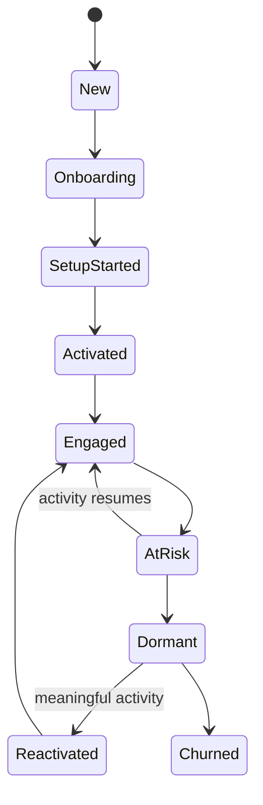
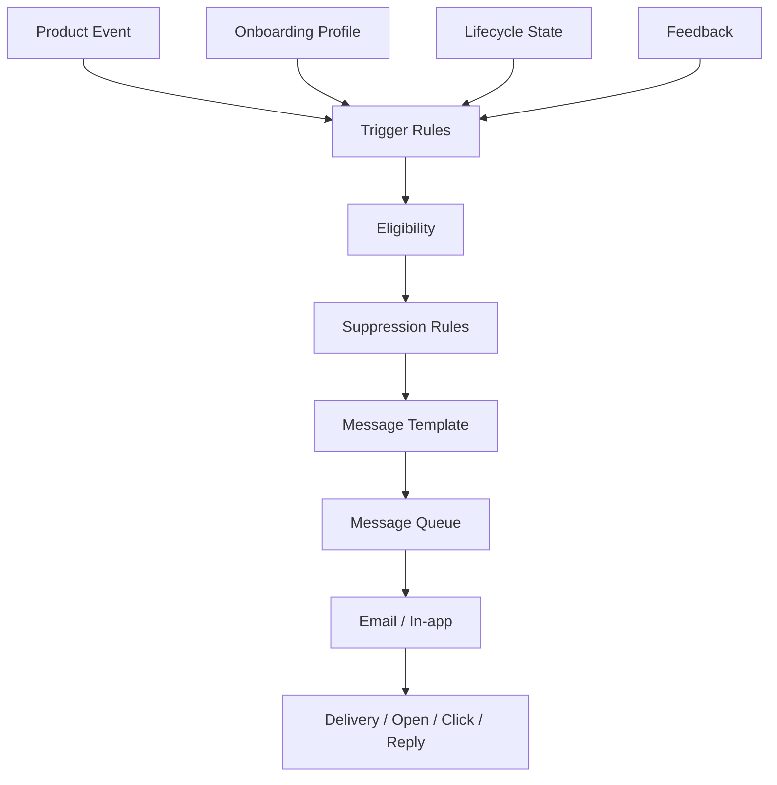
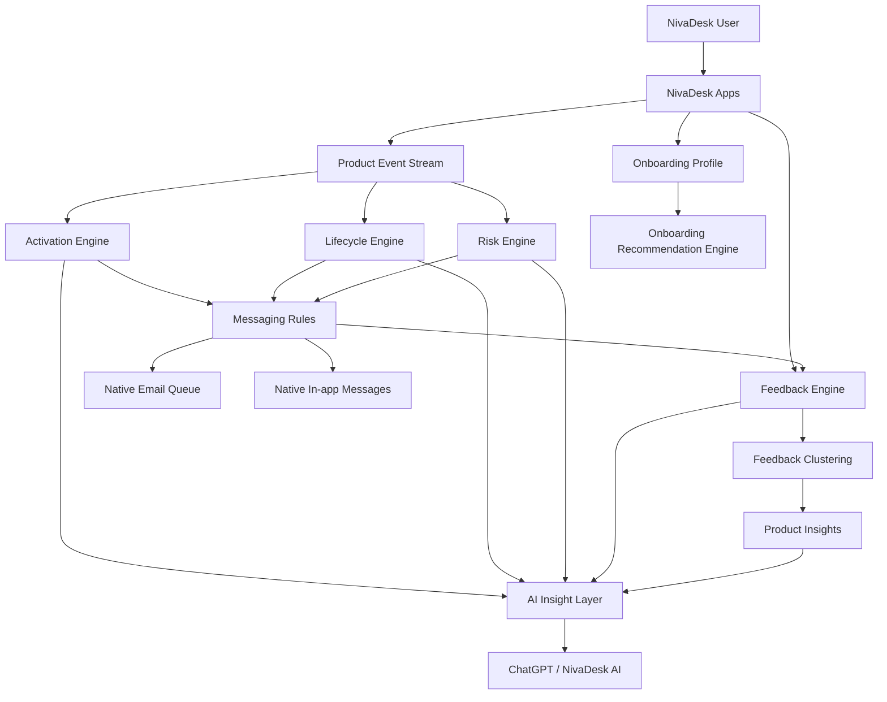
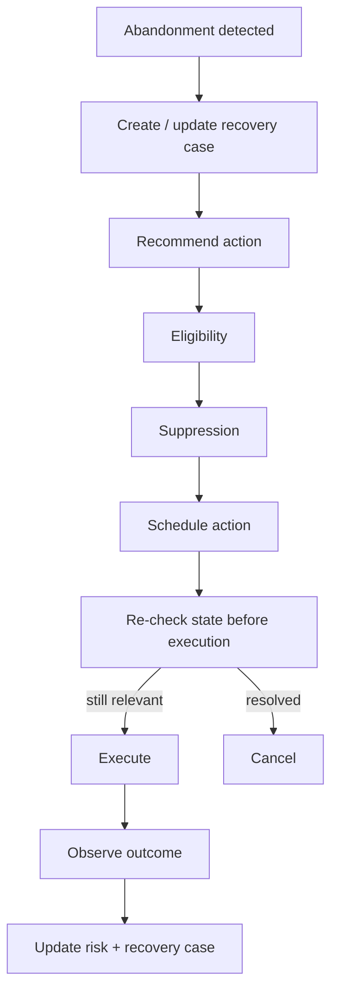

# 1. Bu dosyanın amacı

Bu belge, NivaDesk'e yeni üye olan kullanıcıların:

- kendilerini değerli hissetmesini;
- NivaDesk'i neden seçtiklerinin anlaşılmasını;
- üründen ne beklediklerinin öğrenilmesini;
- doğru onboarding yoluna otomatik yönlendirilmesini;
- ilk gerçek faydaya mümkün olduğunca hızlı ulaşmasını;
- takıldıkları noktaların otomatik fark edilmesini;
- doğru anda yardım görmesini;
- doğru anda feedback vermesini;
- ürünün eksiklerini erken aşamada NivaDesk ekibine iletebilmesini;
- kullanılmama / terk edilme riskinin erken fark edilmesini;
- geri kazanım mesajlarının davranışa göre gönderilmesini;
- verilen feedback'in roadmap ve ürün kararlarına dönüşmesini;
- kullanıcının söylediği eksik daha sonra tamamlandığında tekrar bilgilendirilmesini

sağlayacak **tamamen native NivaDesk sisteminin** uygulama sözleşmesidir.

Bu sistem Intercom, Userpilot, Appcues, PostHog, Canny, Sprig veya benzeri üçüncü parti araçlara bağlı olmak zorunda değildir.

> **Ana ürün kararı:** NivaDesk kendi kullanıcı onboarding, activation, lifecycle, feedback, retention ve AI insight altyapısına sahip olacaktır.

---

# 2. Neden native yapılmalı?

NivaDesk'in diğer SaaS'lardan farkı, kendi kullanıcısının işletme davranışını doğrudan bilmesidir.

NivaDesk şunları görebilir:

- kullanıcı hesabı ne zaman açtı;
- hangi işletme tipini seçti;
- hangi sales channel'ı bağladı;
- bağlantının başarılı olup olmadığı;
- kaç order import edildi;
- customer oluşturuldu mu;
- project/order oluşturuldu mu;
- bank bağlandı mı;
- receipt/invoice match edildi mi;
- ChatGPT kullanıldı mı;
- hangi özellik arandı;
- hangi ekranlarda hata oluştu;
- hangi entegrasyon talep edildi;
- feedback verildi mi;
- kullanıcı ne kadar süredir geri gelmedi.

Bu nedenle onboarding sistemi üçüncü parti bir ürünün yalnızca event olarak gördüğü şeyleri, NivaDesk **business context** ile birlikte anlayabilir.

Örnek:

```text
Kullanıcı:
- signup yaptı
- Shopify bağlamaya çalıştı
- OAuth 2 kez hata verdi
- Amazon integrations sayfasını açtı
- "Amazon var mı?" diye aradı
- feedback'te Amazon istedi
- 48 saat geri gelmedi
```

Native sistem bunu:

```text
activation_blocker = missing_or_failed_integration
risk = high
requested_provider = amazon
```

olarak anlayabilir.

Bu, sıradan page analytics'ten daha değerlidir.

---

# 3. Bu sistemin temel ilkeleri

## 3.1 Kullanıcıyı anketle boğma

Signup sırasında maksimum:

```text
2–3 kısa soru
```

sorulmalıdır.

Uzun feedback formu signup aşamasında YASAKTIR.

---

## 3.2 İlk amaç feedback değil, activation

Yeni kullanıcı henüz NivaDesk'i tanımadığı için:

> “NivaDesk'te ne eksik?”

sorusu ilk dakikada sorulmamalıdır.

İlk amaç:

```text
signup
→ understand goal
→ personalize
→ first value
```

olmalıdır.

---

## 3.3 Feedback doğru anda sorulmalı

Feedback soruları davranışa göre tetiklenmelidir.

Örnek:

```text
integration_connected
→ ask effort
```

veya:

```text
integration_failed x2
→ offer help
```

veya:

```text
activated + 2 sessions
→ ask missing expectation
```

---

## 3.4 Mesajlar generic değil contextual olmalı

Yanlış:

> Complete your setup.

Doğru:

> You started connecting Shopify but didn't finish. Need help?

---

## 3.5 Kullanıcının cevabı ürünü değiştirmeli

Kullanıcı:

```text
Primary goal = Banking & bookkeeping
```

seçtiyse onboarding:

```text
Bank → Transactions → Receipts → Matching
```

öncelikli olmalıdır.

Anket yalnız data collection olmamalıdır.

---

## 3.6 İlk kullanıcılar normal signup değildir

NivaDesk henüz erken aşamada olduğundan ilk kullanıcılar:

```text
early_customer
```

olarak işaretlenebilir.

Bu kullanıcılar ürün gelişimine daha yakından dahil edilir.

---

## 3.7 İnsan teması korunmalı

Sistem native ve otomatik olsa da kullanıcı tamamen botla karşılaşmamalıdır.

Founder / team message gerçek bir kişi adıyla gönderilebilir.

Örneğin:

```text
Gunes from NivaDesk
```

Mesajlar reply edilebilir olmalıdır.

---

# 4. Kullanıcı lifecycle modeli

Her workspace/user bir lifecycle state taşır.

```ts
type UserLifecycleState =
  | "new"
  | "onboarding"
  | "setup_started"
  | "activated"
  | "engaged"
  | "at_risk"
  | "dormant"
  | "churned"
  | "reactivated";
```

Akış:



---

# 5. Lifecycle state tanımları

## NEW

Koşul:

```text
account created
AND onboarding_not_started
```

## ONBOARDING

Koşul:

```text
onboarding_started
AND onboarding_not_completed
```

## SETUP_STARTED

Koşul:

En az bir anlamlı setup aksiyonu:

- integration connect started;
- bank connect started;
- first customer created;
- first project/order started;
- first inventory item added;
- accounting connection started;
- first ChatGPT business-data setup started.

## ACTIVATED

Kullanıcı NivaDesk'ten ilk gerçek değeri gördü.

Activation kullanıcı tipine göre farklı olabilir.

## ENGAGED

Activated kullanıcı son belirlenen dönem içinde düzenli meaningful events üretiyor.

## AT_RISK

Daha önce activated/engaged olmuş fakat beklenen kullanım ritmi azalmış.

## DORMANT

Uzun süredir meaningful activity yok.

## CHURNED

Plan cancellation veya belirlenen churn policy.

## REACTIVATED

Dormant/churn-risk kullanıcı yeniden meaningful event yaptı.

---

# 6. Activation tek bir event değildir

NivaDesk farklı kullanıcı tipleri için farklı activation paths desteklemelidir.

```ts
type ActivationPath =
  | "commerce"
  | "bespoke_studio"
  | "finance"
  | "inventory"
  | "ai"
  | "accounting"
  | "general";
```

---

# 7. Commerce activation

Örnek:

```text
Sign up
↓
Connect Shopify/Etsy/Amazon/eBay/Woo
↓
Import first order
↓
ACTIVATED
```

Zorunlu activation event:

```text
first_external_order_imported
```

Alternatif:

```text
integration_connected + products_imported
```

tek başına activated sayılmamalıdır.

İlk gerçek operational value aranmalıdır.

---

# 8. Bespoke studio activation

Örnek:

```text
Sign up
↓
Create/import customer
↓
Create first project/order
↓
Save workflow
↓
ACTIVATED
```

Activation:

```text
first_customer_created
AND
first_project_or_order_created
```

---

# 9. Finance activation

```text
Sign up
↓
Connect bank
↓
Transactions imported
↓
First receipt/invoice/order match
↓
ACTIVATED
```

Activation:

```text
first_bank_match_completed
```

---

# 10. Inventory activation

```text
Sign up
↓
Create/import product
↓
Add inventory quantity
↓
Inventory used by order / stock movement
↓
ACTIVATED
```

---

# 11. AI activation

AI activation yalnız ChatGPT ekranının açılması değildir.

Doğru:

```text
business data connected
↓
meaningful ChatGPT question
↓
business-data grounded answer
```

Event:

```text
first_grounded_ai_answer
```

---

# 12. Primary onboarding questions

Signup tamamlandıktan hemen sonra kullanıcıya onboarding modal/page gösterilir.

## Soru 1

**What would you most like NivaDesk to help you with?**

Options:

```text
Manage orders & projects
Keep inventory organised
Bring my sales channels together
Banking & bookkeeping
Invoicing & payments
Manage customers
Use ChatGPT with my business
Everything in one place
Other
```

Database:

```ts
type PrimaryGoal =
  | "orders_projects"
  | "inventory"
  | "sales_channels"
  | "banking_bookkeeping"
  | "invoicing_payments"
  | "customers"
  | "chatgpt_business"
  | "all_in_one"
  | "other";
```

---

# 13. Acquisition source question

**How did you first hear about NivaDesk?**

Options:

```text
Google / Search
ChatGPT or another AI assistant
Instagram
YouTube
TikTok
Reddit / online community
A friend or colleague
Shopify / Etsy / another platform
Blog / article
Other
```

Database:

```ts
type AcquisitionSource =
  | "google_search"
  | "ai_assistant"
  | "instagram"
  | "youtube"
  | "tiktok"
  | "reddit_community"
  | "referral"
  | "platform_ecosystem"
  | "blog_article"
  | "other";
```

Other seçilirse:

```text
acquisition_source_other_text
```

saklanır.

Bu veri:

```text
self_reported_attribution
```

olarak etiketlenmelidir.

---

# 14. Business type question

**What best describes your business?**

Options:

```text
Bespoke / custom studio
Handmade / craft business
Jewellery / watches
E-commerce brand
Retail
Wholesale
Service business
Other
```

Database:

```ts
type BusinessType =
  | "bespoke_custom"
  | "handmade_craft"
  | "jewellery_watches"
  | "ecommerce"
  | "retail"
  | "wholesale"
  | "service"
  | "other";
```

---

# 15. Onboarding profile

```json
{
  "user_id": "usr_123",
  "workspace_id": "ws_123",
  "primary_goal": "sales_channels",
  "business_type": "bespoke_custom",
  "acquisition_source": "ai_assistant",
  "acquisition_source_other_text": null,
  "early_customer": true,
  "preferred_activation_path": "commerce",
  "onboarding_started_at": "ISO-8601",
  "onboarding_completed_at": "ISO-8601"
}
```

---

# 16. Personalized onboarding path engine

Onboarding profile sonrası sistem recommended next action üretir.

```ts
interface OnboardingRecommendation {
  recommendationId: string;
  userId: string;
  workspaceId: string;
  goal: PrimaryGoal;
  actionType: string;
  title: string;
  description: string;
  destination: string;
  priority: number;
}
```

---

# 17. Örnek onboarding yolları

## Sales channels

```text
Connect your first sales channel
↓
Import products
↓
Import first order
↓
Review order
```

CTA:

```text
Connect a sales channel
```

---

## Banking

```text
Connect your bank
↓
Import transactions
↓
Upload/attach receipt
↓
Match first transaction
```

CTA:

```text
Connect your bank
```

---

## Bespoke studio

```text
Add your first customer
↓
Create a project/order
↓
Add deposit/payment
↓
Set workflow stage
```

CTA:

```text
Create your first project
```

---

## AI

```text
Connect business data
↓
Ask your first business question
```

CTA:

```text
Connect data to ChatGPT
```

---

# 18. Welcome screen

UI:

```text
Welcome to NivaDesk, Alex.

Thanks for joining us.

You're joining NivaDesk at an early and important stage,
and we're genuinely grateful you've chosen to build your business with us.

A few quick answers will help us shape NivaDesk around the way you work.
```

Buton:

```text
Let's get started
```

---

# 19. “Özel hissettirme” ürün dili

Yapay:

```text
You are one of our most special users!!!
```

kullanılmamalıdır.

Doğru ton:

```text
You're joining us at an early stage.
Your feedback can directly influence what we build next.
```

veya:

```text
Every early customer matters to us, and we genuinely read what you tell us.
```

Amaç:

```text
false exclusivity
```

değil,

```text
real participation
```

hissidir.

---

# 20. Welcome email

Signup sonrası mümkünse dakikalar içinde gönderilir.

Sender display:

```text
Gunes from NivaDesk
```

Reply-to gerçek inbox olmalıdır.

Subject:

```text
Welcome to NivaDesk
```

Copy:

```text
Hi {{first_name}},

Thanks for joining NivaDesk.

We're still at a stage where every new customer genuinely matters to us,
so I wanted to personally say welcome.

We're building NivaDesk to bring the moving parts of running a business
into one calm workspace.

If you get stuck, find something confusing, or expected something that
isn't there, just reply to this email.

I genuinely want to know.

Gunes
NivaDesk
```

Bu email:

- sales-heavy olmamalı;
- 10 CTA içermemeli;
- reply edilebilir olmalı;
- founder/team identity taşımalı.

---

# 21. Message channel modeli

```ts
type MessageChannel =
  | "in_app"
  | "email"
  | "notification";
```

İlk release:

- in_app
- email

yeterlidir.

Push notification zorunlu değildir.

---

# 22. Messaging engine



---

# 23. Messaging rule modeli

```json
{
  "rule_id": "rule_activation_help_01",
  "name": "Setup started but not completed",
  "trigger": {
    "event": "integration_connect_started"
  },
  "conditions": [
    "integration_connected = false",
    "hours_since_trigger >= 12"
  ],
  "suppression": [
    "user_replied_to_founder = true",
    "integration_connected = true",
    "workspace_cancelled = true"
  ],
  "channel": "email",
  "template_id": "tmpl_setup_help"
}
```

---

# 24. Suppression kuralları

Kullanıcı davranışını tamamladıysa eski mesaj gönderilmemelidir.

Örnek:

```text
scheduled:
"Connect your first store"

before send:
integration_connected = true
```

Sonuç:

```text
message cancelled
```

Bu ZORUNLUDUR.

---

# 25. Product event sistemi

NivaDesk kendi event stream'ini oluşturmalıdır.

Event:

```ts
interface ProductEvent {
  eventId: string;
  eventName: string;
  userId?: string;
  workspaceId: string;
  occurredAt: string;
  source: "web" | "ios" | "android" | "macos" | "server" | "integration" | "ai";
  entityType?: string;
  entityId?: string;
  properties: Record<string, unknown>;
  correlationId?: string;
  causationId?: string;
}
```

---

# 26. Core onboarding events

```text
user_signed_up
welcome_screen_viewed
onboarding_started
onboarding_goal_selected
acquisition_source_selected
business_type_selected
onboarding_completed
recommended_action_viewed
recommended_action_clicked
```

---

# 27. Integration events

```text
integration_directory_viewed
integration_viewed
integration_connect_started
integration_auth_started
integration_auth_failed
integration_connected
integration_sync_started
integration_sync_failed
integration_first_data_imported
integration_disconnected
```

Properties:

```json
{
  "provider": "shopify",
  "attempt_number": 2,
  "error_class": "oauth",
  "recoverable": true
}
```

---

# 28. Orders/project events

```text
customer_created
project_created
order_created
external_order_imported
order_opened
order_status_changed
first_customer_created
first_project_created
first_order_created
first_external_order_imported
```

---

# 29. Banking events

```text
bank_connect_started
bank_connected
bank_sync_failed
transactions_imported
receipt_uploaded
invoice_uploaded
bank_match_suggested
bank_match_completed
first_bank_match_completed
```

---

# 30. Inventory events

```text
inventory_item_created
inventory_imported
inventory_adjusted
inventory_reserved
first_inventory_item_created
first_inventory_used_in_order
```

---

# 31. AI events

```text
chatgpt_opened
ai_question_submitted
ai_answer_returned
ai_answer_grounded
ai_action_proposed
ai_action_approved
ai_action_executed
first_grounded_ai_answer
```

PII/sensitive prompt content event property olarak saklanmamalıdır.

---

# 32. Feedback events

```text
feedback_prompt_shown
feedback_prompt_dismissed
feedback_submitted
feedback_followup_submitted
feature_request_created
feedback_linked_to_feature
feedback_status_changed
feedback_user_notified
```

---

# 33. Retention events

```text
activation_completed
engagement_threshold_reached
user_marked_at_risk
user_became_dormant
user_reactivated
subscription_cancel_started
subscription_cancelled
winback_message_sent
winback_clicked
```

---

# 34. First success feedback

Kullanıcı ilk anlamlı setup işlemini tamamladıktan sonra küçük contextual feedback.

Örnek:

```text
Your Shopify store is connected ✓
82 orders are now in NivaDesk.

How was getting set up?
```

Options:

```text
Easy
Okay
Difficult
```

Database:

```ts
type EffortRating =
  | "easy"
  | "okay"
  | "difficult";
```

---

# 35. Difficult follow-up

Kullanıcı `difficult` seçerse:

**What made it difficult?**

Options:

```text
I wasn't sure what to do
Something didn't work
I couldn't find a feature
The terminology was confusing
It took too long
Other
```

Optional textarea.

---

# 36. Missing expectation feedback

İlk dakikada sorulmaz.

Eligibility örneği:

```text
activated = true
AND
meaningful_sessions >= 2
AND
days_since_signup >= 2
AND
missing_expectation_feedback_not_asked
```

Prompt:

```text
Could we ask you one thing?

What's the one thing you expected NivaDesk to do that you couldn't find?
```

Tek textarea.

Bu soru:

```text
What features do you want?
```

sorusundan daha değerlidir.

---

# 37. Non-activation feedback

Kullanıcı:

```text
signup
+
24–48 hours
+
no activation
```

ise:

```text
activation_blocker_prompt
```

gösterilebilir.

Question:

**What stopped you getting started?**

Options:

```text
I didn't understand how to start
The integration I need isn't available
A feature I need is missing
It felt too complicated
I didn't have time
Something didn't work
I'm just exploring for now
Other
```

Optional text.

---

# 38. In-app blocker detection

Örnek:

```text
integration_auth_failed
AND same provider
AND count >= 2
AND within 30 minutes
```

NivaDesk gösterir:

```text
Having trouble connecting Shopify?

We can help.
```

Actions:

```text
Ask us
Try again
Dismiss
```

---

# 39. Contextual help

Contextual help generic support widget'tan farklıdır.

Örnek:

```text
Bank connection failed twice.
```

Message:

```text
It looks like the bank connection isn't completing.

Tell us what you're seeing and we'll help.
```

Context otomatik eklenir:

```text
provider
error class
attempt count
screen
timestamp
```

Secret/error raw data kullanıcı feedback'ine eklenmemelidir.

---

# 40. Feedback Inbox

NivaDesk admin/product alanında yeni bir bölüm:

```text
Product
→ Customer Feedback
```

Her kayıt:

```json
{
  "feedback_id": "fb_123",
  "workspace_id": "ws_123",
  "user_id": "usr_123",
  "source": "in_app",
  "feedback_type": "activation_blocker",
  "stage": "onboarding",
  "text": "I couldn't connect Amazon.",
  "category": "integration",
  "provider": "amazon",
  "impact": "blocked",
  "status": "new",
  "owner_user_id": null,
  "created_at": "ISO-8601"
}
```

---

# 41. Feedback types

```ts
type FeedbackType =
  | "onboarding_effort"
  | "activation_blocker"
  | "missing_expectation"
  | "feature_request"
  | "bug_report"
  | "confusion"
  | "general_feedback"
  | "cancellation_reason"
  | "interview_note";
```

---

# 42. Feedback categories

```text
integration
orders
projects
customers
inventory
banking
receipts
invoicing
payments
accounting
shipping
ai_chatgpt
mobile
performance
ux
terminology
pricing
other
```

---

# 43. Feedback impact

```ts
type FeedbackImpact =
  | "minor"
  | "annoyance"
  | "slows_work"
  | "blocked"
  | "churn_risk";
```

AI önerebilir ama kullanıcı/admin değiştirebilir.

---

# 44. Feedback status

```ts
type FeedbackStatus =
  | "new"
  | "reviewing"
  | "planned"
  | "in_progress"
  | "shipped"
  | "closed"
  | "not_planned";
```

---

# 45. Feedback admin listesi

Kolonlar:

```text
User
Company
Joined
Lifecycle
Primary goal
Acquisition source
Feedback
Category
Impact
Status
Owner
Created
```

Filters:

```text
activation blocker
churn risk
integration
provider
business type
acquisition source
new users
activated users
not activated
date
status
```

---

# 46. Feedback detail

Gösterilecek context:

- user;
- company;
- plan;
- signup date;
- early customer;
- business type;
- primary goal;
- acquisition source;
- lifecycle state;
- activation path;
- activation status;
- last meaningful activity;
- relevant integration status;
- feedback;
- AI classification;
- related similar feedback;
- related product task;
- notification history;
- internal notes.

---

# 47. AI feedback classification

ChatGPT/AI layer feedback geldiğinde şu alanları önerebilir:

```json
{
  "category": "integration",
  "provider": "amazon",
  "impact": "blocked",
  "intent": "missing_capability",
  "summary": "User cannot activate because Amazon integration is unavailable.",
  "confidence": 0.95
}
```

AI classification yalnız suggestion'dır.

Original feedback text değişmez.

---

# 48. Feedback clustering

AI benzer feedback'leri cluster eder.

Örnek:

```text
Amazon integration
12 users
7 activation blocked
3 churn risk

Bank connection confusion
7 users
4 activation blocked

Inventory terminology
5 users
1 activation blocked
```

Cluster:

```json
{
  "cluster_id": "fc_123",
  "title": "Amazon integration missing",
  "feedback_count": 12,
  "blocked_users": 7,
  "at_risk_users": 3,
  "affected_revenue": null,
  "first_seen_at": "ISO-8601",
  "last_seen_at": "ISO-8601"
}
```

---

# 49. Feedback priority score

Priority yalnız count değildir.

Önerilen score:

```text
priority =
  feedback_count_weight
  + blocked_activation_weight
  + churn_risk_weight
  + strategic_fit_weight
  + recency_weight
```

Örnek:

```text
1 user "dark mode"
```

ile:

```text
7 users "cannot activate because Amazon is missing"
```

aynı değildir.

---

# 50. Product Task oluşturma

Feedback cluster'dan:

```text
Create Product Task
```

aksiyonu.

Task:

```json
{
  "task_id": "prd_task_123",
  "title": "Amazon seller integration",
  "source": "customer_feedback",
  "related_feedback_cluster_id": "fc_123",
  "affected_users": 12,
  "activation_blocked_users": 7
}
```

---

# 51. Feedback → shipped loop

Feature shipping olduğunda bağlı feedback kullanıcıları bulunur.

Akış:

```text
Product task shipped
↓
related feedback records
↓
eligible users
↓
prepare personal update
↓
send
↓
feedback_status = shipped
```

---

# 52. Feature shipped mesajı

Örnek:

```text
Hi Alex,

You told us Amazon was one of the things stopping you from using NivaDesk.

It's now available.

Thanks for helping us make NivaDesk better.

Gunes
NivaDesk
```

Bu mesaj generic changelog yerine kullanıcı feedback'iyle ilişkilidir.

---

# 53. Kullanıcıya “dinlendim” hissi

Sistem yalnız feedback almamalıdır.

Feedback lifecycle:

```text
heard
→ reviewed
→ built
→ user informed
```

NivaDesk için fark yaratan özellik budur.

---

# 54. Early Customer Care sistemi

İlk belirlenen kullanıcı grubu:

```text
early_customer = true
```

olabilir.

Önerilen başlangıç:

```text
ilk 300 workspace
```

veya manuel cutoff.

Bu sayı config olmalıdır.

---

# 55. Early customer davranışları

Early customer için:

- founder welcome email;
- daha hızlı feedback prompt;
- optional interview invitation;
- product team visibility;
- feature shipped personal notification;
- feedback priority report'ta ayrı segment.

---

# 56. Founder interview invitation

Eligibility:

```text
early_customer = true
AND
activated = true
AND
days_since_activation >= 2
AND
interview_invite_not_sent
```

In-app/email:

```text
NivaDesk is still young, and conversations with early customers
directly shape what we build.

If you'd ever be happy to have a short conversation with us,
we'd love to hear how you run your business.
```

CTA:

```text
I'd be happy to chat
```

Dismiss mümkündür.

Tekrar ısrar edilmez.

---

# 57. Manual customer care task

Kullanıcı:

```text
impact = blocked
AND early_customer = true
```

ise:

```text
Customer Care Task
```

oluşturulabilir.

Örnek:

```text
Reach out to Alex — blocked by Amazon integration
```

---

# 58. At-risk motoru

At-risk yalnız login olmamasına bakmamalıdır.

Signals:

- no meaningful activity;
- failed integrations;
- repeated errors;
- no activation;
- cancelled onboarding;
- unresolved blocking feedback;
- previously active usage drop;
- subscription cancel intent;
- repeated missing feature search;
- support issue unresolved.

---

# 59. Risk score

```text
risk_score =
  inactivity
  + activation_failure
  + blocker_feedback
  + repeated_error
  + usage_drop
  + cancellation_signal
```

Örnek:

```json
{
  "workspace_id": "ws_123",
  "risk_score": 82,
  "risk_level": "high",
  "reasons": [
    "not_activated_after_48h",
    "integration_failed_3_times",
    "blocked_feedback_open"
  ]
}
```

---

# 60. At-risk seviyeleri

```ts
type RiskLevel =
  | "low"
  | "medium"
  | "high"
  | "critical";
```

İlk sürümde complex ML gerekmez.

Rule-based yeterlidir.

---

# 61. No-activation sequence

Örnek default:

## +12 saat

In-app only:

```text
Need a hand getting started?
```

## +24–48 saat

Personal email:

```text
Hi {{first_name}},

Thanks again for trying NivaDesk.

I noticed you haven't had the chance to get fully set up yet.

If anything was unclear, missing, or simply didn't work the way you expected,
I'd really appreciate hearing what got in the way.

You can just reply to me here.

Gunes
```

## Sonra

Activation blocker survey.

---

# 62. No-activation mesajı suppression

Aşağıdakiler varsa gönderilmez:

```text
activated = true
user_replied = true
support_case_open = true
workspace_cancelled = true
message_opt_out = true
```

---

# 63. Engaged kullanıcı tanımı

İş tipine göre farklı olabilir.

Örnek commerce:

```text
meaningful_order_activity >= threshold
OR
inventory activity
OR
bank activity
```

Bespoke:

```text
projects/orders updated
customers updated
payments updated
```

AI:

```text
grounded AI usage
```

Generic login engagement değildir.

---

# 64. Meaningful event registry

Her event:

```json
{
  "event_name": "external_order_imported",
  "meaningful": true,
  "activation_weight": 5,
  "engagement_weight": 3
}
```

UI page view:

```json
{
  "event_name": "settings_viewed",
  "meaningful": false
}
```

---

# 65. Dormancy

Config örneği:

```yaml
dormancy:
  new_unactivated_days: 7
  activated_low_frequency_days: 14
  engaged_high_frequency_days: 7
```

Hardcoded olmamalıdır.

---

# 66. Win-back

Dormant kullanıcıya tek generic blast yerine sebebe göre mesaj.

Örnek:

```text
reason = amazon_missing
```

ve Amazon artık mevcut.

Mesaj:

```text
You asked us for Amazon. It's now available.
```

Bu en güçlü win-back türüdür.

---

# 67. Cancellation feedback

Subscription cancel başladığında:

```text
Why are you leaving?
```

Options:

```text
Missing feature
Missing integration
Too difficult to use
Too expensive
Not using it enough
Switched to another tool
Technical issues
Just testing
Other
```

Optional:

```text
What could have changed your mind?
```

---

# 68. Cancellation save offer

İlk sürümde agresif discount engine yapılmamalıdır.

Önce öğrenme.

Missing integration ise:

```text
notify when available
```

teklif edilebilir.

Too difficult ise:

```text
offer help
```

Too expensive ise ileride commercial policy.

---

# 69. Message frequency cap

Kullanıcıyı bunaltmamak için:

```yaml
message_frequency:
  onboarding_in_app_max_per_day: 2
  onboarding_email_max_per_48h: 1
  feedback_prompt_max_per_7d: 1
  founder_message_max_initial: 1
```

Critical transactional/support messages hariç.

---

# 70. Prompt dismissal memory

Kullanıcı feedback prompt'u kapatırsa:

```text
feedback_prompt_dismissed
```

saklanır.

Aynı prompt aynı session'da tekrar gösterilmez.

Tekrar gösterim:

```text
minimum cooldown
```

sonrası olabilir.

---

# 71. Message template modeli

```json
{
  "template_id": "tmpl_founder_welcome",
  "channel": "email",
  "name": "Founder welcome",
  "subject": "Welcome to NivaDesk",
  "body_template": "...",
  "active": true,
  "version": 3
}
```

Template versioning zorunludur.

---

# 72. User messaging history

```text
customer_messages
```

tablosu.

Alanlar:

```json
{
  "message_id": "msg_123",
  "workspace_id": "ws_123",
  "user_id": "usr_123",
  "rule_id": "rule_123",
  "template_id": "tmpl_123",
  "template_version": 2,
  "channel": "email",
  "status": "sent",
  "sent_at": "ISO-8601",
  "opened_at": null,
  "clicked_at": null,
  "reply_received": false
}
```

---

# 73. Email reply ingestion

Founder email reply gerçek customer feedback'e dönüşebilmelidir.

Akış:

```text
reply received
↓
link to user/workspace
↓
create feedback
↓
AI classification
↓
Feedback Inbox
```

İlk sürümde reply ingestion connector yoksa admin manuel create yapabilir.

Ama architecture hazır olmalıdır.

---

# 74. Admin Customer Journey

Her user/workspace için timeline:

```text
12:01 Signed up
12:02 Goal: Sales channels
12:02 Source: ChatGPT
12:03 Shopify connect started
12:04 Shopify auth failed
12:06 Shopify auth failed
12:07 Help prompt shown
12:10 Feedback: "Connection keeps failing"
12:12 Founder message sent
13:03 Shopify connected
13:05 82 orders imported
13:06 Activated
```

Bu ekran product/support için çok değerlidir.

---

# 75. Customer Journey veri modeli

Journey yeni bir duplicate event store değildir.

Product events query edilerek oluşturulur.

Gerekirse materialized summary:

```text
customer_journey_summary
```

kullanılır.

---

# 76. Funnel analytics native

NivaDesk temel funnel'ları kendi hesaplayabilir.

Örnek:

```text
100 signups
↓
86 onboarding completed
↓
67 setup started
↓
51 activation completed
↓
43 engaged after 7 days
```

---

# 77. Acquisition source funnel

```text
ChatGPT / AI:
  40 signups
  31 onboarding
  25 activated
  activation rate 62.5%

Google:
  60 signups
  44 onboarding
  21 activated
  activation rate 35%
```

Bu, yalnız signup sayısından daha değerlidir.

---

# 78. Business type funnel

Örnek:

```text
Bespoke/custom
E-commerce
Wholesale
Service
```

için activation farkları.

Bu bilgiler product positioning için kullanılır.

---

# 79. Activation blocker dashboard

Dashboard:

```text
Top activation blockers — last 30 days

Amazon integration missing      12
Bank connection confusion        8
Inventory setup unclear          5
Didn't have time                 4
Shopify auth issue               3
```

Yanında:

```text
blocked users
at-risk users
feedback count
trend
```

---

# 80. Retention dashboard

Widgets:

- New signups;
- Onboarding completion;
- Setup started;
- Activation rate;
- 7-day activated retention;
- At-risk users;
- Dormant users;
- Reactivations;
- Top blockers;
- Acquisition source activation;
- Top feedback clusters.

---

# 81. AI weekly summary

ChatGPT/NivaDesk AI şu soruya cevap verebilmelidir:

> Bu hafta yeni üyeler neden activate olmadı?

Örnek çıktı:

```text
26 new signups
17 completed onboarding
11 activated
6 did not activate

Main blockers:
- 3 Amazon integration unavailable
- 2 bank setup unclear
- 1 Shopify connection error

Most common acquisition source:
ChatGPT — 9 signups

Highest activation source:
Referral — 78%

Recommended action:
Improve bank connection onboarding and surface Amazon availability earlier.
```

---

# 82. AI read tools

Önerilen MCP tools:

```text
onboarding_get_summary
onboarding_list_new_users
onboarding_list_unactivated_users
onboarding_get_user_journey
onboarding_get_activation_funnel
onboarding_get_activation_by_source
onboarding_get_activation_by_business_type

feedback_list
feedback_get
feedback_get_clusters
feedback_get_top_blockers
feedback_get_feature_requests
feedback_get_churn_risks

retention_list_at_risk_users
retention_list_dormant_users
retention_get_reactivation_report
retention_get_weekly_summary
```

---

# 83. AI proposal tools

```text
feedback_propose_category
feedback_propose_cluster
feedback_propose_product_task
feedback_propose_owner
retention_propose_followup
retention_propose_winback_message
onboarding_propose_rule_change
```

AI admin product decisions'i otomatik execute etmemelidir.

---

# 84. AI user-facing tools

NivaDesk customer-facing ChatGPT kullanıcının kendi onboarding verisini sınırlı biçimde görebilir.

Örnek:

> “NivaDesk'i kurarken sırada ne yapmalıyım?”

AI:

```text
You've already connected Shopify.
Your next recommended step is to review your imported orders.
```

Ancak başka kullanıcıların feedback/analytics verisi tenant dışına çıkamaz.

---

# 85. Internal AI vs customer AI

İki ayrı permission scope:

```text
internal_product_insights
customer_workspace_assistant
```

Internal AI:

- cross-user aggregated insights;
- feedback clusters;
- activation analysis.

Customer AI:

- yalnız kendi workspace data.

Bu ayrım ZORUNLUDUR.

---

# 86. Data model tabloları

Önerilen tablolar/collections:

```text
onboarding_profiles
user_lifecycle_states
activation_definitions
activation_progress
product_events
event_definitions
message_rules
message_templates
customer_messages
feedback_records
feedback_clusters
feedback_cluster_links
product_tasks
feedback_product_task_links
customer_care_tasks
risk_scores
lifecycle_state_history
customer_journey_summaries
```

---

# 87. `activation_progress`

```json
{
  "workspace_id": "ws_123",
  "activation_path": "commerce",
  "steps": {
    "integration_connected": true,
    "first_order_imported": true
  },
  "activated": true,
  "activated_at": "ISO-8601"
}
```

---

# 88. Lifecycle history

State yalnız overwrite edilmemeli.

```json
{
  "workspace_id": "ws_123",
  "from_state": "setup_started",
  "to_state": "activated",
  "reason": "first_external_order_imported",
  "occurred_at": "ISO-8601"
}
```

---

# 89. Risk score history

Risk score değişimleri izlenebilir.

```json
{
  "workspace_id": "ws_123",
  "score": 75,
  "level": "high",
  "reasons": ["not_activated_48h"],
  "calculated_at": "ISO-8601"
}
```

---

# 90. Event deduplication

Server/integration event'leri idempotent olmalıdır.

Unique event key:

```text
source
+ event_name
+ entity_id
+ provider_event_id / causation_id
```

gibi uygun dedupe.

Bir Shopify webhook tekrar geldi diye:

```text
first_order_imported
```

iki kez tetiklenmemelidir.

---

# 91. First-event markers

First events transactionally korunmalıdır.

Örnek:

```text
first_bank_match_completed
```

yalnız bir kez.

`first_*` event'leri sonradan analytics için kritik olduğundan race-condition yaratmamalıdır.

---

# 92. Event privacy

Product event properties:

- token;
- raw invoice;
- bank account number;
- full card;
- password;
- secret;
- raw email body;
- raw ChatGPT prompt containing sensitive data

saklamamalıdır.

Event:

```text
bank_match_completed
```

olabilir.

Ama:

```text
bank_description_raw
```

gerekmiyorsa analytics event'e konmaz.

---

# 93. Session replay kararı

İlk release'te native session replay YAPILMAYACAK.

Neden:

- yüksek teknik karmaşıklık;
- DOM capture;
- platform farklılıkları;
- privacy masking;
- storage;
- replay rendering;
- Banking/invoice/customer PII riski.

İlk sürümde event + journey verisi yeterli kabul edilir.

---

# 94. Heatmap kararı

İlk release'te heatmap zorunlu değildir.

Gelecekte ihtiyaç oluşursa event tabanlı click aggregation yapılabilir.

Ama onboarding MVP blocker değildir.

---

# 95. A/B testing kararı

İlk release'te full experimentation platform gerekmez.

Basit feature flag:

```text
onboarding.copy.variant
```

desteklenebilir.

Future:

```text
experiment assignment
metric
variant
```

eklenebilir.

---

# 96. Native sistem mimarisi



---

# 97. Backend servis sınırları

Önerilen logical services:

```text
OnboardingService
ProductEventService
ActivationService
LifecycleService
RiskService
MessagingService
FeedbackService
FeedbackInsightService
CustomerJourneyService
ProductInsightService
```

Tek deploy olmak zorunda değildir.

Logical separation yeterlidir.

---

# 98. ProductEventService

Sorumluluk:

- event validation;
- schema version;
- write;
- dedupe;
- first-event marking;
- downstream dispatch.

Doğrudan messaging kararını içermez.

---

# 99. ActivationService

Sorumluluk:

- activation path;
- required milestones;
- progress;
- activation completion;
- activation timestamp.

---

# 100. LifecycleService

Sorumluluk:

- current state;
- transition rules;
- transition history.

---

# 101. RiskService

Sorumluluk:

- risk signals;
- score;
- reasons;
- risk transitions;
- high-risk tasks.

İlk release rule-based.

---

# 102. MessagingService

Sorumluluk:

- trigger rules;
- eligibility;
- suppression;
- cooldown;
- template selection;
- queue;
- delivery tracking.

---

# 103. FeedbackService

Sorumluluk:

- feedback create;
- context attach;
- classification proposal;
- status;
- owner;
- product task link;
- user notification link.

---

# 104. CustomerJourneyService

Sorumluluk:

- event timeline;
- meaningful milestones;
- message history;
- feedback history;
- lifecycle timeline.

---

# 105. ProductInsightService

Sorumluluk:

- funnels;
- cohorts;
- acquisition;
- blockers;
- retention;
- feedback clusters;
- weekly summaries.

---

# 106. Native email delivery

NivaDesk email provider değişebilir.

Bu spec provider-independent olmalıdır.

Interface:

```ts
interface EmailProvider {
  send(message: OutboundEmail): Promise<EmailSendResult>;
}
```

Messaging rules provider'a doğrudan bağlı olmamalıdır.

---

# 107. Email queue

```text
message intent
→ eligibility
→ suppression
→ render
→ queue
→ send
→ provider result
→ delivery state
```

Retry idempotent olmalıdır.

Aynı welcome email retry ile iki kez gitmemelidir.

---

# 108. In-app message modeli

```json
{
  "message_id": "im_123",
  "user_id": "usr_123",
  "placement": "dashboard_top",
  "type": "help",
  "title": "Need a hand getting started?",
  "body": "...",
  "primary_action": {},
  "dismissible": true,
  "expires_at": "ISO-8601"
}
```

---

# 109. In-app placement'lar

İlk release:

```text
dashboard_top
page_inline
modal_small
success_panel
settings_integrations
```

Full-screen interrupt yalnız onboarding başlangıcında.

---

# 110. UI prensibi

Onboarding:

- premium;
- sakin;
- az seçenek;
- tek ana CTA;
- küçük ilerleme;
- mobile uyumlu;
- skip edilebilir alanlar;
- keyboard accessible;
- screen reader labels.

---

# 111. Progress indicator

Örnek:

```text
Step 1 of 3
```

Ama:

```text
13-step onboarding
```

yapılmamalıdır.

---

# 112. Onboarding skip

Acquisition source gibi sorular:

```text
Skip
```

opsiyonuna sahip olabilir.

Primary goal mümkünse gerekli tutulabilir.

Ama account creation bunun yüzünden bloklanmamalıdır.

---

# 113. Onboarding re-entry

Kullanıcı onboarding'i yarıda bırakırsa dashboard'a girebilir.

NivaDesk:

```text
Continue setup
```

kartı gösterir.

Onboarding modal kullanıcıyı her login'de kilitlememelidir.

---

# 114. Recommended setup checklist

Dashboard:

```text
Your NivaDesk setup

✓ Tell us what you'd like help with
□ Connect your first sales channel
□ Import your first order
```

Ama personalized.

Finance user:

```text
✓ Tell us your goal
□ Connect your bank
□ Match your first transaction
```

---

# 115. Checklist complete

Activation tamamlandıysa checklist:

```text
You're set up ✓
```

olup collapse olabilir.

Sonsuza kadar dashboard'da kalmamalıdır.

---

# 116. Success celebrations

Küçük ve kontrollü.

Örnek:

```text
Shopify connected ✓
82 orders are now in NivaDesk.
```

Confetti gibi aşırı görsel zorunlu değildir.

Premium ürün tonuna uygun.

---

# 117. Error-aware onboarding

Onboarding recommendation başarılı state'e göre ilerler.

Yanlış:

```text
Connect Shopify
```

step'i OAuth başlatılınca complete.

Doğru:

```text
integration_connected
AND initial verification passed
```

sonrası complete.

---

# 118. Integration unavailable behavior

Kullanıcı onboarding'de Amazon seçer ama connector Coming Soon ise:

```text
Amazon is coming soon.
```

Ardından:

```text
Notify me when it's available
```

ve alternatif:

```text
Connect another channel
```

Bu seçim feedback/interest olarak saklanır.

---

# 119. Missing integration interest

```json
{
  "feedback_type": "feature_request",
  "category": "integration",
  "provider": "amazon",
  "source": "onboarding",
  "impact": "unknown"
}
```

Ama kullanıcı:

```text
I cannot use NivaDesk without Amazon
```

derse:

```text
impact = blocked
```

---

# 120. Feature interest vs blocker ayrımı

```text
"Would be nice"
```

ile:

```text
"I cannot start without this"
```

aynı değildir.

Feedback UI sorabilir:

```text
Is this stopping you from getting started?
Yes / No
```

---

# 121. Feedback prompt timing rules

## Onboarding effort

Immediately after first successful setup action.

## Missing expectation

After activation + meaningful usage.

## Activation blocker

24–48h without activation.

## General feedback

Not more than once per configured period.

## NPS/PMF-like survey

İlk release zorunlu değildir.

Later:

```text
activated + enough usage
```

sonrası.

---

# 122. PMF question — future

Gelecekte:

```text
How would you feel if you could no longer use NivaDesk?
```

Options:

```text
Very disappointed
Somewhat disappointed
Not disappointed
```

Ama yeni signup'a sorulmaz.

---

# 123. NPS — future

NPS:

```text
How likely are you to recommend NivaDesk?
```

yalnız:

```text
activated
+
meaningful usage history
```

sonrası.

İlk onboarding sisteminin parçası değildir.

---

# 124. Admin “New Customers” view

Yeni admin/customer-success ekranı:

```text
Customers
→ New Customers
```

Kolonlar:

```text
Customer
Company
Joined
Goal
Source
Business type
Activation
Lifecycle
Risk
Last activity
Feedback
```

---

# 125. New customer filters

```text
Joined today
Joined this week
Not activated
Activated
High risk
Early customers
Needs reply
Blocked
Missing integration
```

---

# 126. Needs reply

Feedback:

```text
requires_human_reply = true
```

olabilir.

Örnek:

- bug;
- blocked;
- angry/churn;
- founder email reply;
- enterprise lead.

---

# 127. Customer care owner

```text
owner_user_id
```

alanı.

İlk aşamada Gunes/Ecem/ekip.

Later customer-success team.

---

# 128. Internal note

Admin:

```text
internal_notes
```

ekleyebilir.

AI customer-facing response bu notları görmez.

---

# 129. Customer priority

```ts
type CustomerCarePriority =
  | "normal"
  | "high"
  | "urgent";
```

High:

```text
blocked early customer
```

Urgent:

```text
payment/subscription critical issue
```

---

# 130. Product analytics retention

Event retention süresi config olmalıdır.

Raw product events sonsuza kadar tutulmak zorunda değildir.

Aggregates daha uzun tutulabilir.

Örnek:

```yaml
retention:
  raw_product_events_days: 365
  message_delivery_events_days: 365
  feedback_records: account_lifetime_or_policy
  aggregate_metrics: long_term
```

Gerçek policy hukuki/privacy gereksinimleriyle uyarlanmalıdır.

---

# 131. Account deletion

Workspace deletion:

- onboarding profile;
- feedback PII;
- journey;
- message history

retention policy'ye göre silinmeli/anonymize edilmelidir.

Product aggregate istatistikleri anonymized ise kalabilir.

---

# 132. Consent / marketing distinction

Onboarding/service messages ile marketing email aynı şey kabul edilmemelidir.

Transactional/service:

```text
welcome
setup help
requested feature update
support
```

Marketing:

```text
newsletter
promotional campaign
```

ayrı preference olmalıdır.

Yasal uygulama bölgeye göre doğrulanmalıdır.

---

# 133. User preferences

```json
{
  "service_emails": true,
  "product_updates": true,
  "marketing_emails": false,
  "feedback_requests": true
}
```

Critical transactional messages ayrı policy.

---

# 134. ChatGPT internal örnek sorgular

- “Bu hafta kaç yeni kullanıcı activate oldu?”
- “En çok hangi noktada bırakıyorlar?”
- “ChatGPT'den gelen kullanıcıların activation oranı ne?”
- “Amazon isteyen kaç kullanıcı var?”
- “Kaç kullanıcı Amazon olmadığı için blocked oldu?”
- “Banking onboarding'de hangi hata en çok tekrarlanıyor?”
- “Son 30 günde churn riski en yüksek 20 yeni kullanıcıyı göster.”
- “Feedback'leri tema bazında grupla.”
- “Shipped olmuş ama kullanıcıya haber verilmemiş feedback'leri göster.”

---

# 135. ChatGPT customer care örneği

Admin:

> “Bugün kişisel olarak cevap vermem gereken yeni kullanıcılar kim?”

AI:

```text
5 users need attention:
1. Alex — blocked by Shopify auth error x3
2. Maria — asked for Amazon and marked it as required
3. ...
```

---

# 136. Automated actions safety

AI aşağıdakileri doğrudan yapmamalıdır:

- subscription discount;
- account cancellation;
- delete feedback;
- send bulk customer email;
- mark product task shipped;
- merge users;
- change activation definition.

Proposal + approval.

---

# 137. Native automation builder — future

Bu system later NivaDesk customers için ürünleştirilebilir.

Örneğin:

```text
When customer becomes at risk
→ create task
→ send approved message
```

Ama ilk sistem internal NivaDesk use case için optimize edilir.

---

# 138. Gelecekte müşterilere satılabilecek modül

İç sistem ileride:

```text
Customer Insights
```

veya:

```text
Retention
```

modülüne dönüşebilir.

NivaDesk müşterileri kendi müşterileri için:

- lifecycle;
- repeat purchase;
- at-risk;
- feedback;
- follow-up;
- AI summary

kullanabilir.

Ancak internal onboarding system ile customer-facing CRM retention module aynı permission boundary olmalıdır.

---

# 139. İlk release kapsamı — MUST

Aşağıdakiler ilk native release'te olmalıdır:

- [ ] Welcome screen
- [ ] Primary goal question
- [ ] Acquisition source question
- [ ] Business type question
- [ ] Onboarding profile
- [ ] Personalized next action
- [ ] Setup checklist
- [ ] Product event stream
- [ ] Meaningful event registry
- [ ] Activation paths
- [ ] Lifecycle states
- [ ] Welcome email
- [ ] Native messaging rules
- [ ] Message suppression
- [ ] Integration failure help prompt
- [ ] First success effort question
- [ ] No-activation blocker question
- [ ] Missing expectation question
- [ ] Feedback Inbox
- [ ] Feedback status/category/impact
- [ ] Customer Journey timeline
- [ ] At-risk rule engine
- [ ] New Customers admin view
- [ ] Basic funnels
- [ ] Acquisition activation report
- [ ] AI feedback summary/read tools
- [ ] AI activation/retention read tools
- [ ] Feature shipped → feedback user notification linkage
- [ ] Audit and privacy controls

---

# 140. İkinci release — SHOULD

- [ ] Feedback clustering
- [ ] Product task linkage
- [ ] AI proposed prioritization
- [ ] Founder interview system
- [ ] Win-back reason-based flows
- [ ] Cancellation feedback
- [ ] Message frequency controls UI
- [ ] Advanced cohort analytics
- [ ] Reply ingestion
- [ ] Feature request “notify me” groups
- [ ] Reactivation reporting

---

# 141. Sonraki faz — MAY

- [ ] Native heatmaps
- [ ] Session replay
- [ ] Full A/B experimentation
- [ ] predictive ML churn
- [ ] advanced email campaign builder
- [ ] customer-facing Retention module
- [ ] mobile push campaigns

---

# 142. İlk sürümde yapılmaması gerekenler

1. 10+ soruluk signup survey.
2. Signup formunda zorunlu “what's missing?” alanı.
3. Generic onboarding tour'u herkese aynı göstermek.
4. Her kullanıcıya aynı 5 email'i zamanla göndermek.
5. Kullanıcı zaten action yaptıktan sonra outdated email göndermek.
6. Login'i activation saymak.
7. Page view'ı meaningful engagement saymak.
8. Tüm feedback'i feature request yapmak.
9. Feedback count'u tek priority metric yapmak.
10. Kullanıcının yazdığı original feedback'i AI summary ile değiştirmek.
11. Her prompt'u tekrar tekrar göstermek.
12. Early customer mesajında sahte exclusivity kullanmak.
13. No-reply founder email göndermek.
14. Feedback alıp kullanıcıya hiçbir zaman geri dönmemek.
15. Üçüncü parti onboarding aracını core source of truth yapmak.
16. Session replay'i MVP blocker yapmak.
17. Banking/customer/invoice PII'yı analytics event'e taşımak.
18. AI'nın bulk email'i approval olmadan göndermesi.
19. Kullanıcı tenant'ları arasında feedback data leak.
20. Risk score'u açıklanamaz black-box ML ile ilk sürümde yapmak.

---

# 143. Default onboarding config

```yaml
onboarding:
  questions:
    primary_goal: required
    acquisition_source: optional
    business_type: optional

  welcome_email:
    enabled: true

  first_success_effort_prompt:
    enabled: true

  activation_blocker_prompt:
    enabled: true
    earliest_hours_after_signup: 24

  missing_expectation_prompt:
    enabled: true
    earliest_days_after_activation: 2
    minimum_meaningful_sessions: 2

  early_customer:
    enabled: true
    first_workspace_count: 300
```

---

# 144. Default risk config

```yaml
risk:
  new_unactivated:
    after_hours: 48
    score: 60

  repeated_integration_failure:
    threshold: 2
    window_minutes: 30
    score_add: 25

  blocking_feedback:
    score_add: 35

  activated_inactivity:
    days: 14
    score_add: 30

  lifecycle:
    high_score: 70
    critical_score: 90
```

Config olmalıdır, hardcoded olmamalıdır.

---

# 145. Default message config

```yaml
messages:
  in_app_max_per_day: 2
  feedback_prompt_max_per_7_days: 1
  onboarding_email_max_per_48_hours: 1
  founder_welcome_once: true
  respect_service_email_preferences: true
```

---

# 146. Test plan — onboarding

- signup;
- onboarding start;
- skip optional;
- primary goal selection;
- personalized next action;
- refresh mid-onboarding;
- mobile;
- multi-user workspace;
- owner vs invited teammate;
- onboarding complete idempotent;
- checklist correct by goal.

---

# 147. Test plan — activation

- commerce activation;
- bespoke activation;
- finance activation;
- AI activation;
- duplicate first event;
- late import;
- integration reconnect;
- activation not reverted by temporary disconnect;
- wrong path not activated;
- multi-path user.

---

# 148. Test plan — lifecycle

- new → onboarding;
- onboarding → setup;
- setup → activated;
- activated → engaged;
- engaged → at-risk;
- at-risk → engaged;
- dormant → reactivated;
- history preserved.

---

# 149. Test plan — messaging

- correct trigger;
- suppression;
- cooldown;
- user already activated;
- email retry;
- duplicate prevention;
- template version;
- opt-out;
- workspace cancelled;
- message history.

---

# 150. Test plan — feedback

- effort prompt;
- difficult follow-up;
- blocker survey;
- missing expectation;
- dismissal;
- duplicate prompt;
- category;
- impact;
- status;
- product task link;
- shipped user notification.

---

# 151. Test plan — privacy

- no secrets in events;
- no raw banking PII;
- no cross-tenant feedback;
- customer AI cannot query aggregate internal data;
- internal admin permission required;
- deleted account cleanup;
- email preference behavior.

---

# 152. Test plan — AI

- correct aggregate;
- user journey;
- feedback clustering suggestion;
- no original feedback mutation;
- no bulk message without approval;
- no cross-tenant leakage;
- internal vs customer tool permission.

---

# 153. Acceptance criteria

Sistem tamamlanmış sayılmak için:

- [ ] New user welcome experience çalışıyor.
- [ ] Kullanıcı primary goal seçebiliyor.
- [ ] Acquisition source saklanıyor.
- [ ] Business type saklanıyor.
- [ ] Personalized onboarding path oluşuyor.
- [ ] Product events güvenilir biçimde kaydoluyor.
- [ ] Meaningful events page views'tan ayrılıyor.
- [ ] Activation paths doğru çalışıyor.
- [ ] Lifecycle state history var.
- [ ] Founder welcome email native gönderiliyor.
- [ ] Message suppression çalışıyor.
- [ ] Integration failure contextual help gösteriyor.
- [ ] First-success effort feedback çalışıyor.
- [ ] Non-activation blocker feedback çalışıyor.
- [ ] Missing expectation doğru zamanda soruluyor.
- [ ] Feedback Inbox mevcut.
- [ ] Feedback context user journey ile bağlı.
- [ ] At-risk users bulunabiliyor.
- [ ] New Customers admin view mevcut.
- [ ] Activation funnel mevcut.
- [ ] Acquisition-source activation raporu mevcut.
- [ ] AI yeni kullanıcı/feedback/retention özetleri üretebiliyor.
- [ ] Feature shipped kullanıcı feedback'iyle ilişkilendirilebiliyor.
- [ ] İlgili kullanıcıya shipped notification gönderilebiliyor.
- [ ] Tenant/privacy tests geçiyor.
- [ ] Existing Orders/Banking/Integrations/ChatGPT regression tests geçiyor.

---

# 154. Developer / AI implementation sırası

Bu dosyayı uygulayan coding agent:

1. Existing authentication/workspace modelini incele.
2. Existing user/workspace IDs'i source of truth olarak kullan.
3. `onboarding_profiles` oluştur.
4. Product event schema + validator oluştur.
5. Event registry oluştur.
6. First-event/idempotency mekanizmasını kur.
7. Onboarding UI'yı geliştir.
8. Primary goal → activation path mapping yap.
9. Personalized recommendation engine'i ekle.
10. Activation progress motorunu oluştur.
11. Lifecycle state/history oluştur.
12. Welcome email native messaging katmanını oluştur.
13. Message rules + suppression + cooldown geliştir.
14. Integration failure triggers bağla.
15. First-success feedback prompt'u oluştur.
16. Non-activation blocker flow'u oluştur.
17. Missing expectation flow'u oluştur.
18. Feedback Inbox backend/UI geliştir.
19. Customer Journey timeline oluştur.
20. Rule-based Risk Engine oluştur.
21. New Customers admin view oluştur.
22. Funnel aggregates oluştur.
23. Acquisition source analytics oluştur.
24. AI read tools ekle.
25. AI feedback classification/clustering proposals ekle.
26. Feedback → Product Task link'i ekle.
27. Shipped → affected users notification flow'u ekle.
28. Feature flag altında internal rollout yap.
29. İlk NivaDesk real users ile test et.
30. Regression ve privacy tests tamamlanmadan global enable etme.

---

# 155. Feature flags

```text
onboarding.native.enabled
onboarding.personalization.enabled
feedback.native.enabled
retention.native.enabled
customer_journey.enabled
ai.product_insights.enabled
```

Rollout bağımsız olabilir.

---

# 156. Rollback

Feature flag kapatıldığında:

- onboarding zorunlu modal durur;
- message rules durur;
- event collection core operations'ı bozmaz;
- feedback kayıtları silinmez;
- activation history korunur;
- Orders/Inventory/Banking çalışmaya devam eder;
- ChatGPT core tools etkilenmez.

---

# 157. Observability

Metrics:

```text
event_ingest_success_rate
event_processing_lag
activation_evaluation_errors
message_queue_lag
message_send_failure_rate
feedback_create_failure
risk_engine_failure
journey_query_latency
```

Alerts critical sistem failures için.

---

# 158. Product KPI'ları

Ana KPI:

```text
Signup → Activation Rate
```

Secondary:

```text
Time to Activation
Onboarding Completion Rate
Setup Start Rate
7-day Activated Retention
Activation Blocker Rate
High-risk New Users
Feedback Response Rate
Feature-request Blocked Users
Reactivation Rate
```

---

# 159. Vanity metric olmaması gerekenler

Tek başına:

```text
signups
page views
emails opened
```

başarı göstergesi değildir.

NivaDesk için gerçek başarı:

```text
user reached meaningful business value
```

olmalıdır.

---

# 160. İlk 30 günlük product review

Internal weekly meeting/AI summary:

```text
New users
Onboarding completion
Activation
Median time to activation
Top blockers
Top requested integrations
Top missing expectations
At-risk early customers
Feedback shipped
Users waiting for shipped features
```

---

# 161. NivaDesk'e özel örnek full journey

```text
Gunes Watches Ltd signs up
↓
Goal = Bring sales channels together
↓
Source = ChatGPT
↓
Business type = Jewellery / watches
↓
Recommended: Connect Shopify
↓
Shopify connect starts
↓
OAuth success
↓
56 orders imported
↓
Activation = complete
↓
Prompt: How was setup?
↓
Easy
↓
2 days later:
"What did you expect NivaDesk to do that you couldn't find?"
↓
"Amazon integration"
↓
Feedback created
↓
AI category = integration
↓
provider = Amazon
↓
impact question = "This is important but not blocking"
↓
Feedback cluster Amazon grows to 14
↓
Product task linked
↓
Amazon shipped
↓
User automatically eligible for personal update
↓
"Amazon is now available — thanks for helping us shape NivaDesk."
```

---

# 162. Blocked user journey örneği

```text
New user signs up
↓
Goal = Banking & bookkeeping
↓
Connect bank
↓
Connection fails
↓
Retry
↓
Fails again
↓
Contextual help shown
↓
User writes:
"It keeps sending me back to the bank."
↓
Feedback = bug/blocker
↓
Risk score = high
↓
Customer Care task created
↓
Founder/team replies
↓
Issue fixed
↓
User reconnects
↓
First bank match
↓
Activated
↓
Risk cleared
```

---

# 163. Acquisition insight örneği

AI:

> “Where are our best new users coming from?”

NivaDesk:

```text
ChatGPT / AI assistant
Signups: 42
Activated: 28
Activation: 66.7%

Google
Signups: 63
Activated: 23
Activation: 36.5%

Referral
Signups: 18
Activated: 14
Activation: 77.8%
```

Bu self-reported acquisition + product behavior birleşimidir.

---

# 164. “Ne eksik?” insight örneği

AI:

> “What are users expecting that NivaDesk doesn't currently do?”

Output:

```text
1. Amazon integration — 14 mentions
   6 activation blockers

2. Automated bank reconciliation rules — 9 mentions
   2 blockers

3. Mobile order editing — 6 mentions
   1 blocker

4. Xero integration — 5 mentions
   2 blockers
```

---

# 165. Product cümlesi

Bu sistem kullanıcı açısından görünürde basit olmalıdır:

> **NivaDesk sizi sadece sisteme kaydetmez; ne yapmak istediğinizi öğrenir, doğru kurulumu gösterir, takıldığınızda yardım eder ve söylediğiniz şeyleri hatırlar.**

Internal product tanımı:

> **Understand → Guide → Activate → Listen → Retain → Improve.**

---

# 166. Nihai mimari cümlesi

```text
New User
   ↓
Understand Intent
   ↓
Personalized Setup
   ↓
Meaningful Activation
   ↓
Contextual Help
   ↓
Timely Feedback
   ↓
Lifecycle & Risk
   ↓
Product Insight
   ↓
AI Analysis
   ↓
Product Improvement
   ↓
Close the Loop with the User
```

---


# 167. Abandonment Detection Engine

NivaDesk yalnızca kullanıcının `at_risk` olduğunu söylememelidir.

Sistem mümkün olduğunca şu sorulara cevap üretmelidir:

```text
Kullanıcı ne yapmak istiyordu?
↓
Hangi adımı başlattı?
↓
Hangi noktada bıraktı?
↓
Bırakmadan önce ne oldu?
↓
Muhtemel sebep nedir?
↓
Hangi recovery aksiyonu en uygundur?
↓
Aksiyon alındı mı?
↓
Kullanıcı geri döndü mü?
↓
Activation / engagement gerçekleşti mi?
```

Bu motorun adı:

```text
Abandonment Detection Engine
```

olacaktır.

---

# 168. Abandonment state modeli

```ts
type AbandonmentState =
  | "none"
  | "suspected"
  | "confirmed"
  | "recovery_in_progress"
  | "recovered"
  | "unrecovered"
  | "do_not_contact";
```

`confirmed` her zaman kullanıcının açıkça “bıraktım” demesi anlamına gelmez.

Sistem davranış + zaman + feedback sinyalleriyle yüksek güvenli abandonment tespit edebilir.

---

# 169. Abandonment reason modeli

```ts
type AbandonmentReason =
  | "missing_integration"
  | "missing_feature"
  | "technical_failure"
  | "setup_confusion"
  | "too_complex"
  | "no_time"
  | "exploring_only"
  | "pricing"
  | "trust_or_security_concern"
  | "did_not_understand_value"
  | "workflow_mismatch"
  | "data_import_problem"
  | "bank_connection_problem"
  | "accounting_setup_problem"
  | "mobile_limit"
  | "performance"
  | "support_needed"
  | "unknown";
```

Sebep:

```text
user_confirmed
```

veya:

```text
system_inferred
```

olabilir.

---

# 170. Abandonment confidence

```json
{
  "workspace_id": "ws_123",
  "state": "suspected",
  "reason": "technical_failure",
  "reason_source": "system_inferred",
  "confidence": 0.82,
  "evidence": [
    "shopify_auth_failed_3_times",
    "no_meaningful_activity_24h",
    "help_prompt_dismissed"
  ]
}
```

Confidence önerilen aralık:

```text
0.00–0.49 = weak signal
0.50–0.74 = probable
0.75–1.00 = strong
```

AI tahmini tek başına kullanıcıya mesaj göndermek için yeterli olmamalıdır.

Mesaj eligibility ayrıca rule engine tarafından doğrulanmalıdır.

---

# 171. Abandonment detection sinyalleri

## Signup abandonment

```text
user_signed_up
AND onboarding_not_started
AND elapsed >= configured_threshold
```

## Onboarding abandonment

```text
onboarding_started
AND onboarding_not_completed
AND no_activity >= threshold
```

## Setup abandonment

```text
setup_action_started
AND corresponding_success_event_missing
AND no_retry_or_progress
```

## Integration abandonment

```text
integration_connect_started
AND integration_connected = false
AND no_progress >= threshold
```

## Failed integration abandonment

```text
integration_auth_failed >= 2
AND same provider
AND user leaves flow
```

## Banking abandonment

```text
bank_connect_started
AND bank_connected = false
```

veya:

```text
bank_connected
AND transactions_imported
AND first_bank_match_completed = false
AND no meaningful finance activity
```

## Commerce abandonment

```text
integration_connected
AND first_external_order_imported = false
```

## AI abandonment

```text
chatgpt_opened
AND no grounded answer
AND no business data connected
```

---

# 172. Abandonment checkpoint modeli

Her onboarding/activation flow explicit checkpoint taşımalıdır.

Örnek commerce:

```text
signup
onboarding_complete
integration_selected
integration_auth_started
integration_connected
initial_sync_complete
first_order_imported
first_order_reviewed
activated
```

Her checkpoint:

```json
{
  "flow": "commerce_activation",
  "checkpoint": "integration_auth_started",
  "entered_at": "ISO-8601",
  "completed_at": null,
  "abandoned_at": null
}
```

Bu sayede sistem yalnız “kullanıcı kayboldu” değil:

> “Shopify authorization başladıktan sonra kayboldu.”

diyebilir.

---

# 173. Last successful checkpoint

Her kullanıcı için:

```text
last_successful_onboarding_checkpoint
```

saklanmalıdır.

Örnek:

```json
{
  "flow": "banking_activation",
  "last_successful_checkpoint": "transactions_imported",
  "next_expected_checkpoint": "first_bank_match_completed"
}
```

Bu alan recovery mesajını kişiselleştirir.

---

# 174. Next Expected Action

Recovery motoru kullanıcının **en küçük mantıklı sonraki adımını** bilmelidir.

Yanlış:

```text
Come back to NivaDesk.
```

Doğru:

```text
Your bank is already connected.
The next step is to match your first transaction.
```

Model:

```json
{
  "workspace_id": "ws_123",
  "next_expected_action": "complete_first_bank_match",
  "destination": "/bank/transactions",
  "reason": "activation_path"
}
```

---

# 175. Abandonment Reason Resolver

Reason resolver şu öncelikle çalışmalıdır:

```text
1. Explicit user feedback
2. Explicit cancellation reason
3. Known provider/system error
4. Repeated behavioral signal
5. Strong contextual inference
6. Unknown
```

Örnek:

Kullanıcı:

```text
"The Amazon integration is missing."
```

dediyse sistem:

```text
reason = missing_integration
reason_source = user_confirmed
```

yapar.

AI bunu başka bir kategoriye override etmez.

---

# 176. Recovery Action Engine

Abandonment tespit edilince otomatik olarak bir `recovery_case` oluşturulabilir.

```json
{
  "recovery_case_id": "rc_123",
  "workspace_id": "ws_123",
  "user_id": "usr_123",
  "abandonment_reason": "missing_integration",
  "risk_level": "high",
  "last_checkpoint": "integration_selected",
  "next_expected_action": "connect_supported_channel",
  "status": "open",
  "recommended_action": "ask_blocker_and_offer_notify_me"
}
```

---

# 177. Recovery action types

```ts
type RecoveryActionType =
  | "show_contextual_help"
  | "show_resume_setup"
  | "send_founder_email"
  | "ask_blocker"
  | "offer_human_help"
  | "offer_retry"
  | "offer_alternative_path"
  | "offer_notify_when_available"
  | "create_customer_care_task"
  | "send_feature_shipped_update"
  | "send_reactivation_message"
  | "no_action";
```

---

# 178. Recovery action matrix

| Reason | İlk aksiyon | İkinci aksiyon | Yapılmaması gereken |
|---|---|---|---|
| Missing integration | Notify-me + alternative | Feature shipped follow-up | Generic “finish setup” |
| Missing feature | Ask impact | Product feedback linkage | Feature sözü vermek |
| Technical failure | Retry/help | Customer care task | Marketing email |
| Setup confusion | Resume exact step | Contextual guide | Baştan onboarding |
| Too complex | Simplified path | Human help | Daha fazla tour |
| No time | Gentle reminder | Resume where left | Çok sık mesaj |
| Exploring only | No pressure | Later check-in | High-risk escalation |
| Pricing | Learn reason | Approved commercial path | Otomatik indirim |
| Trust/security | Explain relevant controls | Human reply | Manipulative urgency |
| Workflow mismatch | Ask expected workflow | Feedback/product research | “You used it wrong” tonu |
| Data import problem | Retry/import help | Human support | Generic survey |
| Bank problem | Bank-specific help | Care task | Sales message |

---

# 179. Recovery sequencing

Bir kullanıcı aynı anda 5 recovery flow'a girmemelidir.

Priority:

```text
critical technical blocker
>
explicit user request/help
>
activation blocker
>
high churn risk
>
general onboarding reminder
>
product marketing
```

Yeni yüksek-priority case açılırsa düşük-priority mesajlar suppress edilir.

---

# 180. Recovery case status

```ts
type RecoveryCaseStatus =
  | "open"
  | "waiting_for_user"
  | "human_followup_required"
  | "resolved"
  | "recovered"
  | "closed_unrecovered"
  | "suppressed";
```

---

# 181. Recovery Queue UI

Admin alanında:

```text
Customers
→ Recovery Queue
```

Kolonlar:

```text
Customer
Company
Reason
Last checkpoint
Risk
Recommended action
Last contact
Waiting since
Owner
Status
```

Filters:

```text
high risk
not activated
technical blocker
missing integration
needs human reply
early customer
no action taken
feature now available
```

---

# 182. Recovery case detail

Gösterilecek context:

```text
User
Company
Signup date
Primary goal
Business type
Acquisition source
Activation path
Lifecycle state
Risk score
Last successful checkpoint
Next expected action
Last meaningful activity
Detected abandonment reason
Evidence
Feedback
Errors
Messages sent
Replies
Recommended action
Recovery status
```

---

# 183. Recovery action effectiveness

Her recovery aksiyonu ölçülmelidir.

```json
{
  "recovery_case_id": "rc_123",
  "action": "send_founder_email",
  "performed_at": "ISO-8601",
  "user_replied": true,
  "user_returned": true,
  "meaningful_action_after": true,
  "activated_after": true,
  "time_to_return_hours": 6
}
```

---

# 184. Recovery success tanımı

Sadece email open:

```text
recovery success
```

değildir.

Recovery success seviyeleri:

```ts
type RecoveryOutcome =
  | "message_seen"
  | "user_replied"
  | "user_returned"
  | "setup_resumed"
  | "activation_completed"
  | "engagement_restored"
  | "subscription_retained"
  | "no_recovery";
```

En değerli outcome:

```text
meaningful business activity restored
```

olmalıdır.

---

# 185. Recovery attribution window

Bir recovery aksiyonundan sonra success attribution sonsuza kadar sürmemelidir.

Örnek config:

```yaml
recovery_attribution:
  activation_window_days: 7
  reactivation_window_days: 14
```

Kullanıcı 6 ay sonra dönerse eski email otomatik olarak success sayılmamalıdır.

---

# 186. Reactivation Engine

Dormant veya unrecovered kullanıcı geri döndüğünde:

```text
user_reactivated
```

event'i oluşur.

Ama yalnız login:

```text
reactivation
```

sayılmaz.

Reactivation:

```text
meaningful activity resumes
```

olmalıdır.

Örnek:

- integration yeniden bağlandı;
- first pending setup completed;
- order imported;
- bank match tamamlandı;
- project güncellendi;
- grounded AI question yapıldı.

---

# 187. Reactivation state

```json
{
  "workspace_id": "ws_123",
  "previous_state": "dormant",
  "reactivated_at": "ISO-8601",
  "reactivation_trigger": "amazon_integration_shipped",
  "first_meaningful_event": "integration_connected",
  "recovered_case_id": "rc_123"
}
```

---

# 188. Feature-triggered reactivation

Bu NivaDesk için en önemli win-back mekanizmalarından biridir.

Örnek:

```text
User blocked because Amazon missing
↓
feedback linked to Amazon product task
↓
Amazon ships
↓
eligible unrecovered users identified
↓
personal update sent
↓
user returns
↓
Amazon connected
↓
order imported
↓
reactivated
```

Bu davranış first-class feature olmalıdır.

---

# 189. Feature shipped eligibility

Her feedback kullanıcısına otomatik mesaj gönderilmemelidir.

Eligibility:

```text
feedback linked to shipped task
AND feedback status != closed_not_relevant
AND user account active
AND user has not opted out of relevant product/service update
AND same missing capability was meaningful
```

Blocked users highest priority.

---

# 190. Reactivation message priority

Öncelik:

```text
1. User explicitly requested this feature
2. Feature was activation blocker
3. Feature was churn reason
4. User said "notify me"
5. General interested user
```

---

# 191. Recovery copy principles

Recovery mesajı:

- suçlayıcı olmamalı;
- “you failed to complete” dememeli;
- urgency manipulation yapmamalı;
- tam kaldığı yerden devam etmeyi teklif etmeli;
- mümkünse tek CTA;
- gerçek sebebe göre yazılmalı.

Yanlış:

```text
You haven't finished your setup!
```

Doğru:

```text
Your Shopify connection is almost done.
You can continue from where you left off.
```

---

# 192. Recovery from technical failure

Akış:

```text
integration_failed x2
↓
contextual help
↓
error persists
↓
recovery_case = technical_failure
↓
customer care task
↓
human reply if required
↓
technical issue resolved
↓
resume exact checkpoint
```

Sistem kullanıcıdan baştan başlamasını istememelidir.

---

# 193. Recovery from missing integration

Akış:

```text
User selects Amazon
↓
Amazon unavailable
↓
Ask:
"Is Amazon required for you to get started?"
↓
Yes
↓
impact = blocked
↓
feedback cluster
↓
notify_when_available = true
↓
No generic activation nags
↓
Amazon ships
↓
personal reactivation message
```

Bu kullanıcı `no activation` olduğu için tekrar tekrar setup email'i almamalıdır.

---

# 194. Recovery from “no time”

Kullanıcı:

```text
I didn't have time
```

seçerse risk score aşırı artırılmamalıdır.

Sistem:

```text
resume later
```

durumuna geçebilir.

Mesaj:

```text
Your setup is saved.
You can continue from where you left off whenever you're ready.
```

Düşük frekanslı reminder dışında baskı yapılmaz.

---

# 195. Recovery from “exploring only”

Kullanıcı sadece keşif yapıyorsa:

```text
reason = exploring_only
```

Sistem:

- churn risk olarak agresif işaretlemez;
- founder rescue email zinciri başlatmaz;
- onboarding state'i korunur;
- daha sonra user-triggered resume bekler.

---

# 196. Recovery from “too complex”

Kullanıcı:

```text
too_complex
```

derse sistem daha fazla özellik göstermemelidir.

Recovery:

```text
Simplified setup mode
```

önerebilir.

Örnek:

```text
Let's start with just one thing:
Connect your bank.
```

veya:

```text
Create your first customer.
```

---

# 197. Simplified Setup Mode

```ts
type SetupComplexityMode =
  | "standard"
  | "simplified";
```

Simplified:

- tek recommended action;
- secondary cards hidden/collapsed;
- optional configuration ertelenir;
- jargon azaltılır;
- progress üç adımdan fazla olmamalıdır.

---

# 198. Recovery from pricing

Pricing abandonment product failure ile aynı kabul edilmez.

System:

```text
pricing_reason
```

alt seçenekleri toplayabilir:

```text
too expensive for current size
not enough value yet
needed feature missing for price
just comparing
other
```

İlk release otomatik discount vermemelidir.

---

# 199. Recovery from trust/security concern

NivaDesk banking/accounting/customer data kullandığından bu ayrı reason olmalıdır.

Örnek feedback:

```text
"I'm not comfortable connecting my bank."
```

Recovery:

- security/privacy explanation;
- read-only scope açıklaması;
- data access boundaries;
- human question opportunity.

Asla:

```text
"Everyone connects their bank"
```

gibi baskı kullanılmamalıdır.

---

# 200. Do Not Contact / Recovery Suppression

Aşağıdakiler recovery messaging'i durdurur:

```text
user explicitly asks not to be contacted
email opt-out relevant to message
account deleted
workspace cancelled + no legitimate service reason
active human support conversation
legal/compliance suppression
message frequency cap
recovery case resolved
```

State:

```text
do_not_contact
```

audit edilmelidir.

---

# 201. Human handoff

Bazı recovery case'leri otomasyonda kalmamalıdır.

Human handoff trigger:

```text
early_customer + blocked
critical risk
repeated technical failure
explicit request for help
negative/high-friction feedback
billing/payment concern
security concern
```

Task:

```text
Contact user personally
```

---

# 202. Recovery follow-up limit

Aynı unresolved case için default:

```text
max automated recovery attempts = 2
```

sonrasında:

```text
no_action
```

veya human review.

Kullanıcıya sonsuz win-back zinciri gönderilmemelidir.

Config olmalıdır.

---

# 203. Recovery action scheduler



Re-check ZORUNLUDUR.

---

# 204. Recovery before-send revalidation

Örnek:

12 saat sonra email planlandı.

Bu sırada kullanıcı:

```text
integration_connected
```

yaptı.

Email gönderilmemelidir.

```text
recovery_action_cancelled_reason = already_resolved
```

olarak kaydedilir.

---

# 205. Recovery analytics dashboard

Metrics:

```text
Detected abandonment cases
Recovery cases opened
Recovery actions sent
User reply rate
Return rate
Setup resume rate
Activation recovery rate
Engagement recovery rate
Unrecovered rate
Median time to recovery
Recovery by reason
Recovery by acquisition source
Recovery by business type
Recovery by message/action type
```

---

# 206. Abandonment funnel

Örnek:

```text
100 signups
↓
82 onboarding complete
↓
63 setup started
↓
18 abandonment detected
↓
12 recovery action taken
↓
8 users returned
↓
6 activated
```

Bu sistemin başarısı:

```text
recovered activation
```

üzerinden ölçülmelidir.

---

# 207. Recovery by reason report

```text
Missing integration
Cases: 12
Recovered: 3
Pending feature: 7
Unrecovered: 2

Technical failure
Cases: 8
Recovered: 6
Unrecovered: 2

Too complex
Cases: 5
Recovered: 3
```

Bu product priority kararlarına bağlanmalıdır.

---

# 208. AI abandonment tools

Internal MCP/read tools:

```text
abandonment_list_cases
abandonment_get_case
abandonment_get_top_reasons
abandonment_get_funnel
abandonment_get_by_activation_path
abandonment_get_by_source
abandonment_get_unrecovered
abandonment_get_recovery_performance

reactivation_list_users
reactivation_get_report
reactivation_get_feature_driven_report
```

---

# 209. AI recovery proposal tools

```text
recovery_propose_action
recovery_propose_message
recovery_propose_human_handoff
recovery_propose_simplified_setup
recovery_propose_feature_notify_group
```

Bulk send:

```text
approval required
```

---

# 210. AI örnek sorular

- “Yeni kullanıcıların en çok hangi adımda bıraktığını göster.”
- “Shopify bağlantısında bırakıp dönmeyenleri göster.”
- “Amazon olmadığı için activate olmayan kaç kullanıcı var?”
- “Recovery email sonrası kaç kişi geri dönüp activate oldu?”
- “En iyi çalışan recovery aksiyonu hangisi?”
- “No time diyenleri yüksek risk olarak işaretliyor muyuz?”
- “Feature shipped sonrası geri dönen kullanıcıları göster.”
- “Son 30 günde unrecovered high-risk kullanıcıları listele.”

---

# 211. Recovery Customer Journey örneği

```text
10:00 Signup
10:02 Goal = Sales channels
10:03 Amazon selected
10:03 Amazon unavailable
10:04 User says Amazon is required
10:04 Feedback = blocked
10:04 Recovery case opened
10:04 Reason = missing_integration
10:05 Notify-me enabled
10:05 Generic setup reminders suppressed

3 weeks later
09:00 Amazon released
09:01 User eligible for reactivation
09:02 Personal update sent
10:15 User returns
10:18 Amazon connected
10:20 First order imported
10:20 User reactivated
10:20 Recovery case = recovered
```

---

# 212. Recovery data model

Yeni tablolar/collections:

```text
abandonment_cases
abandonment_evidence
flow_checkpoints
recovery_cases
recovery_actions
recovery_outcomes
reactivation_events
```

---

# 213. `flow_checkpoints`

```json
{
  "workspace_id": "ws_123",
  "flow": "commerce_activation",
  "checkpoint": "integration_auth_started",
  "status": "entered",
  "entered_at": "ISO-8601",
  "completed_at": null,
  "metadata": {
    "provider": "shopify"
  }
}
```

---

# 214. `recovery_actions`

```json
{
  "recovery_action_id": "ra_123",
  "recovery_case_id": "rc_123",
  "action_type": "send_founder_email",
  "scheduled_at": "ISO-8601",
  "executed_at": null,
  "status": "scheduled",
  "suppression_checked_at": null,
  "template_id": "tmpl_recovery_technical",
  "actor": "system"
}
```

---

# 215. `recovery_outcomes`

```json
{
  "recovery_case_id": "rc_123",
  "action_id": "ra_123",
  "outcome": "activation_completed",
  "observed_at": "ISO-8601",
  "attribution_valid": true
}
```

---

# 216. Abandonment acceptance criteria

- [ ] Signup abandonment tespit ediliyor.
- [ ] Onboarding abandonment tespit ediliyor.
- [ ] Setup abandonment tespit ediliyor.
- [ ] Integration abandonment provider bazında görülebiliyor.
- [ ] Son başarılı checkpoint saklanıyor.
- [ ] Next expected action hesaplanıyor.
- [ ] User-confirmed reason inference'dan üstün.
- [ ] Recovery case oluşturuluyor.
- [ ] Recovery action reason'a göre seçiliyor.
- [ ] Outdated recovery messages before-send revalidation ile iptal ediliyor.
- [ ] Aynı kullanıcı parallel spam recovery flow'larına girmiyor.
- [ ] Recovery success yalnız email open olarak sayılmıyor.
- [ ] Meaningful return/activation ölçülüyor.
- [ ] Feature shipped kullanıcıları yeniden hedefleyebiliyor.
- [ ] Reactivation login yerine meaningful activity ile tanımlanıyor.
- [ ] Do-not-contact ve frequency caps uygulanıyor.
- [ ] High-risk early customer human handoff oluşturabiliyor.
- [ ] Recovery analytics mevcut.
- [ ] AI abandonment/recovery read tools mevcut.

---

# 217. Abandonment / Recovery test planı

## Detection

- signup + no onboarding;
- onboarding started + no completion;
- integration started + no success;
- repeated provider failure;
- banking started + abandoned;
- commerce import incomplete;
- explicit blocker feedback;
- no-time feedback;
- exploring-only feedback.

## Reason resolution

- explicit reason overrides inferred;
- technical error creates technical reason;
- missing integration;
- unknown remains unknown if confidence weak.

## Recovery

- correct action selected;
- action suppression;
- action cooldown;
- max attempts;
- human handoff;
- resolved-before-send cancellation.

## Reactivation

- login only does not reactivate;
- meaningful event reactivates;
- feature-driven return linked to feature;
- recovered activation attributed inside window;
- late return not incorrectly attributed.

## Privacy

- recovery evidence contains no secret/token;
- internal-only reasons not exposed incorrectly;
- cross-tenant recovery queries impossible.

---

# 218. Default abandonment config

```yaml
abandonment:
  signup_no_onboarding_hours: 12
  onboarding_idle_hours: 12
  setup_idle_hours: 12
  integration_failure_threshold: 2
  integration_failure_window_minutes: 30

recovery:
  automated_attempts_max_per_case: 2
  recheck_before_send: true
  attribution_activation_days: 7
  attribution_reactivation_days: 14
  human_handoff_for_early_customer_blocked: true

reactivation:
  meaningful_event_required: true
  login_only_is_not_reactivation: true
```

Tüm değerler config olmalıdır.

---

# 219. Abandonment motorunun ürün prensibi

Sistem kullanıcıyı kovalamamalıdır.

Ama kullanıcı sessizce kaybolduğunda NivaDesk:

```text
neden
```

sorusunu cevapsız bırakmamalıdır.

Doğru davranış:

> **Detect → Understand → Help → Observe → Learn → Re-engage when relevant.**

---

# 220. Güncellenmiş nihai kullanıcı döngüsü

```text
New User
   ↓
Understand Intent
   ↓
Personalized Setup
   ↓
Observe Progress
   ↓
Detect Abandonment
   ↓
Understand Reason
   ↓
Take Appropriate Recovery Action
   ↓
Meaningful Activation
   ↓
Listen
   ↓
Monitor Engagement
   ↓
Detect Risk
   ↓
Recover / Reactivate
   ↓
Product Insight
   ↓
Build What Matters
   ↓
Close the Loop with the User
```

---

# 221. Son karar

NivaDesk bu sistemi üçüncü parti onboarding ürünü gibi yalnızca UI katmanı olarak değil, kendi **Customer Learning & Retention Core**'u olarak geliştirmelidir.

Bu core:

- NivaDesk'in kendi yeni kullanıcılarını korur;
- product-market-fit sinyallerini hızlandırır;
- feature önceliklerini gerçek kullanıcı etkisine bağlar;
- ChatGPT ile feedback ve churn sinyallerini anlamlandırır;
- ileride NivaDesk müşterilerine sunulabilecek Customer Insights / Retention modülünün temelini oluşturur.

> **Amaç kullanıcıdan feedback toplamak değildir. Amaç kullanıcıyı anlamak, doğru değere ulaştırmak, neden kaybolduğunu görmek ve söylediği şeyleri ürün gelişimine bağlamaktır.**
