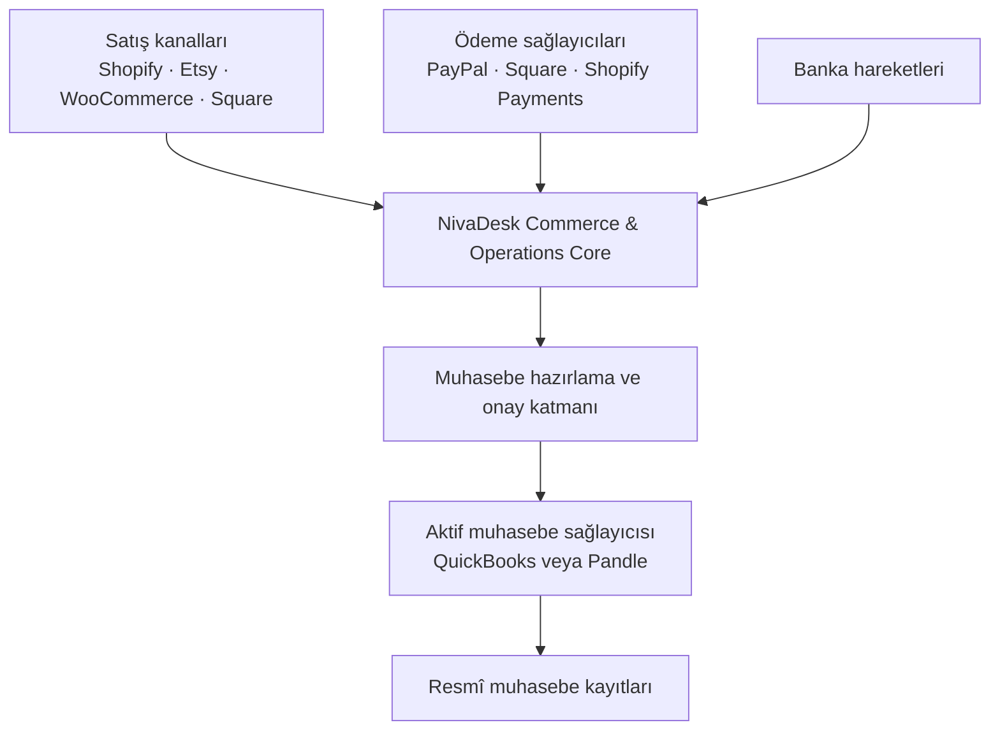
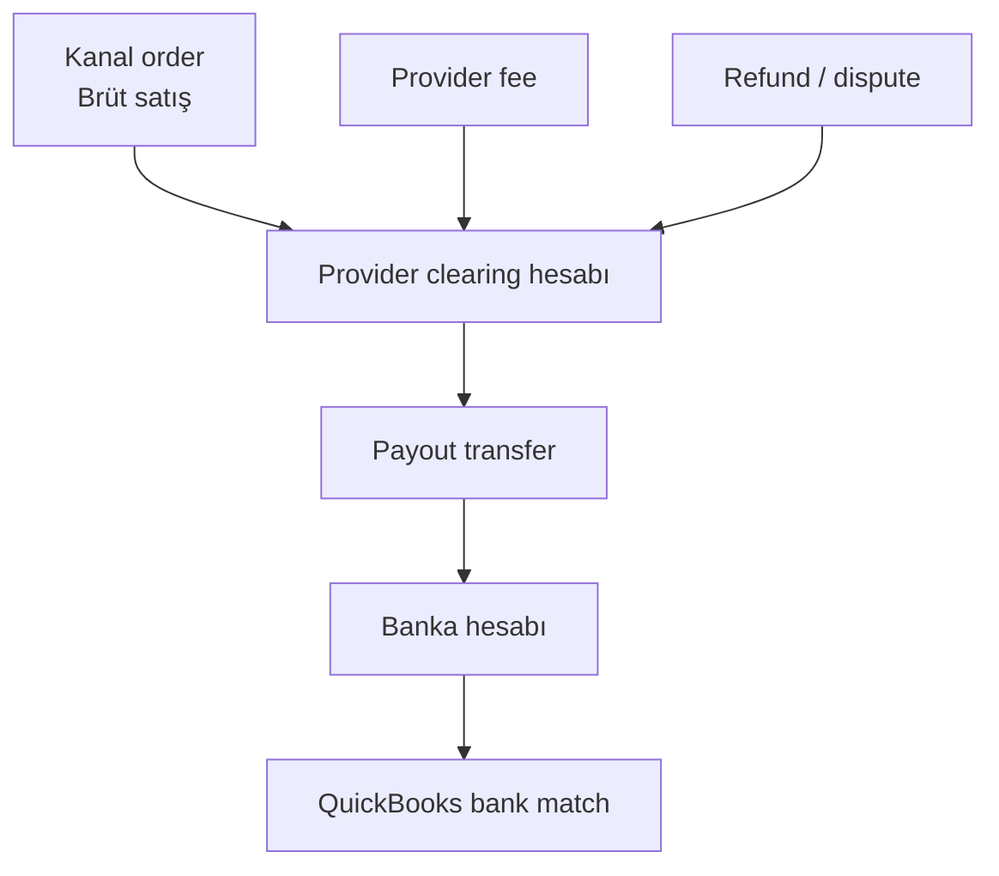
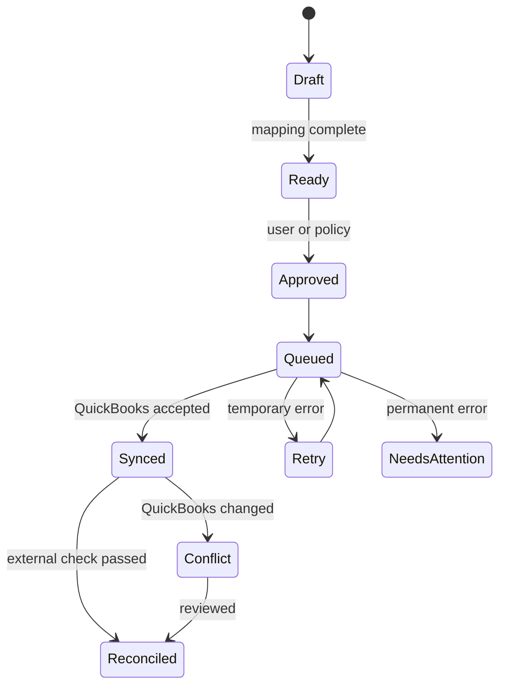

# NivaDesk – QuickBooks Online Entegrasyon Spesifikasyonu

> **Belge türü:** Ürün, UX, veri modeli ve teknik uygulama şartnamesi  
> **Hedef okuyucu:** Yazılım geliştirici, yapay zekâ kodlama ajanı, ürün tasarımcısı ve muhasebe danışmanı  
> **Tarih:** 2 Eylül 2026  
> **Kapsam:** QuickBooks **Online**; Shopify, Etsy, WooCommerce, Square, PayPal, banka, satın alma ve isteğe bağlı NivaDesk envanter sistemiyle birlikte çalışma  
> **Dil:** Türkçe; kod ve veri alanları İngilizce

---

## 0. Yapay zekâ için kısa görev özeti

```yaml
project: NivaDesk QuickBooks Online Integration
integration_type: accounting_connector
primary_goal: >
  NivaDesk'teki onaylanmış satış, ödeme, ücret, iade, satın alma ve isteğe bağlı
  envanter maliyetlerini QuickBooks Online'a doğru, denetlenebilir ve tekrarsız
  biçimde aktarmak; QuickBooks'taki muhasebeci düzeltmelerini güvenli biçimde
  NivaDesk'e geri yansıtmak.

core_rule: >
  QuickBooks bir satış kanalı veya NivaDesk operasyon verisinin sahibi değildir.
  QuickBooks, resmî muhasebe kayıtlarının ve muhasebeci tarafından yapılan
  düzeltmelerin sahibidir.

required:
  - generic accounting connector architecture
  - only one primary accounting writer per company and accounting period
  - review-first posting before automation
  - provider/currency-specific clearing accounts
  - idempotent posting and duplicate prevention
  - webhook plus CDC/periodic reconciliation
  - SyncToken-aware conflict handling
  - GBP, UK VAT and multi-currency support
  - visible audit trail and Needs Attention queue
  - Pandle regression protection

must_not:
  - write the same sale through both Pandle and QuickBooks
  - record a payout as new revenue
  - match a customer payment directly to an aggregated payout
  - create synthetic QuickBooks bank-feed transactions
  - promise access to QuickBooks Banking For Review rows without verified API support
  - blindly overwrite accountant edits
  - use SKU, name or document number as the only external identity
  - run blind two-way inventory quantity synchronisation
  - hardcode QuickBooks account or UK VAT identifiers
  - automatically file VAT returns
```

### Tek cümlelik ürün tanımı

**NivaDesk işi yönetir; QuickBooks muhasebeyi resmileştirir; her ekonomik olay yalnızca bir kez kaydedilir.**

---

## 1. En önemli mimari karar

QuickBooks, Shopify veya Etsy gibi bir **commerce connector** değildir. Ayrı bir **accounting connector** ailesine aittir.



Bu ayrımın sonucu:

- Shopify, Etsy, WooCommerce ve Square sipariş/listing/ödeme bilgisi getirir.
- PayPal ve diğer ödeme sağlayıcıları para hareketi, işlem ücreti, iade ve payout getirir.
- Banka bağlantısı gerçek banka giriş/çıkışını gösterir.
- NivaDesk siparişi, projeyi, üretimi, malzemeyi, belgeyi ve gerçek kârlılığı yönetir.
- QuickBooks onaylanmış muhasebe belgesini, vergi uygulamasını, hesap planını ve muhasebeci düzeltmelerini yönetir.

### REQ-ARCH-001 — Ortak accounting connector katmanı

Altyapı yalnızca `QuickBooksService` olarak yazılmamalıdır.

```ts
interface AccountingProviderAdapter {
  connect(input: ConnectInput): Promise<ConnectionResult>;
  disconnect(connectionId: string): Promise<void>;
  getCapabilities(): AccountingCapabilities;
  getCompanyProfile(): Promise<AccountingCompanyProfile>;
  getAccounts(): Promise<AccountingAccount[]>;
  getTaxCodes(): Promise<AccountingTaxCode[]>;
  getCustomers(cursor?: string): Promise<Page<AccountingCustomer>>;
  getVendors(cursor?: string): Promise<Page<AccountingVendor>>;
  getItems(cursor?: string): Promise<Page<AccountingItem>>;
  previewPosting(eventId: string): Promise<PostingPreview>;
  postDocument(command: AccountingCommand): Promise<PostingResult>;
  fetchEntity(identity: ExternalIdentity): Promise<ExternalSnapshot>;
  reconcile(cursor: ReconciliationCursor): Promise<ReconciliationResult>;
}
```

İlk adapter'lar:

- `PandleAccountingAdapter`
- `QuickBooksOnlineAccountingAdapter`

Gelecekte aynı çekirdeğe:

- Xero
- Sage
- FreeAgent

eklenebilmelidir.

### REQ-ARCH-002 — Tek aktif muhasebe yazıcısı

Aynı şirket, aynı defter ve aynı tarih aralığı için yalnızca **bir** sistem otomatik muhasebe kaydı yazabilmelidir.

```yaml
primary_accounting_provider: quickbooks_online | pandle | none
connection_mode: primary_write | shadow_read | migration_read | disabled
write_boundary_date: YYYY-MM-DD
```

Örnek:

- 31 Aralık'a kadar: Pandle `primary_write`
- 1 Ocak'tan itibaren: QuickBooks `primary_write`
- Eski Pandle bağlantısı: `migration_read`

Pandle ve QuickBooks aynı satışları aynı anda otomatik yazmamalıdır. Bağlantı sihirbazı çift yazma riskini tespit edip kurulumu durdurmalıdır.

---

## 2. Sistemlerin veri sahipliği

| Veri | Ana sahip | NivaDesk'in davranışı |
|---|---|---|
| Sipariş ve iş akışı | NivaDesk / satış kanalı | Ortak modele çevirir, üretim sürecini yönetir |
| Ürün, malzeme, rezervasyon | NivaDesk | QuickBooks'a yalnızca gerekli muhasebe özetini yollar |
| Kanal ödeme olayı | Ödeme sağlayıcısı | Brüt, ücret, iade ve payout'u ayrı tutar |
| Gerçek banka hareketi | Banka | Yeni gelir yaratmadan muhasebe kaydıyla eşleştirir |
| Hesap planı ve vergi kodu | QuickBooks | QuickBooks'tan okur; yerel ID hardcode etmez |
| Onaylanmış muhasebe belgesi | QuickBooks | External ID ve `SyncToken` ile takip eder |
| Muhasebeci düzeltmesi | QuickBooks | Körlemesine geri yazmaz; çeker, kilitler veya conflict açar |
| Proje/order kârlılığı | NivaDesk | Kanal, malzeme, emek, kargo ve ücretleri birleştirir |

### Alan bazlı sahiplik

“İki yönlü senkronizasyon” tüm alanların iki sistemce serbestçe değiştirilebilmesi demek değildir.

| Alan grubu | Yazma yetkisi |
|---|---|
| Order workflow, production stage, notes | Yalnızca NivaDesk |
| QBO account, tax code, posted totals | QuickBooks / onaylı posting |
| Customer operasyon notları | NivaDesk |
| Customer muhasebe adı ve bakiye | QuickBooks'tan okunabilir; kontrollü güncelleme |
| Posting status ve external identities | Entegrasyon çekirdeği |

---

## 3. StockSmith ve diğer rakiplerden çıkarılan ders

### StockSmith'in güçlü tarafı

[StockSmith QuickBooks entegrasyonu](https://stocksmith.io/integrations/quickbooks/) şu konularda güçlü ve anlaşılır bir kapsam sunuyor:

- Gerçek reçete/BOM maliyetlerinden COGS journal oluşturma
- Envanter değerini QuickBooks'a journal ile aktarma
- Purchase order'ı QuickBooks bill'e dönüştürme
- Gönderilen kayıtların audit trail'ini gösterme
- Çoklu satış kanallarının stok etkisini merkezde toplama

### StockSmith'in açık sınırlamaları

Kendi sayfasında entegrasyonun tek yönlü olduğu; faturaları/giderleri QuickBooks'tan geri almadığı; item-level iki yönlü stok senkronizasyonu yapmadığı; QuickBooks Online Plus/Advanced ve USD ile sınırlı olduğu belirtiliyor.

### NivaDesk'in daha iyi olması gereken alanlar

| Konu | StockSmith yaklaşımı | NivaDesk hedefi |
|---|---|---|
| Coğrafya/para | USD odaklı | GBP ve UK VAT öncelikli; kontrollü çoklu para |
| Kapsam | Envanter ve üretim muhasebesi | Siparişten payout ve banka eşleşmesine tam zincir |
| QuickBooks'tan geri okuma | Sınırlı/tek yönlü | Muhasebeci değişiklikleri, posted kayıtlar ve sync health |
| Satış şekli | Envanter odaklı | Bespoke, milestone/deposit, kanal siparişi ve günlük özet |
| Ödeme sağlayıcıları | Temel muhasebe aktarımı | PayPal/Square/Etsy/Shopify fee-refund-payout clearing zinciri |
| Çift kayıt koruması | Belirtilen kapsam dahilinde | Tüm connector'lar arasında kaynak sahipliği ve posting fingerprint |
| Hata yönetimi | Audit trail | Preview, conflict, retry, DLQ ve kullanıcıya açıklanabilir hata |

Rakiplerden ek dersler:

- [Katana](https://katanamrp.com/integrations/quickbooks/) satış order'larından invoice ve purchase order'lardan bill üretmeyi, kişi bağlantılarını ve inventory balance aktarımını öne çıkarıyor.
- [Cin7](https://www.cin7.com/integrations/quickbooks-online/) satış, purchase, invoice, payment, credit note, inventory adjustment ve COGS kapsamını geniş tutuyor; bu genişlik iyi olmakla birlikte alan sahipliği yanlış kurulursa duplicate/conflict riski yaratır.
- [Unleashed](https://www.unleashedsoftware.com/app-marketplace/quickbooks-inventory-management/) satış, satın alma ve envanter eşitlemesini ve QuickBooks tax code'larını çekmeyi öne çıkarıyor.

NivaDesk'in farkı, “en fazla veriyi iki yönlü kopyalamak” değil; **doğru verinin doğru sistemde sahipliğini belirleyip yalnızca gerekli muhasebe sonucunu tekrarsız üretmek** olmalıdır.

---

## 4. Önerilen kullanıcı deneyimi

### 4.1 Integrations kartı

```text
QuickBooks Online
Official accounting connection

Company: EGGcraft Ltd
Mode: Primary accounting
Status: Connected
Last sync: 2 minutes ago

[Open setup] [Sync activity] [Disconnect]
```

Bağlantı kartında sadece “Connected” yazması yeterli değildir. Şunlar görünmelidir:

- Bağlı QuickBooks şirket adı
- `realmId` ile temsil edilen şirket bağlantısı
- Mod: Primary / Read-only / Migration
- Son başarılı webhook ve reconciliation zamanı
- Açık hata/uyarı sayısı
- Son başarılı posting zamanı

### 4.2 Kurulum sihirbazı

#### Adım 1 — QuickBooks'a bağlan

- Intuit OAuth 2.0 ile bağlan.
- OAuth `state` doğrulansın.
- Dönen `realmId` doğru workspace'e bağlansın.
- Token'lar şifreli saklansın.
- Disconnect sırasında erişim iptal/revoke akışı çalışsın.

#### Adım 2 — Şirketi doğrula

QuickBooks'tan okunup kullanıcıya gösterilecekler:

- Şirket adı
- Ülke ve home currency
- Financial year başlangıcı
- Multi-currency ayarı
- Closing date/lock bilgisi erişilebildiği ölçüde
- Aktif hesap planı
- Aktif tax code'ları

Yanlış QuickBooks şirketi seçilmişse devam edilmemelidir.

#### Adım 3 — Muhasebe kaynağını seç

```text
Current primary accounting provider: Pandle

( ) Keep Pandle as primary; connect QuickBooks read-only
( ) Migrate to QuickBooks from a selected date
( ) Cancel setup
```

QuickBooks primary seçilecekse `write_boundary_date` zorunludur.

#### Adım 4 — Mevcut uygulama/çift kayıt kontrolü

Kullanıcıya açık kontrol listesi gösterilsin:

- QuickBooks içinde PayPal bağlantısı aktif mi?
- Square uygulaması aktif mi?
- Shopify/Etsy/WooCommerce satış uygulaması kayıt yazıyor mu?
- Bank feed bağlı mı?
- Başka inventory uygulaması COGS journal yazıyor mu?

API üzerinden her uygulamayı güvenilir biçimde listelemek mümkün değilse kullanıcı onayı istenmeli ve sonuç audit log'a yazılmalıdır. Aynı veri akışı için iki yazıcıya izin verilmemelidir.

#### Adım 5 — Posting modu

Her satış kaynağı için ayrı seçim:

| Mod | Kullanım | QuickBooks sonucu |
|---|---|---|
| `detailed` | Bespoke/düşük hacimli işler | Her order için invoice veya sales receipt |
| `daily_summary` | Yüksek hacimli kanal | Kanal + tarih + para + vergi bazında özet |
| `payout_summary` | Muhasebeci onaylı özel durum | Settlement/payout dönemi özeti |
| `disabled` | Sadece NivaDesk'te takip | Hiç posting yok |

Önerilen başlangıç:

- Manual/Instagram/bespoke NivaDesk order: `detailed`
- Düşük hacimli Shopify/Etsy: `detailed`
- Çok yüksek hacimli kanal: muhasebeci onayıyla `daily_summary`
- Payout: **gelir değil transfer**; satış posting moduyla karıştırılmamalı

Mod değişikliği sadece ileri tarihli boundary ile yapılmalıdır. Aynı gün/işlem hem detailed hem summary yazılamaz.

#### Adım 6 — Hesap ve vergi eşleştirmeleri

QuickBooks hesap ve tax code listeleri canlı olarak çekilir.

Zorunlu mapping örnekleri:

| NivaDesk olayı | QuickBooks hesabı/türü |
|---|---|
| Product sales | Sales income |
| Bespoke service | Service income |
| Shipping charged | Shipping income |
| Discounts | Discount/contra-income policy |
| PayPal fees | Merchant fees expense |
| Etsy fees | Marketplace fees expense |
| Shopify fees | Merchant fees expense |
| Materials purchase | Expense veya Inventory Asset policy |
| Inventory value | Inventory Asset |
| COGS | Cost of Goods Sold |
| PayPal GBP balance | PayPal GBP clearing/current asset |
| Square GBP balance | Square GBP clearing/current asset |
| Refund | Refund/contra-income policy |

Mapping'ler isimden tahmin edilip otomatik kesinleştirilmemelidir. NivaDesk önerir, yetkili kullanıcı veya muhasebeci onaylar.

#### Adım 7 — Mevcut kayıtları eşleştir

- Customer
- Vendor
- Product/service item
- Clearing account

İsim eşitliği tek başına merge sebebi değildir. Kullanıcıya adaylar ve farklar gösterilir.

#### Adım 8 — Dry run

Gerçek kayıt yazmadan en az şu örnekler gösterilir:

- Bir bespoke invoice + deposit
- Bir Etsy/Shopify/PayPal satışı
- Bir refund + fee
- Bir supplier bill
- Bir payout transfer
- Varsa aylık COGS/valuation journal

Kullanıcı her kaydın QuickBooks'ta hangi entity ve hesaba dönüşeceğini görür.

---

## 5. NivaDesk ekran yapısı

QuickBooks detay sayfası:

1. **Overview**
2. **Mappings**
3. **Sales**
4. **Purchases**
5. **Inventory & COGS**
6. **Reconciliation**
7. **Sync Activity**
8. **Settings**

### Overview

```text
QuickBooks Online — Connected
Company: EGGcraft Ltd
Accounting mode: Primary

Ready to post          12
Awaiting review         4
Awaiting bank match     3
Needs attention         2
Synced today           41

Sales     Healthy
Purchases Healthy
Payments  Healthy
Inventory Review required
```

### Posting preview

Kullanıcıya muhasebe jargonu saklanmamalı; basit açıklama ve muhasebe ayrıntısı birlikte verilmelidir.

| Kaynak | QuickBooks kaydı | Debit | Credit | Tax | Durum |
|---|---|---:|---:|---|---|
| ND-1042 final invoice | Invoice | — | £2,000 | UK VAT 20% | Ready |
| PayPal fee PP-882 | Expense | £34.20 | — | No VAT | Ready |
| PayPal payout PO-44 | Transfer | £1,965.80 | £1,965.80 | — | Awaiting bank match |

### Needs Attention örnekleri

- “Etsy fee için QuickBooks hesabı seçilmedi.”
- “Bu customer için iki muhtemel QuickBooks kaydı bulundu.”
- “QuickBooks'ta invoice muhasebeci tarafından değiştirildi.”
- “Bu dönem QuickBooks'ta kapalı. Düzeltme kaydı gerekiyor.”
- “PayPal kayıtlarını başka bir QuickBooks uygulaması da yazıyor olabilir.”
- “Webhook işlendi fakat güncel entity henüz okunamadı.”

Her hata kartında şunlar olmalıdır:

- İnsan dilinde sebep
- Etkilenen NivaDesk ve QuickBooks kayıtları
- Güvenli çözüm seçenekleri
- Retry
- Ignore with reason
- Open in QuickBooks
- Audit trail

---

## 6. Satışların QuickBooks'a aktarılması

### 6.1 Belge eşleştirmesi

| NivaDesk olayı | Önerilen QuickBooks entity | Not |
|---|---|---|
| Approved estimate | `Estimate` | Ayardan açılır; muhasebe etkisi yok |
| Vadeli/ödenmemiş satış | `Invoice` | Customer borcu oluşturur |
| Invoice'a gelen para | `Payment` | İlgili Invoice'a linklenir |
| Anında ödenmiş perakende satış | `SalesReceipt` | Posting policy'ye göre |
| Müşteriye alacak/iade | `CreditMemo` veya `RefundReceipt` | Muhasebeci onaylı policy |
| Supplier purchase | `Bill`, `Purchase` veya `Expense` | Ödeme durumuna göre |
| Supplier credit | `VendorCredit` | Kaynak belgeye bağlı |
| Kanal payout'u | `Transfer`/deposit-clearing hareketi | Yeni satış değildir |
| Dönem COGS | `JournalEntry` | Önizleme ve onay gerekir |

QuickBooks Accounting API'deki entity davranışı güncel resmî referanstaki ilgili [Invoice](https://developer.intuit.com/app/developer/qbo/docs/api/accounting/all-entities/invoice), [Bill](https://developer.intuit.com/app/developer/qbo/docs/api/accounting/all-entities/bill) ve diğer entity sözleşmelerine göre uygulanmalıdır; isim benzerliğine bakarak entity seçilmemelidir.

### 6.2 Bespoke order, deposit ve milestone

Örnek:

```text
Order total: £3,000 + VAT
Deposit: 30% = £900 + VAT
Final payment: £2,100 + VAT
```

Önerilen iki desteklenen policy:

1. **Milestone invoices:** Deposit ve final için ayrı QuickBooks Invoice.
2. **Single invoice + partial payments:** Tek Invoice; iki Payment bağlantısı.

Hangi yöntemin kullanılacağı şirket ayarıdır ve muhasebeci tarafından onaylanmalıdır. Sistem kendiliğinden değiştirmemelidir.

`Estimate Approved`, `Painting`, `Ready to Ship` gibi NivaDesk workflow durumları QuickBooks'a muhasebe belgesi olarak gönderilmez.

### 6.3 Kanal satışları

Shopify/Etsy/WooCommerce/Square order NivaDesk'e geldiğinde:

1. Order canonical modele alınır.
2. Payment provider ve sales channel ayrı tutulur.
3. Vergi, discount, shipping ve refund bileşenleri normalize edilir.
4. Posting policy belirlenir.
5. NivaDesk preview üretir.
6. Onay/otomasyon kuralı sonrası QuickBooks entity oluşturulur.
7. External ID ve `SyncToken` saklanır.

### 6.4 Bir satış yalnızca bir kez gelir olmalı

Örnek bir Etsy order PayPal üzerinden ödenmiş olsun:

- Etsy order: satışın ticari kaynağı
- PayPal transaction: paranın hareket ettiği sağlayıcı
- PayPal payout: PayPal bakiyesinden bankaya transfer
- Bank feed credit: gerçek banka girişi

Bunların dördü ayrı gelir değildir. Gelir yalnızca satış posting'inde oluşur.



---

## 7. Clearing account modeli

Her ödeme sağlayıcısı ve para birimi için ayrı clearing account önerilir:

- PayPal GBP Clearing
- PayPal EUR Clearing
- PayPal USD Clearing
- Square GBP Clearing
- Shopify Payments GBP Clearing
- Etsy Payments GBP Clearing
- Amazon Settlement GBP Clearing

### Örnek muhasebe akışı

Brüt satış £1,000; fee £30; payout £970:

| Olay | Debit | Credit |
|---|---:|---:|
| Satış ödemesi | PayPal Clearing £1,000 | Sales/VAT toplam £1,000 |
| PayPal fee | Merchant Fee Expense £30 | PayPal Clearing £30 |
| Payout | Bank £970 | PayPal Clearing £970 |

Sonuç:

- Gelir bir kez yazılır.
- Fee görünür.
- PayPal clearing sıfırlanır.
- Bankaya gelen £970, £1,000'lik tek customer payment ile yanlış eşleştirilmez.

Payout içindeki birden fazla satış, refund, chargeback ve fee NivaDesk'te açıklanabilir biçimde gruplanmalıdır.

---

## 8. QuickBooks Banking ve banka eşleştirmesi

### Kritik API sınırı

QuickBooks'un halka açık Accounting API'sinin, QuickBooks Banking ekranındaki tüm bekleyen **For Review** satırlarını üçüncü taraflara sunduğu varsayılmamalıdır. Bu yüzden geliştirici:

- sahte bank-feed satırı oluşturmamalı,
- “NivaDesk QuickBooks bank feed'i onaylar” özelliğini kanıtlanmamış biçimde vaat etmemeli,
- sandbox ve güncel resmî dokümanla desteklenmeyen private/undocumented endpoint kullanmamalıdır.

### Güvenli akış

1. Banka bağlantısı gerçek banka hareketini QuickBooks'a getirir.
2. NivaDesk satış, payment, bill, expense, deposit veya transfer gibi doğru accounting kaydını oluşturur.
3. QuickBooks Banking, gelen gerçek banka hareketini mevcut kayıtla eşleştirir.
4. Kullanıcı QuickBooks içinde match/confirm yapar.
5. NivaDesk posted kayıtları ve erişilebilen muhasebe sonucunu reconciliation job ile doğrular.

NivaDesk durumları:

```yaml
bank_match_status:
  - not_applicable
  - awaiting_bank_transaction
  - awaiting_match_in_quickbooks
  - matched
  - mismatch
  - unknown_api_limitation
```

QuickBooks ileride resmî API ile bu satırlara erişim sağlarsa capability açılır; UI hardcode edilmez.

### Pandle ile fark

Pandle bağlantısında NivaDesk'in belirli banka satırlarını onaylama/confirm etme akışı varsa bu davranış QuickBooks'a otomatik kopyalanmamalıdır. Her accounting provider kendi capability map'ini döndürmelidir.

```ts
type AccountingCapabilities = {
  bankFeedPendingRowsRead: boolean;
  bankFeedMatchWrite: boolean;
  invoicesWrite: boolean;
  billsWrite: boolean;
  attachmentsWrite: boolean;
  cdcRead: boolean;
  webhooks: boolean;
};
```

---

## 9. Satın alma, supplier ve belgeler

### 9.1 Purchase ile banka transaction aynı şey değildir

- Purchase order: sipariş niyeti
- Goods received: malın teslim alınması
- Bill: supplier borcu
- Bill payment: borcun ödenmesi
- Bank transaction: paranın gerçek hareketi

Bu olaylar ayrı tutulmalıdır.

### 9.2 Entity akışı

| NivaDesk | QuickBooks | Muhasebe etkisi |
|---|---|---|
| Supplier | Vendor | Kimlik eşleştirmesi |
| Purchase Order | PurchaseOrder, ayara bağlı | Genellikle posting dışı |
| Received, unpaid purchase | Bill | Borç doğurur |
| Paid immediately | Purchase/Expense | Hesaptan çıkış |
| Pay existing bill | BillPayment | Borcu kapatır |
| Supplier refund/credit | VendorCredit/uygun refund | Borç veya masraf düzeltmesi |
| Receipt/invoice file | Attachable | Kayda belge ekler |

NivaDesk'te yüklenen receipt veya supplier invoice, mümkünse QuickBooks'un attachment mekanizmasıyla ilgili entity'ye bağlanmalıdır. Dosya checksum'u saklanarak aynı belge iki kez yüklenmemelidir.

### 9.3 Sipariş ve proje bağlantısı

QuickBooks'a gönderilen her supplier cost NivaDesk'te şunlara bağlanabilmelidir:

- Supplier
- NivaDesk purchase
- Order/project
- Material veya expense category
- Receipt/invoice
- Bank transaction
- QuickBooks entity

Bu bağlantı, QuickBooks'taki temel muhasebe raporundan daha ayrıntılı **order-level true profit** üretir.

---

## 10. Envanter, COGS ve valuation

### 10.1 Varsayılan karar

NivaDesk envanteri kullanılıyorsa operasyonel stok sahibi **NivaDesk** olmalıdır. QuickBooks'a item bazında kör iki yönlü quantity sync yapılmamalıdır.

QuickBooks item mapping şu amaçlarla tutulabilir:

- Ürün/service satırı
- Income account seçimi
- Expense/COGS account seçimi
- Inventory asset account seçimi
- SKU ve açıklama

Ancak QuickBooks item quantity'si NivaDesk'teki fiziksel stok ledger'ını otomatik overwrite etmemelidir.

### 10.2 Desteklenecek iki muhasebe policy'si

#### Policy A — Purchases expensed

Küçük stüdyo için basit yöntem:

- Malzeme alımı doğrudan expense yazılır.
- NivaDesk yine malzeme kullanımını ve order profit'i operasyonel olarak takip eder.
- QuickBooks'a dönemsel inventory/COGS journal yazılmaz.

#### Policy B — Inventory asset + COGS

Gelişmiş yöntem:

- Alımlar inventory asset'e gider.
- Kullanılan/satılan maliyet dönemsel COGS olur.
- NivaDesk dönem sonu valuation ve COGS önerisi üretir.
- Muhasebeci preview'u onayladıktan sonra `JournalEntry` oluşturulur.

NivaDesk iki policy'den birini kendiliğinden seçmemelidir.

### 10.3 COGS journal güvenliği

Her journal için benzersiz anahtar:

```text
workspace + quickbooks_realm + period + currency + valuation_method + journal_type
```

Kurallar:

- Aynı dönem için ikinci journal oluşturulmaz; gerekirse approved adjustment oluşturulur.
- QuickBooks closing date kontrol edilir.
- Kapalı dönem rewrite edilmez.
- Journal öncesi opening value + purchases - COGS ± adjustments = closing value kontrolü yapılır.
- NivaDesk'teki valuation raporu snapshot olarak saklanır.
- Journal satırları hangi order/material hareketlerinden geldiğine kadar drill-down edilebilir.

StockSmith'in COGS ve valuation gücü burada korunur; NivaDesk ayrıca payment, payout, bank ve order profit zincirini de bağlar.

---

## 11. UK VAT ve çoklu para

### REQ-TAX-001 — Tax code'ları hardcode etme

QuickBooks'taki aktif TaxCode/TaxRate verisi bağlantı bazında okunmalıdır. “20% VAT” ismine bakıp sabit bir ID varsayılmamalıdır.

Desteklenmesi gereken durumlar:

- VAT inclusive fiyat
- VAT exclusive fiyat
- Standard rate
- Reduced/zero rate
- Exempt/out of scope policy
- Export ve platformun topladığı vergiler için muhasebeci mapping'i
- Refund üzerinde orijinal tax treatment'ın korunması

NivaDesk ilk sürümlerde VAT return **file etmemelidir**. Doğru transaction ve tax code üretmeli; filing QuickBooks/muhasebeci sorumluluğunda kalmalıdır.

### REQ-FX-001 — Para birimi modeli

Bağlantı sırasında:

- QuickBooks home currency okunur.
- Multi-currency ayarı kaydedilir.
- Customer/vendor currency'sinin sonradan değiştirilemeyebileceği dikkate alınır.
- Her transaction tek para birimiyle gönderilir.
- Source amount, home amount ve exchange rate ayrı saklanır.
- Provider clearing account para birimine göre ayrılır.

```ts
type MoneySnapshot = {
  sourceAmount: string;
  sourceCurrency: string;
  homeAmount?: string;
  homeCurrency: string;
  exchangeRate?: string;
  rateSource?: "provider" | "quickbooks" | "manual";
  rateTimestamp?: string;
};
```

Kur farkı, payout tarihi ile satış tarihi farklıysa görünür accounting adjustment olarak işlenmelidir; satış tutarı sessizce değiştirilmemelidir.

---

## 12. Kimlik, veri modeli ve duplicate önleme

### 12.1 Generic accounting connections

```sql
accounting_connections
- id
- workspace_id
- provider                  -- quickbooks_online, pandle
- external_company_id       -- QBO realmId
- company_name
- mode                      -- primary_write, shadow_read, migration_read
- home_currency
- country_code
- capabilities_json
- encrypted_credentials_ref
- status
- write_boundary_date
- last_webhook_at
- last_reconciliation_at
- created_at
- updated_at
```

### 12.2 External identities

```sql
external_identities
- id
- provider
- connection_id
- entity_type               -- invoice, payment, bill, customer, journal_entry...
- external_id
- nivadesk_entity_type
- nivadesk_entity_id
- external_sync_token       -- QBO SyncToken
- external_updated_at
- raw_snapshot_ref
- created_at
- updated_at

UNIQUE(provider, connection_id, entity_type, external_id)
UNIQUE(connection_id, nivadesk_entity_type, nivadesk_entity_id, entity_type)
```

QuickBooks'a özel `quickbooks_invoice_id` gibi kolonlar NivaDesk `orders` tablosuna dağılmamalıdır.

### 12.3 Accounting events ve postings

```sql
accounting_events
- id
- workspace_id
- event_type
- economic_event_key
- source_provider
- source_connection_id
- source_entity_type
- source_entity_id
- occurred_at
- currency
- normalized_payload_json
- created_at

accounting_postings
- id
- accounting_event_id
- accounting_connection_id
- policy_version
- posting_fingerprint
- target_entity_type
- target_external_id
- request_id
- status
- preview_json
- posted_snapshot_json
- error_code
- error_message
- approved_by
- approved_at
- posted_at
- reconciled_at

UNIQUE(accounting_connection_id, posting_fingerprint)
```

`posting_fingerprint`, aynı ekonomik olay tekrar webhook veya import ile gelse bile ikinci kayıt oluşmasını engeller.

Örnek:

```text
sha256(workspace | source_provider | source_connection |
       economic_event_key | posting_policy | accounting_period)
```

SKU, customer adı, `DocNumber` veya memo duplicate anahtarı değildir.

### 12.4 Mapping tabloları

```sql
accounting_account_mappings
accounting_tax_mappings
accounting_item_mappings
accounting_contact_mappings
accounting_posting_policies
accounting_sync_cursors
accounting_sync_events
accounting_conflicts
```

---

## 13. QuickBooks OAuth ve güvenlik

Uygulama [Intuit OAuth 2.0 yetkilendirme akışını](https://developer.intuit.com/app/developer/qbo/docs/develop/authentication-and-authorization) kullanmalıdır.

Zorunlu güvenlik kuralları:

- Authorization Code flow
- Tahmin edilemez ve tek kullanımlık `state`
- Callback'te workspace/user bağının doğrulanması
- `realmId`'nin token ve connection ile atomik saklanması
- Access ve refresh token'ların uygulama veritabanında açık metin olmaması
- En düşük gerekli scope
- Refresh token rotation davranışının desteklenmesi
- Disconnect/revoke akışı
- Token ve hassas customer verisinin log'larda maskelenmesi
- Yetkili rol dışında account/tax mapping ve posting policy değiştirilememesi
- Her manual posting/ignore/retry işleminde actor audit'i

OAuth callback içinde uzun import veya posting yapılmamalı; connection kaydedilip async setup job başlatılmalıdır.

---

## 14. Webhook, CDC ve reconciliation

### 14.1 Webhook tek başına yeterli değildir

[QuickBooks webhooks](https://developer.intuit.com/app/developer/qbo/docs/develop/webhooks) düşük gecikme için kullanılmalıdır. Ancak event kaçabilir, gecikebilir veya tekrar gelebilir.

Güvenli akış:

1. Webhook alınır.
2. İmza doğrulanır.
3. Ham envelope inbox'a yazılır.
4. Hızlı şekilde başarılı HTTP cevabı verilir.
5. Async queue ilgili QuickBooks entity'sini güncel haliyle fetch eder.
6. External snapshot normalize edilir.
7. Field ownership ve `SyncToken` kontrol edilir.
8. NivaDesk update, conflict veya ignore kararı verir.

Intuit'in webhook payload yapısı zamanla değişebileceği için parser tek legacy JSON şekline kilitlenmemelidir. Intuit'in [CloudEvents webhook payload değişikliği duyurusu](https://blogs.intuit.com/2025/11/12/upcoming-change-to-webhooks-payload-structure/) dikkate alınmalı; güncel production/sandbox payload sözleşmesi entegrasyon testinde doğrulanmalıdır.

### 14.2 Change Data Capture ve periyodik kontrol

[QuickBooks Change Data Capture](https://developer.intuit.com/app/developer/qbo/docs/develop/explore-the-quickbooks-online-api/change-data-capture) ve uygun entity sorguları, webhook kaçaklarını bulmak için kullanılmalıdır.

Connection bazında ayrı cursor:

```yaml
cursors:
  customers: timestamp_or_checkpoint
  vendors: timestamp_or_checkpoint
  items: timestamp_or_checkpoint
  invoices: timestamp_or_checkpoint
  payments: timestamp_or_checkpoint
  bills: timestamp_or_checkpoint
  purchases: timestamp_or_checkpoint
  journals: timestamp_or_checkpoint
```

Kurallar:

- Cursor yalnızca ilgili batch tamamen başarılıysa ilerletilir.
- Dokümante edilen CDC zaman penceresi ve entity limitleri aşılırsa sayfalı/targeted query kullanılır.
- Günlük lightweight reconciliation, periyodik deep reconciliation yapılır.
- Silinmiş/void kayıtlar ayrıca ele alınır.
- Reconciliation yeni posting üretmeden önce external identity arar.

### 14.3 Queue, retry ve rate limit

- Queue provider + connection/realm bazında bölümlenir.
- [Intuit API limitleri](https://help.developer.intuit.com/s/article/API-call-limits-and-throttling) güncel resmî değerden okunup konfigüre edilir; kod içine sonsuza kadar sabitlenmez.
- `429` ve geçici `5xx` için exponential backoff + jitter uygulanır.
- Belirsiz timeout sonrası create işlemi körlemesine tekrarlanmaz; `requestId`, external search ve posting fingerprint ile sonuç kontrol edilir.
- Permanent validation hatası `Needs Attention` olur.
- Maksimum güvenli retry sonrası Dead Letter Queue'ya taşınır; event kaybolmaz.

---

## 15. SyncToken ve muhasebeci değişiklikleri

QuickBooks entity update'lerinde güncel `SyncToken` kullanılmalıdır.

Akış:

1. NivaDesk entity'yi son kez ne zaman okuduğunu bilir.
2. Update öncesinde gerekirse güncel QuickBooks entity fetch edilir.
3. Stored `SyncToken` güncel değilse blind overwrite yapılmaz.
4. Alan sahipliği karşılaştırılır.
5. Karar:
   - NivaDesk alanıysa güvenli merge,
   - QuickBooks/muhasebeci alanıysa pull-back,
   - iki taraf değiştiyse `Conflict`.

Örnek conflict:

```text
Invoice QB-8421 changed in QuickBooks

NivaDesk total:   £2,400
QuickBooks total: £2,350
Changed by:       External/Accountant

[Keep QuickBooks] [Create adjustment] [Review details]
```

Silme yerine mümkün olduğunca QuickBooks'un void/credit/adjustment muhasebe davranışı kullanılmalıdır. Posted bir belge sırf NivaDesk order'ı düzenlendi diye otomatik silinmemelidir.

---

## 16. Posting state machine



UI etiketleri:

- Not synced
- Ready for review
- Approved
- Queued
- Synced
- Reconciled
- Changed in QuickBooks
- Conflict
- Needs attention
- Ignored with reason

Her order, payment, purchase ve financial activity üzerinde küçük QuickBooks badge'i ve “Open in QuickBooks” bağlantısı bulunmalıdır.

---

## 17. Capability registry

QuickBooks sürümü, ülke, şirket ayarı ve API kapsamı nedeniyle tüm özellikler her bağlantıda aynı olmayabilir.

```json
{
  "provider": "quickbooks_online",
  "companyCountry": "GB",
  "invoices": { "read": true, "write": true },
  "payments": { "read": true, "write": true },
  "estimates": { "read": true, "write": true },
  "bills": { "read": true, "write": true },
  "purchaseOrders": { "read": true, "write": "verify_plan_and_company" },
  "attachments": { "write": true },
  "journals": { "read": true, "write": true },
  "taxCodes": { "read": true },
  "multiCurrency": { "enabled": true },
  "webhooks": true,
  "cdc": true,
  "bankFeedPendingRows": { "read": false, "write": false }
}
```

Capability bağlantı anında ve gerektiğinde tekrar hesaplanmalıdır. UI desteklenmeyen özelliği gizlemeli veya “QuickBooks bu bağlantıda bunu desteklemiyor” demelidir.

---

## 18. Audit trail ve açıklanabilirlik

Her posting için şu zincir görülebilmelidir:

```text
15:04 Etsy order #882 imported
15:04 NivaDesk order ND-1044 created
15:05 Etsy payment normalized
15:05 Accounting preview generated
15:11 Approved by Ayse
15:11 QuickBooks SalesReceipt created: 7132
15:11 PayPal fee Expense created: 7133
15:12 External entities fetched and verified
15:12 Posting reconciled
16:40 PayPal payout detected
16:41 QuickBooks transfer created
Next day: Awaiting bank match
```

Saklanması gerekenler:

- Kaynak event kimliği
- Normalized payload sürümü
- Posting policy sürümü
- Preview
- Onaylayan kullanıcı
- QuickBooks request/response metadata'sı
- External ID ve `SyncToken`
- Retry geçmişi
- Conflict kararı
- Ignore nedeni
- Raw snapshot referansı

Raw veriler debugging/audit içindir; NivaDesk UI ve core business logic doğrudan raw QuickBooks JSON'una bağlanmamalıdır.

---

## 19. Otomasyon seviyeleri

### Seviye 1 — Read only / shadow

- QuickBooks şirket, hesap, tax, customer, vendor ve item verisini oku.
- Hiç kayıt yazma.
- NivaDesk ile olası mapping ve duplicate raporu üret.

### Seviye 2 — Review first

- Posting preview üret.
- Kullanıcı onayı olmadan yazma.
- İlk canlı sürüm için önerilen seviye.

### Seviye 3 — Rule-approved automation

Örnek:

```text
IF source = Etsy
AND currency = GBP
AND tax mapping exists
AND total difference = 0
AND no duplicate risk
THEN auto-post daily summary
ELSE Needs Attention
```

### Seviye 4 — Exception-only review

Yalnızca en az 30 günlük başarılı, reconciled kullanım ve yetkili kullanıcı onayından sonra açılmalıdır.

Otomasyon hiçbir zaman şu durumlarda çalışmamalı:

- Mapping eksik
- Total/tax dengesiz
- Closed period
- Customer/vendor belirsiz
- Başka connector duplicate riski
- Para birimi uyumsuz
- Stale `SyncToken` / accountant edit
- Unsupported capability

---

## 20. Uygulama aşamaları

### Faz 0 — Karar ve muhasebe doğrulaması

- UK şirket tipi, VAT registration ve QuickBooks planı doğrulanır.
- Pandle'dan devam mı migration mı kararlaştırılır.
- Posting mode, clearing accounts ve inventory policy muhasebeci tarafından onaylanır.
- Intuit developer app, sandbox ve production gereksinimleri tamamlanır.

**Çıkış kriteri:** İmzalanmış mapping/policy belgesi ve çift yazma sınırı.

### Faz 1 — Generic accounting core

- `AccountingProviderAdapter`
- Generic connections, mappings, external identities, events ve postings
- Capability registry
- Queue/retry/DLQ
- Pandle adapter regression testleri

**Çıkış kriteri:** QuickBooks eklemek için Orders/Banking/Inventory core tablolarına provider-specific kolon eklenmemesi.

### Faz 2 — QuickBooks read-only

- OAuth + realm
- CompanyInfo/preferences
- Accounts, tax codes, customers, vendors, items
- Posted entity import
- Webhook inbox + CDC/reconciliation
- Mapping önerileri ve duplicate report

**Çıkış kriteri:** NivaDesk hiçbir kayıt yazmadan QuickBooks bağlantı sağlığını ve mapping'leri gösterebilir.

### Faz 3 — Satış posting

- Estimate
- Invoice/SalesReceipt
- Payment
- Credit/refund policy
- Detailed/daily summary
- Preview/manual approval

**Çıkış kriteri:** Bespoke ve bir commerce channel için satıştan QuickBooks'a tekrarsız uçtan uca test.

### Faz 4 — Purchases ve belgeler

- Vendor
- PurchaseOrder ayarı
- Bill/Purchase/Expense
- BillPayment/VendorCredit
- Receipt attachment
- Order/project attribution

**Çıkış kriteri:** Supplier invoice → bill → payment → bank eşleşme zinciri açıklanabilir.

### Faz 5 — Payment provider ve bank reconciliation

- Provider/currency clearing accounts
- Fees, refunds, disputes, chargebacks
- Payout transfer
- Awaiting bank match durumu
- Native QuickBooks app duplicate guard

**Çıkış kriteri:** Gross-to-net farkı sıfır ve payout yeni gelir yaratmıyor.

### Faz 6 — Opsiyonel inventory accounting

- Item/account mapping
- Valuation preview
- COGS journal
- Closed period/adjustment handling
- Journal drill-down

**Çıkış kriteri:** NivaDesk stock ledger ile QuickBooks dönem sonu değeri mutabık; aynı dönem duplicate journal yok.

### Faz 7 — Kontrollü otomasyon ve geri okuma

- Accountant edit conflict flow
- Rule-based auto posting
- Deep reconciliation
- Exception dashboard
- Migration completion report

---

## 21. Zorunlu test senaryoları

### Bağlantı ve güvenlik

- [ ] OAuth state yanlışsa callback reddediliyor.
- [ ] Yanlış workspace/realm eşleşmesi engelleniyor.
- [ ] Token refresh sonrası eski token güvenle değişiyor.
- [ ] Disconnect erişimi iptal ediyor ve local secret temizleniyor.
- [ ] Hassas token/PII log'a düşmüyor.

### Duplicate ve idempotency

- [ ] Aynı webhook 10 kez gelirse tek NivaDesk update oluşuyor.
- [ ] Create request timeout sonrası retry ikinci QuickBooks entity oluşturmuyor.
- [ ] Aynı order Etsy ve PayPal üzerinden görülse bile tek gelir oluşuyor.
- [ ] Aynı dönem daily summary ve detailed posting aynı anda çalışmıyor.
- [ ] QuickBooks native PayPal/Square app riski kurulumda uyarılıyor.
- [ ] Pandle primary iken QuickBooks write durduruluyor.

### Satış

- [ ] Bespoke order %30 deposit + final balance doğru invoice/payment üretiyor.
- [ ] Immediate paid sale policy ile doğru SalesReceipt oluşuyor.
- [ ] Discount, shipping ve VAT ayrı ve toplamı dengeli.
- [ ] Partial refund orijinal vergi uygulamasını koruyor.
- [ ] Cancel/void sonrası posted belge otomatik silinmiyor; onaylı düzeltme akışı var.

### Ödeme, fee ve payout

- [ ] £1,000 sale + £30 fee + £970 payout clearing hesabını sıfırlıyor.
- [ ] Payout yeni gelir oluşturmuyor.
- [ ] Aggregated payout tek customer payment'a bağlanmıyor.
- [ ] Refund ve chargeback ayrı olaylar olarak izleniyor.
- [ ] Payout bankada görünmeden `awaiting_bank_transaction` kalıyor.

### Purchase

- [ ] PO muhasebe transaction'ı sanılmıyor.
- [ ] Received/unpaid purchase Bill oluyor.
- [ ] Paid-now purchase doğru Expense/Purchase oluyor.
- [ ] Receipt attachment aynı dosyayı ikinci kez yüklemiyor.
- [ ] Supplier credit ilgili vendor/purchase ile bağlı.

### VAT ve currency

- [ ] GBP home currency doğru.
- [ ] EUR/USD satış source ve home amount ile saklanıyor.
- [ ] VAT inclusive/exclusive hesapları tam eşleşiyor.
- [ ] Zero/exempt/out-of-scope mapping'leri kullanıcı onaylı.
- [ ] Kur farkı satış totalini sessizce değiştirmiyor.
- [ ] Sistem VAT return otomatik file etmiyor.

### Sync ve conflict

- [ ] Webhook kaçırılırsa CDC/reconciliation değişikliği buluyor.
- [ ] Out-of-order event eski veriyle yeniyi ezmiyor.
- [ ] Accountant invoice totalini değiştirince stale `SyncToken` conflict açıyor.
- [ ] Geçici 429/5xx retry oluyor; permanent validation error `Needs Attention` oluyor.
- [ ] Closed period'a kayıt yazılmıyor.
- [ ] Deleted/void QuickBooks entity görünür uyarı üretiyor.

### Inventory accounting

- [ ] Inventory kapalıyken satış ve purchase entegrasyonu çalışıyor.
- [ ] Expense policy'de COGS journal üretilmiyor.
- [ ] Asset+COGS policy'de aynı dönem journal tekrarlanmıyor.
- [ ] Opening + purchases - COGS ± adjustments = closing kontrolü sağlanıyor.
- [ ] Kapalı dönem rewrite yerine adjustment öneriliyor.

### Bank API sınırı

- [ ] For Review satırları erişilebilir varsayılmıyor.
- [ ] NivaDesk synthetic bank-feed row oluşturmuyor.
- [ ] Durum `awaiting_match_in_quickbooks` olarak doğru gösteriliyor.
- [ ] Capability değişirse UI bağlantı bazında adapte oluyor.

---

## 22. Definition of Done

Entegrasyon ancak aşağıdakilerin tamamı sağlandığında tamamlanmış sayılır:

1. Yeni accounting provider eklemek NivaDesk core order/inventory/payment tablolarını değiştirmiyor.
2. Aynı ekonomik olay ikinci QuickBooks kaydı üretemiyor.
3. Pandle ve QuickBooks çift yazma teknik olarak engelleniyor.
4. Sale, fee, refund, dispute, payout ve bank hareketi birbirinden ayrılıyor.
5. GBP/UK VAT ve kontrollü multi-currency çalışıyor.
6. Hesap ve vergi mapping'leri QuickBooks'tan okunuyor; hardcode edilmiyor.
7. Webhook kaybı reconciliation ile yakalanıyor.
8. Muhasebeci değişikliği blind overwrite edilmiyor.
9. Kullanıcı her posting'in kaynağını ve QuickBooks sonucunu görebiliyor.
10. Hata event'i kaybolmuyor; retry veya Needs Attention'a gidiyor.
11. Inventory kullanmayan müşteri de QuickBooks entegrasyonunu kullanabiliyor.
12. Inventory kullanan müşteri için COGS/valuation opsiyonel ve muhasebeci onaylı.
13. QuickBooks bank feed API sınırı kullanıcıya dürüst biçimde yansıtılıyor.
14. Tüm kritik akışlar sandbox ve production-like test verisiyle doğrulanıyor.

---

## 23. Geliştiriciye son talimat

Bu entegrasyonu “NivaDesk verilerini QuickBooks'a kopyala” olarak uygulamayın.

Önce her olayın ne olduğunu belirleyin:

- satış mı,
- customer payment mı,
- provider fee mi,
- refund/dispute mı,
- payout transfer mı,
- supplier bill mi,
- bank hareketi mi,
- inventory valuation/COGS düzeltmesi mi?

Sonra bu olayın:

1. sahibi olan sistemi,
2. NivaDesk canonical kimliğini,
3. QuickBooks'taki doğru entity'sini,
4. posting policy ve vergi eşleştirmesini,
5. duplicate anahtarını,
6. reconciliation yöntemini

belirleyin.

NivaDesk'in hedefi QuickBooks'u taklit etmek değildir. Hedef:

> **Siparişten malzemeye, ödemeden payout'a ve bankaya kadar tüm iş bağlamını NivaDesk'te koruyup; QuickBooks'a yalnızca doğru, onaylanmış ve denetlenebilir muhasebe sonucunu göndermektir.**

Bu şekilde NivaDesk, StockSmith'in inventory/COGS gücünü aşar; Katana/Cin7 benzeri satış ve purchase bağlantısını sağlar; ayrıca Pandle, PayPal, Square, Shopify, Etsy, WooCommerce ve banka verilerini tek duplicate-safe finans zincirinde birleştirir.

---

## 24. Kaynaklar ve doğrulama notu

Bu belge 2 Eylül 2026 tarihinde erişilebilen ürün ve geliştirici kaynaklarına göre hazırlanmıştır. Uygulama başlamadan önce Intuit sandbox'ta ülke, plan ve entity davranışları yeniden doğrulanmalıdır.

### Resmî QuickBooks / Intuit kaynakları

- [QuickBooks Online authentication and authorization](https://developer.intuit.com/app/developer/qbo/docs/develop/authentication-and-authorization)
- [QuickBooks Online webhooks](https://developer.intuit.com/app/developer/qbo/docs/develop/webhooks)
- [QuickBooks Online Change Data Capture](https://developer.intuit.com/app/developer/qbo/docs/develop/explore-the-quickbooks-online-api/change-data-capture)
- [QuickBooks Online Accounting API – Account](https://developer.intuit.com/app/developer/qbo/docs/api/accounting/all-entities/account)
- [QuickBooks Online Accounting API – Invoice](https://developer.intuit.com/app/developer/qbo/docs/api/accounting/all-entities/invoice)
- [QuickBooks Online Accounting API – Bill](https://developer.intuit.com/app/developer/qbo/docs/api/accounting/all-entities/bill)
- [QuickBooks Online API limits and throttling](https://help.developer.intuit.com/s/article/API-call-limits-and-throttling)
- [Intuit: upcoming change to webhooks payload structure](https://blogs.intuit.com/2025/11/12/upcoming-change-to-webhooks-payload-structure/)

### Rakip/ürün araştırması

- [StockSmith – QuickBooks Online Integration](https://stocksmith.io/integrations/quickbooks/)
- [Katana – QuickBooks integration](https://katanamrp.com/integrations/quickbooks/)
- [Katana – Sync purchase orders as QuickBooks bills](https://support.katanamrp.com/en/articles/5968171-syncing-katana-purchase-orders-to-quickbooks-online-as-bills)
- [Cin7 – QuickBooks Online integration](https://www.cin7.com/integrations/quickbooks-online/)
- [Cin7 Core – QuickBooks Online integration guide](https://help.core.cin7.com/hc/en-us/articles/9034527490063-QuickBooks-Online-integration)
- [Cin7 – Sync COGS to QuickBooks Online](https://help.omni.cin7.com/hc/en-us/articles/9128585970831-Sync-COGS-to-QuickBooks-Online)
- [Unleashed – QuickBooks inventory management](https://www.unleashedsoftware.com/app-marketplace/quickbooks-inventory-management/)
