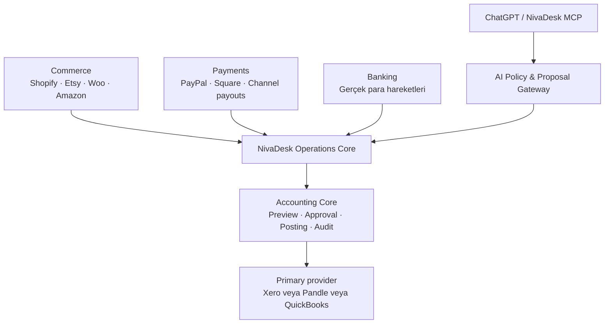
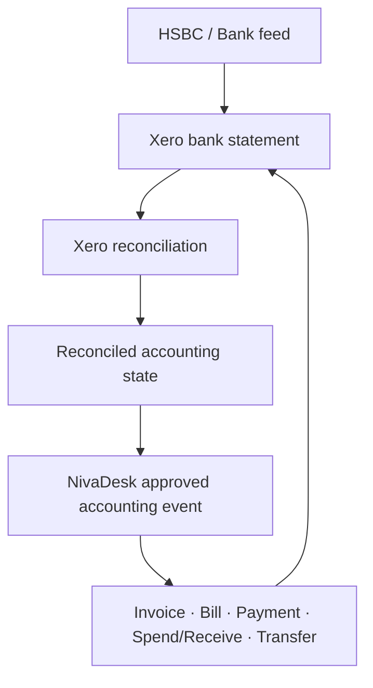
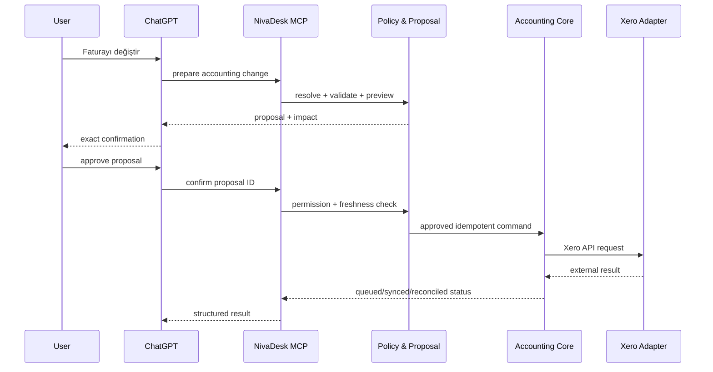
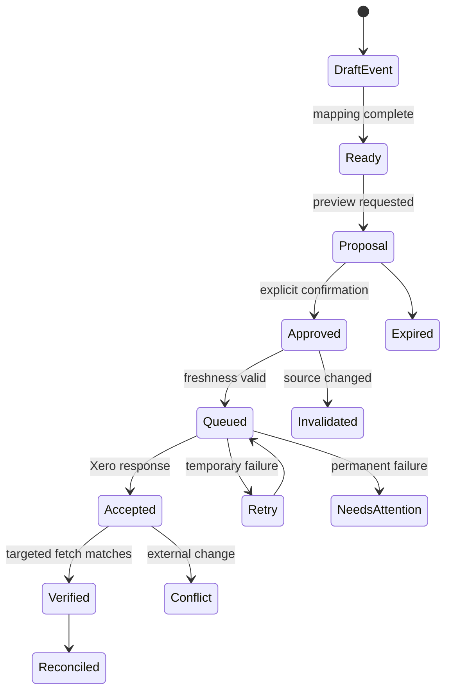

# NivaDesk – Xero ve Yapay Zekâ Destekli Muhasebe Entegrasyon Spesifikasyonu

> **Belge türü:** Ürün, UX, güvenlik, veri modeli ve teknik uygulama şartnamesi  
> **Hedef okuyucu:** Yazılım geliştirici, yapay zekâ kodlama ajanı, ürün tasarımcısı, güvenlik uzmanı ve muhasebe danışmanı  
> **Araştırma tarihi:** 2 Eylül 2026  
> **Kapsam:** Xero Accounting; NivaDesk Orders, Invoices, Banking, Inventory, Purchases, PayPal, Square, Shopify, Etsy, WooCommerce, Amazon ve mevcut ChatGPT/MCP bağlantısı  
> **Ana pazar:** Birleşik Krallık, GBP ve UK VAT  
> **Dil:** Açıklamalar Türkçe; teknik alan ve komut adları İngilizce

---

## 0. Yapay zekâ için normatif görev özeti

```yaml
project: NivaDesk Xero Accounting Integration
integration_type: accounting_provider_adapter
ai_interface: NivaDesk MCP / ChatGPT connection

primary_goal: >
  NivaDesk'teki onaylanmış satış, ödeme, ücret, iade, satın alma, belge ve
  isteğe bağlı envanter maliyeti olaylarını Xero'ya doğru, açıklanabilir,
  denetlenebilir ve tekrarsız biçimde aktarmak; Xero'daki muhasebeci
  değişikliklerini kontrollü biçimde NivaDesk'e geri yansıtmak.

core_positioning:
  nivadesk: operational truth and decision layer
  commerce_channels: external order/listing sources
  payment_providers: payment/fee/refund/payout sources
  bank: real cash movement source
  xero: formal accounting record and accountant correction authority
  chatgpt: permission-aware natural-language interface, never an accounting authority

required:
  - generic AccountingProviderAdapter; not a standalone Xero-only architecture
  - one primary accounting writer per company, ledger and date range
  - Xero OAuth 2.0 with granular scopes and tenant selection
  - encrypted token storage and serialized refresh
  - webhook plus If-Modified-Since reconciliation
  - Xero Idempotency-Key plus NivaDesk posting fingerprint
  - external identity and snapshot-based conflict detection
  - review-first posting, Needs Attention and full audit trail
  - GBP, UK VAT and controlled multi-currency
  - payment-provider/currency clearing accounts
  - draft-first accounting documents by default
  - AI proposal -> explicit approval -> revalidation -> queued execution
  - no use of Xero API data for model training or fine-tuning

must_not:
  - let ChatGPT write directly to Xero outside NivaDesk Accounting Core
  - allow Pandle, QuickBooks and Xero to auto-write the same economic event
  - treat payout or bank deposit as new revenue
  - expose Xero OAuth tokens to ChatGPT, browser or client application
  - assume public access to unreconciled Xero bank-feed statement lines
  - use Xero's closed Bank Feeds API without formal eligibility and approval
  - blindly overwrite accountant changes
  - modify an authorised, paid, reconciled or closed-period record like a draft
  - create a second order from a payment, refund or accounting webhook
  - use SKU, email, name, invoice number or reference as the sole external identity
  - run blind two-way item quantity sync
  - post both Xero tracked-inventory COGS and NivaDesk COGS for the same item
  - hardcode account IDs, tax type IDs or currencies
  - let AI file VAT returns, change the primary accounting provider, or post manual journals autonomously
```

### Tek cümlelik ürün tanımı

**NivaDesk işi ve bağlamı yönetir; Xero muhasebe sonucunu resmileştirir; ChatGPT ise yalnızca izinli ve onaylanabilir bir çalışma arayüzüdür.**

---

## 1. Ana mimari karar

Xero bir satış kanalı, ödeme sağlayıcısı veya banka bağlantısı değildir. Xero, NivaDesk'in ortak **Accounting Core** yapısına takılan bir muhasebe sağlayıcısıdır.



### XR-ARCH-001 — Provider bağımsız muhasebe çekirdeği

Mevcut QuickBooks şartnamesindeki `AccountingProviderAdapter`, Xero eklenirken genişletilmelidir:

```ts
interface AccountingProviderAdapter {
  connect(input: AccountingConnectInput): Promise<ConnectionResult>;
  disconnect(connectionId: string): Promise<void>;
  getCapabilities(connectionId: string): Promise<AccountingCapabilities>;

  getOrganisationProfile(): Promise<AccountingOrganisation>;
  getAccounts(cursor?: string): Promise<Page<AccountingAccount>>;
  getTaxRates(cursor?: string): Promise<Page<AccountingTaxRate>>;
  getContacts(cursor?: string): Promise<Page<AccountingContact>>;
  getItems(cursor?: string): Promise<Page<AccountingItem>>;

  preview(command: AccountingCommand): Promise<PostingPreview>;
  execute(command: ApprovedAccountingCommand): Promise<PostingResult>;
  fetchExternalEntity(identity: ExternalIdentity): Promise<ExternalSnapshot>;
  reconcile(checkpoint: SyncCheckpoint): Promise<ReconciliationResult>;
}
```

Provider uygulamaları:

```text
PandleAccountingAdapter
QuickBooksOnlineAccountingAdapter
XeroAccountingAdapter
Future: Sage / FreeAgent
```

Orders, Banking, Inventory, Payments ve ChatGPT araçlarının içinde:

```text
if provider === "xero"
```

şeklinde dağınık muhasebe mantığı bulunmamalıdır.

### XR-ARCH-002 — Tek aktif muhasebe yazıcısı

Aynı şirket, aynı ledger ve aynı tarih aralığı için yalnız bir provider `primary_write` olabilir.

```yaml
primary_accounting_provider: xero | pandle | quickbooks_online | none
connection_mode: primary_write | shadow_read | migration_read | disabled
write_boundary_date: YYYY-MM-DD
```

Örnek geçiş:

```text
Pandle primary_write:       2026-01-01 → 2026-12-31
Xero shadow_read:           kurulum ve karşılaştırma dönemi
Xero primary_write:         2027-01-01 → ileri
Pandle migration_read:      eski kayıtların açıklanması için
QuickBooks disabled:        aynı şirket için yazma yok
```

Bu kural UI uyarısı değil, sunucu tarafı unique/exclusion constraint ve posting policy kontrolü olmalıdır.

### XR-ARCH-003 — Tek ekonomik olay

Aşağıdakiler aynı satışın farklı görünümleridir:

- Etsy/Shopify/WooCommerce order
- PayPal/Square/channel payment
- Provider fee
- Provider payout
- Banka deposit'i
- Xero accounting document

Gelir yalnız bir kez tanınır. Payout ve banka deposit'i yeni gelir değildir.

---

## 2. Sistemler ve alan sahipliği

| Veri | Ana sahip | Xero entegrasyonunun davranışı |
|---|---|---|
| Order workflow, tasarım ve üretim durumu | NivaDesk | Xero bu alanları değiştiremez |
| Channel order/listing identity | İlgili commerce provider | NivaDesk canonical modele bağlar |
| Payment, fee, refund, dispute | Payment provider | Ayrı financial activity olarak normalize edilir |
| Payout/settlement | Payment provider | Clearing → bank transfer olarak işlenir |
| Gerçek banka hareketi | Banka | Xero kaydıyla eşleştirilir; yeni gelir yaratmaz |
| Customer operasyon geçmişi | NivaDesk | Xero Contact'a gerekli muhasebe alanları aktarılır |
| Formal invoice/bill/payment | Xero | Posted/authorised olduktan sonra accounting alanlarında otoritedir |
| Chart of Accounts ve TaxRates | Xero | Canlı okunur, hardcode edilmez |
| Accountant correction | Xero | NivaDesk'e conflict/change olarak geri çekilir |
| Order-level true profit | NivaDesk | Malzeme, emek, shipping, fee ve VAT bağlamını korur |
| AI intent | Kullanıcı + NivaDesk policy | Tek başına kayıt otoritesi değildir |

### XR-OWN-001 — İki yönlü sync, ortak mülkiyet değildir

| Alan grubu | Yazma sahibi |
|---|---|
| Production status, tracking, internal notes | NivaDesk |
| Xero account code, tax type, authorised totals | Xero / onaylı posting |
| Draft invoice açıklaması ve satırları | Policy'ye göre NivaDesk; henüz posted değilse |
| Contact accounting defaults | Xero; kontrollü öneriyle değiştirilebilir |
| External IDs, hashes, sync state | Integration Core |
| AI suggestion/confidence | AI gateway; gerçek kayıt değildir |

---

## 3. Xero'nun 2026 teknik ve ticari gerçekleri

### 3.1 Granular OAuth scopes

Xero, 2 Mart 2026'dan sonra oluşturulan uygulamalarda ayrıntılı izin kapsamlarını kullanıyor. NivaDesk yalnız gerekli endpoint gruplarını istemeli; geniş eski scope'lara göre tasarlanmamalıdır.

Kurallar:

- Scope listesi kodda merkezi bir registry'de tutulur.
- Read-only kurulum, write scope istemeden başlayabilmelidir.
- Yeni özellik açılırken kullanıcı yeniden yetkilendirmeye yönlendirilir.
- `401 insufficient_scope` genel bağlantı hatası sayılmaz; **Update Permissions** aksiyonu gösterilir.
- Bağlantının gerçek scope set'i veritabanında saklanır.
- UI capability'yi scope + API + company ayarı + NivaDesk policy bileşiminden hesaplar.

### 3.2 Geliştirici tier, bağlantı ve günlük API bütçesi

2 Eylül 2026 itibarıyla Xero Developer fiyatlandırma sayfası:

| Tier | Maksimum bağlantı | Günlük çağrı / organisation | Not |
|---|---:|---:|---|
| Starter | 5 | 1,000 | Ücretsiz başlangıç |
| Core | 50 | 5,000 | Ücretli |
| Plus | 1,000 | 5,000 | App certification |
| Advanced | 10,000 | 5,000 | Security assessment |
| Enterprise | Sınırsız | 5,000 | Özel |

Bu değerler konfigürasyon olmalı, uygulama koduna kalıcı sabit olarak yazılmamalıdır. Xero fiyatlandırma/policy değişikliği NivaDesk operasyon maliyetini ve onboarding kapasitesini etkiler.

Önemli:

- Yeni bağlantının ilk senkronunda her şeyi tekrar tekrar çekmek pahalıdır.
- `If-Modified-Since`, pagination, targeted fetch ve webhook şarttır.
- Connection başına API budget dashboard'u olmalıdır.
- Rate-limit veya günlük bütçe yaklaşınca düşük öncelikli sync ertelenir; accounting write ve kritik reconciliation önceliklendirilir.
- `Retry-After` ve resmî limit header'ları dikkate alınır.

### 3.3 Journals erişimi aynı şey değildir

Xero'nun **Journals endpoint'i**, source transaction'lardan üretilen tüm journal kayıtlarını okumak içindir ve 2026 fiyatlandırmasında Advanced tier, security assessment ve use-case approval gerektiren premium özelliktir.

Bu nedenle:

- NivaDesk “tüm Xero journal satırlarını her zaman okuyabilir” varsaymamalıdır.
- `Journals read` ayrı capability olmalıdır.
- COGS için `ManualJournals` yazma ihtiyacı ile tam `Journals` okuma ihtiyacı birbirine karıştırılmamalıdır.
- Manual journal desteği app tier, scope, endpoint ve Xero organisation davranışıyla sandbox'ta doğrulanmalıdır.
- Tam journal erişimi yoksa reconciliation source documents, manual journal response ve rapor snapshot'larıyla yapılır.

### 3.4 Xero API verisi ve yapay zekâ

Xero'nun 2026 Developer Terms güncellemesi, API'den alınan verilerin AI/ML modellerini **eğitmek için** kullanılamayacağını belirtiyor. Xero ayrıca geliştiricilere kendi MCP Server, Agents Toolkit ve Prompt Library araçlarını sunuyor.

NivaDesk için sonuç:

- Xero verisiyle model training, fine-tuning veya ortak model iyileştirmesi yapılmaz.
- Kullanıcının canlı sorgusunu yanıtlamak için gereken minimum veri seçilir.
- Prompt, tool log ve telemetry içinde gereksiz Xero PII/tam raw payload tutulmaz.
- Xero token'ı veya tenant erişimi hiçbir zaman modele verilmez.
- Canlı inference/tool kullanımının Xero terms, OpenAI veri işleme ayarları ve NivaDesk privacy policy ile uyumu yayın öncesinde hukuki/güvenlik incelemesine alınır.
- Kullanıcının onayladığı deterministic rule, model eğitimi değildir; structured business rule olarak saklanır.

---

## 4. Xero bank feed ve reconciliation sınırı

### XR-BANK-001 — Kapalı Bank Feeds API

Xero'nun resmî dokümantasyonuna göre Bank Feeds API, Xero ile kurulmuş finansal hizmet ortaklığı bulunan kurumlara açık **closed API**'dir.

NivaDesk normal bir accounting app olarak:

- ham banka statement satırı gönderemez,
- Xero'nun unreconciled bank feed satırlarını genel Accounting API ile çekebileceğini varsayamaz,
- Xero reconciliation ekranını dışarıdan taklit edemez,
- undocumented/private endpoint veya browser automation kullanamaz.

### Güvenli çalışma şekli



1. Xero kendi bank feed'iyle gerçek statement satırını alır.
2. NivaDesk doğru accounting document'ı üretir.
3. Xero kullanıcıya match/reconcile önerir.
4. Kullanıcı reconciliation'ı Xero içinde tamamlar.
5. NivaDesk, public API'nin sunduğu reconciled/derived durumu geri okur.

Önerilen NivaDesk durumları:

```yaml
xero_bank_match_status:
  - not_applicable
  - accounting_document_ready
  - awaiting_xero_bank_feed
  - awaiting_reconciliation_in_xero
  - reconciled
  - mismatch
  - unavailable_via_public_api
```

### Pandle ile fark

Pandle'da mevcut imported transaction'ı NivaDesk'ten kategorize edip confirm etme capability'si bulunuyorsa bu özellik Xero'ya otomatik taşınamaz. Provider capability map'i gerçeği göstermelidir:

```json
{
  "bankFeedPendingLinesRead": false,
  "bankFeedReconcileWrite": false,
  "reconciledBankTransactionsRead": true,
  "bankTransactionsWrite": true,
  "bankTransfersWrite": true
}
```

`bankTransactionsWrite`, “ham banka statement satırı yaz” anlamına gelmez; Xero'da spend/receive money türü accounting transaction oluşturma yeteneğidir.

---

## 5. Rakip araştırması ve NivaDesk fırsatı

### 5.1 StockSmith

StockSmith'in kendi yardım merkezine göre 3 Temmuz 2026 itibarıyla Xero entegrasyonu henüz yoktur; kullanıcıya COGS ve Inventory Valuation raporlarını manuel kullanması öneriliyor.

NivaDesk fırsatı:

- StockSmith'in Xero bağlantısını beklemeden gerçek native integration sunmak.
- COGS ve valuation raporundan fazlasını; order, invoice, payment, fee, payout ve bank zincirini birleştirmek.

### 5.2 Katana

Katana'nın güçlü özellikleri:

- Finalized sales order → Xero invoice
- Purchase order → Xero bill
- Customer ve supplier contact sync
- Xero accounting documents'a Katana içinden erişim
- Xero'dan maliyetleri geri çekerek profit analizine katma
- Multi-location inventory, batch ve serial operasyonları

NivaDesk'e alınacak ders: satış ve purchase document akışı net olmalı; fakat NivaDesk'in bespoke order, customer-owned item ve işçilik/malzeme bağlamı korunmalıdır.

### 5.3 Cin7

Cin7; sales orders, purchase orders, inventory movements, COGS, credit notes ve tax data sync kapsamını öne çıkarıyor.

NivaDesk'e alınacak ders:

- Kapsam geniş olabilir ama tüm alanları kör iki yönlü sync etmek güvenli değildir.
- Field ownership ve provider-specific capability zorunludur.
- Inventory movements ile accounting valuation aynı veri değildir.

### 5.4 A2X

A2X'in en güçlü yaklaşımı:

- Amazon, Shopify, eBay, Etsy ve Walmart payout verisini özetler.
- Sales, fees, taxes, refunds ve gift cards bileşenlerini ayırır.
- Payout ile tam eşleşen summary invoice/bill üretir.
- Xero'yu binlerce order ile doldurmaz.
- Draft veya approved posting seçimi sunar.
- Posting öncesi review yaklaşımı vardır.
- Çoklu para, vergi ve kanal desteği sunar.

NivaDesk'e alınacak ders: yüksek hacimli kanallarda `payout_summary` veya `daily_summary` modu gerçekten gereklidir.

NivaDesk'in A2X'ten farkı:

- NivaDesk sadece payout accounting yapmaz; canonical order, customer, production, shipping, inventory ve order profit'i zaten bilir.
- Bespoke/milestone invoice ile ecommerce özetlerini aynı sistemde destekler.
- AI kullanıcıya summary'nin hangi order, fee ve refund'lardan oluştuğunu açıklayabilir.

### 5.5 Synder

Synder; sales, refunds, expenses, multichannel data, historical import, auto reconciliation, categorisation, product matching ve multi-currency özelliklerini öne çıkarıyor.

NivaDesk'e alınacak ders: kullanıcı hem ayrıntılı sync hem özet posting ihtiyacına sahip olabilir.

NivaDesk'in farkı:

- Her kayıt için gerçek operation/order bağlamı.
- AI'ın yalnız öneri değil, güvenli proposal ve approval workflow'u.
- Birden fazla accounting provider arasında single-writer/migration güvenliği.
- Payment provider → clearing → payout → bank zincirinin görünür olması.

### 5.6 Unleashed ve diğer inventory ürünleri

Güçlü yönleri:

- Perpetual inventory
- Purchase/sales sync
- Multi-location stock
- Üretim ve warehouse süreçleri
- Accounting sistemine otomatik sonuç aktarımı

NivaDesk tüm MRP özelliklerini kopyalamak zorunda değildir. EGGcraft/NivaDesk için öncelik:

- unique watches/dials ve serialized items,
- customer-owned item ayrımı,
- material cost ve supplier purchase,
- bespoke order profitability,
- güvenli dönemsel COGS/valuation.

### Rakip karşılaştırma özeti

| Özellik | StockSmith | Katana | Cin7 | A2X | Synder | NivaDesk hedefi |
|---|---|---|---|---|---|---|
| Xero native bağlantı | Henüz yok | Var | Var | Var | Var | Var |
| Bespoke order/milestone | Sınırlı | Genel order | Genel order | Hayır | Genel finance | Güçlü |
| Inventory/COGS | Güçlü rapor | Güçlü | Güçlü | Accounting odaklı | Orta | Opsiyonel ve açıklanabilir |
| Payout reconciliation | Sınırlı | Temel | Geniş | Çok güçlü | Güçlü | Kanal + order bağlamıyla güçlü |
| AI üzerinden işlem | Belirgin değil | AI özellikleri | Belirgin değil | Belirgin değil | Otomasyon | Proposal/onay/audit |
| Birden fazla accounting provider | Hayır | Sınırlı | Connector bazlı | Xero/QB | Çoklu | Single-writer migration-safe |
| Order-level true profit | Ürün odaklı | Üretim odaklı | Geniş | Summary odaklı | Finance odaklı | Bespoke + malzeme + fee + shipping |

---

## 6. Bağlantı ve onboarding sihirbazı

### Adım 1 — Xero OAuth bağlantısı

Xero standard Authorization Code flow kullanılmalıdır.

Zorunlu kontroller:

- Tek kullanımlık, tahmin edilemez `state`
- Exact redirect URI
- Minimum granular scopes
- `offline_access` yalnız kalıcı sync gerekiyorsa
- Access/refresh token şifreleme
- Refresh token rotation ve connection bazlı mutex/lock
- Callback'te verified NivaDesk organisation identity
- Token ve secret'ın browser/AI/log'a çıkmaması
- Revoke/disconnect flow

### Adım 2 — Tenant seçimi

Bir OAuth grant birden fazla Xero tenant/organisation erişimi taşıyabilir. Kullanıcı hangi organisation'ın hangi NivaDesk workspace'e bağlanacağını açıkça seçmelidir.

```text
Choose a Xero organisation

( ) EGGcraft Ltd — GB — GBP
( ) Gunes Gocmen Sole Trader — GB — GBP

[Continue]
```

Sistem tüm tenant'ları otomatik bağlamamalıdır.

### Adım 3 — Organisation doğrulama

Xero'dan okunup kullanıcıya gösterilecekler:

- Legal/trading name
- Organisation ID ve tenant ID
- Country
- Base currency
- Financial year-end
- Tax/VAT basis erişilebildiği ölçüde
- Multi-currency capability
- Chart of Accounts
- TaxRates
- Tracking categories
- Conversion/lock date erişilebildiği ölçüde

### Adım 4 — Primary accounting provider

```text
Current primary provider: Pandle

( ) Keep Pandle primary; Xero read-only
( ) Migrate to Xero from a selected date
( ) Connect Xero for comparison only
```

Migration seçilirse:

- boundary date,
- opening balances sorumluluğu,
- outstanding invoices/bills taşıma policy'si,
- old provider read retention,
- dual-posting prohibition

açıkça gösterilir.

### Adım 5 — Duplicate connector kontrolü

Kullanıcıya mevcut Xero bağlantıları sorulur:

- PayPal direct feed
- Stripe/Square sync app
- Shopify/Etsy/Amazon connector
- A2X/Synder/Dext Commerce
- Inventory/COGS app
- Bank feed

Her stream için tek posting owner seçilir:

```yaml
streams:
  etsy_sales: nivadesk
  paypal_transactions: nivadesk
  paypal_bank_feed: xero_native
  shopify_sales: external_a2x
  inventory_cogs: nivadesk
```

NivaDesk başka bir app'in yazdığı stream'i `read_only_external` yapabilmelidir.

### Adım 6 — Posting strategy

| Mod | Uygun kullanım | Xero sonucu |
|---|---|---|
| `detailed` | Bespoke/düşük hacimli satış | Order başına invoice/payment |
| `daily_summary` | Orta-yüksek hacimli kanal | Gün + kanal + currency + tax özeti |
| `payout_summary` | Marketplace settlement | Payout ile eşleşen summary invoice/bill |
| `disabled` | Başka app owner veya sadece operational | Posting yok |

Önerilen başlangıç:

- Manual/Instagram/WhatsApp bespoke order: `detailed`
- Düşük hacimli Shopify/Etsy: `detailed`
- Çok yüksek hacimli kanal: `daily_summary` veya `payout_summary`
- PayPal/Square payout: revenue değil transfer

Mod yalnız ileri tarihli boundary ile değişir. Overlap yasaktır.

### Adım 7 — Account ve TaxRate mapping

Xero hesapları/TaxRates canlı okunur. NivaDesk önerir, kullanıcı veya muhasebeci onaylar.

| NivaDesk olayı | Örnek Xero hedefi |
|---|---|
| Bespoke service income | Sales/Service income account |
| Complete watch sale | Product sales account |
| Shipping charged | Shipping income |
| Materials | Expense veya Inventory Asset policy |
| Platform fees | Merchant/Marketplace Fees expense |
| Refund | Credit/contra income policy |
| PayPal GBP | PayPal GBP clearing bank account |
| Square GBP | Square GBP clearing bank account |
| COGS | Cost of Goods Sold |
| Inventory valuation | Inventory Asset |

### Adım 8 — Contact ve item matching

Candidate eşleşmeleri:

- stored external mapping,
- verified exact email,
- company/tax number,
- phone/address,
- user confirmation.

İsim eşitliği tek başına merge yapmaz.

### Adım 9 — AI izinleri

```text
AI & ChatGPT access

[x] Read accounting summaries
[x] Explain discrepancies
[x] Prepare draft changes
[ ] Execute explicitly approved changes
[ ] Authorise Xero invoices
[ ] Create payments or credit notes
[ ] Create manual journals
[ ] Bulk accounting changes
```

Yüksek riskli izinler varsayılan kapalıdır ve owner/integration-admin dışında açılamaz.

### Adım 10 — Dry run ve shadow period

Gerçek posting öncesi en az:

- bespoke invoice + %30 deposit,
- Etsy/Shopify sale + fee,
- partial refund,
- PayPal/Square payout,
- supplier bill + attachment,
- GBP/EUR örneği,
- COGS/valuation policy'si,
- AI invoice change proposal

önizlenir.

En az bir accounting period veya belirlenen örnek set boyunca shadow comparison önerilir.

---

## 7. NivaDesk → Xero entity eşleştirmesi

| NivaDesk | Xero | Kural |
|---|---|---|
| Customer/Supplier | `Contact` | Aynı Contact her iki rolü taşıyabilir |
| Estimate | `Quote` | Opsiyonel; accounting etkisi yok |
| Customer invoice | `Invoice` / ACCREC | Draft-first önerilir |
| Supplier bill | `Invoice` / ACCPAY | Purchase received/unpaid sonrası |
| Customer payment | `Payment` | Doğrulanmış payment source gerekir |
| Supplier payment | `Payment` | Bill ile ilişkilendirilir |
| Customer credit/refund | `CreditNote` / ACCRECCREDIT | Original tax treatment korunur |
| Supplier credit | `CreditNote` / ACCPAYCREDIT | Supplier bill ile bağlantılı |
| Paid-now expense | `BankTransaction` / spend | Bank/clearing policy'ye göre |
| Other receipt | `BankTransaction` / receive | Revenue duplication kontrolü |
| Provider payout | `BankTransfer` veya settlement clearing flow | Yeni gelir değildir |
| Purchase order | `PurchaseOrder` | Posting dışı; ayara bağlı |
| Material/product mapping | `Item` | Varsayılan untracked/accounting mapping |
| Receipt/invoice file | `Attachment` | Checksum ile duplicate önleme |
| COGS/valuation | `ManualJournal` | Opsiyonel, preview + accountant approval |
| Order/project attribution | Xero Project/Tracking veya reference | Capability ve kullanım policy'si |

### XR-MAP-001 — Invoice number authority

Her posting stream için numara sahibi seçilmelidir:

```yaml
invoice_number_authority: nivadesk | xero
```

- NivaDesk owner ise invoice number Xero'ya gönderilir ve Xero uniqueness önceden kontrol edilir.
- Xero owner ise NivaDesk Xero'nun döndürdüğü number'ı saklar.
- Aynı stream'de iki sistem sıra üretmez.
- Authorised invoice number AI tarafından sessizce değiştirilemez.

### XR-MAP-002 — NivaDesk reference

Xero document içinde NivaDesk order/invoice reference gösterilebilir, ancak `Reference` tek kimlik değildir. Stable mapping external identity tablosundadır.

### XR-MAP-003 — Deposit ve milestone

EGGcraft örneği:

```text
Order: £3,000 + VAT
Deposit: 30% = £900 + VAT
Final: £2,100 + VAT
```

Desteklenen policy:

1. Deposit ve final için milestone invoice'ları.
2. Tek invoice + partial payments.
3. Para invoice'dan önce geldiyse accountant-approved prepayment/overpayment flow.

AI veya connector kendiliğinden policy seçmez.

### XR-MAP-004 — Payment doğruluğu

Order status `Paid`, doğrulanmış provider/bank payment event'i olmadan Xero `Payment` oluşturmamalıdır.

```text
NivaDesk order says Paid
≠
Verified accounting payment
```

Manual payment eklenirse actor, method, date, amount, currency ve evidence zorunludur.

---

## 8. Satış, fee, refund ve payout akışı

### 8.1 Detailed sale

```text
Canonical Order
  -> accounting event
  -> draft Xero invoice
  -> verified payment
  -> Xero payment allocated to invoice
  -> provider clearing account
  -> fee/refund adjustments
  -> payout transfer to bank
  -> Xero reconciliation
```

### 8.2 Summary sale

Özet posting anahtarı:

```text
workspace + source_connection + period + currency + tax_bucket + posting_mode
```

Summary içinde saklanmalı:

- included order IDs,
- gross sales,
- discounts,
- shipping,
- taxes,
- gift cards/store credit policy,
- refunds,
- fees,
- reserves/adjustments,
- net settlement,
- payout ID.

NivaDesk her summary'den order seviyesine drill-down sunmalıdır.

### 8.3 Clearing account örneği

Brüt PayPal satışı £1,000, fee £30, payout £970:

| Olay | Debit | Credit |
|---|---:|---:|
| Customer payment | PayPal GBP Clearing £1,000 | Receivable £1,000 |
| Provider fee | Merchant Fees £30 | PayPal GBP Clearing £30 |
| Payout | HSBC £970 | PayPal GBP Clearing £970 |

Payout banka deposit'iyle eşleşir; £1,000 customer payment'la doğrudan eşleşmez.

### 8.4 Refund/dispute

- Refund, original payment ve order'a bağlanır.
- Credit note / refund allocation policy accountant-approved olur.
- Chargeback/dispute refund ile aynı event değildir.
- Fee reversal ayrı financial activity olabilir.
- Lost dispute, open dispute ve reversed dispute ayrı durumlar taşır.
- Xero summary ile provider ledger toplamı birebir açıklanır.

---

## 9. Purchases, supplier bills ve attachments

### Ayrı lifecycle

```text
Purchase Order
  -> Goods/Service Received
  -> Supplier Bill
  -> Payment
  -> Bank Reconciliation
```

Purchase order banka harcaması değildir. Bank harcaması da otomatik supplier bill değildir.

| Durum | Xero işlemi |
|---|---|
| PO approved, henüz teslim yok | PurchaseOrder, opsiyonel |
| Mal teslim, ödeme daha sonra | ACCPAY Invoice/Bill |
| Anında ödenmiş küçük harcama | Spend BankTransaction |
| Bill ödeme | Payment |
| Supplier credit | ACCPAY CreditNote |
| Receipt/invoice | İlgili entity attachment |

### Attachment kuralları

- Dosya checksum'u tutulur.
- Aynı dosya aynı entity'ye ikinci kez yüklenmez.
- MIME type, boyut ve Xero endpoint limitleri doğrulanır.
- PII/secret malware scan'den geçer.
- NivaDesk original file owner olarak kalabilir; Xero attachment external copy'dir.
- AI dosyanın içeriğinden öneri çıkarabilir ancak attachment veya bill posting'i kullanıcıya preview etmeden yapmaz.

---

## 10. Inventory, Items, COGS ve valuation

### 10.1 En önemli double-COGS riski

Xero tracked inventory item, invoice/bill hareketlerinden otomatik stock/COGS etkisi üretebilir. NivaDesk aynı item için ayrıca dönemsel COGS journal yazarsa maliyet iki kez kaydedilir.

Bu nedenle her item/accounting group için tek policy:

```yaml
inventory_accounting_mode:
  - expense_on_purchase
  - nivadesk_periodic_valuation
  - xero_tracked_inventory
  - disabled
```

### Mode A — Expense on purchase

- Malzeme alımı expense olur.
- NivaDesk physical stock ve order profit'i takip etmeye devam eder.
- Xero COGS/valuation journal yoktur.

### Mode B — NivaDesk periodic valuation

- NivaDesk operational inventory authority'dir.
- Xero invoice line'larında untracked item/account mapping kullanılır.
- Inventory asset ve COGS dönemsel ManualJournal ile düzeltilir.
- Journal preview ve accountant approval zorunludur.

### Mode C — Xero tracked inventory

- Xero quantity/value accounting owner'dir.
- NivaDesk bu item grubu için ayrıca COGS journal yazmaz.
- Xero item limitleri ve temel inventory davranışı ürün ihtiyacına uygun olmalıdır.
- Raw material, work-in-progress, unique serial/customer-owned item ihtiyaçları için varsayılan öneri değildir.

### COGS journal güvenliği

```text
opening inventory
+ eligible purchases
+/- inventory adjustments
- cost of goods sold
= closing inventory
```

Journal key:

```text
tenant + period + currency + valuation_method + item_scope + journal_type
```

Kurallar:

- Aynı dönem ve scope için duplicate journal yok.
- Closed/locked dönem overwrite edilmez.
- Düzeltme yeni adjustment proposal olarak açılır.
- Underlying stock ledger snapshot saklanır.
- Her journal satırı NivaDesk movement/order/material verisine drill-down eder.
- Journals read capability yoksa “full ledger verified” denmez.

---

## 11. UK VAT ve multi-currency

### XR-TAX-001 — TaxRates canlı okunmalı

Xero TaxRates ve account tax defaults bağlantı sırasında ve periyodik olarak okunur. Tax type isim veya yüzde üzerinden hardcode edilmez.

Normalized tax model:

```ts
type TaxTreatment = {
  jurisdiction: string;
  sourceTaxCode?: string;
  accountingTaxType?: string;
  rate?: string;
  amountType: "exclusive" | "inclusive" | "no_tax";
  evidence?: string;
  mappingVersion: string;
  approvedBy?: string;
};
```

Desteklenmesi gerekenler:

- VAT inclusive/exclusive
- Standard rate
- Reduced/zero rate
- Exempt/out of scope
- Export ve place-of-supply policy
- Platform-collected tax
- Partial refund'da original tax treatment
- Mixed-tax invoice lines

NivaDesk ilk fazlarda VAT return file etmez. AI da VAT return filing, VAT period lock veya toplu tax recoding yapamaz.

### XR-FX-001 — Para birimi

- Organisation base currency okunur.
- Enabled currencies/capability belirlenir.
- Customer/contact ve invoice currency mapping'i korunur.
- Source amount, settlement amount, home amount ve exchange rate ayrı tutulur.
- Clearing accounts provider + currency bazındadır.
- Kur farkı ayrı economic event olur; satış totalini sessizce değiştirmez.

```ts
type FinancialAmount = {
  amount: string;
  currency: string;
  homeAmount?: string;
  homeCurrency: string;
  exchangeRate?: string;
  rateSource?: "provider" | "xero" | "manual";
  rateTimestamp?: string;
};
```

---

## 12. OAuth, tenant ve token veri modeli

OAuth grant ile accounting connection ayrılmalıdır:

```sql
accounting_oauth_grants
- id
- workspace_id
- provider                    -- xero
- encrypted_access_token_ref
- encrypted_refresh_token_ref
- token_expires_at
- granted_scopes_json
- authorised_by_user_id
- refresh_generation
- status
- created_at
- updated_at

accounting_connections
- id
- workspace_id
- oauth_grant_id
- provider                    -- xero
- external_tenant_id
- external_organisation_id
- organisation_name
- country_code
- base_currency
- mode                        -- primary_write, shadow_read...
- write_boundary_date
- capabilities_json
- status
- last_webhook_at
- last_reconciliation_at
- created_at
- updated_at

UNIQUE(provider, external_tenant_id, workspace_id)
```

Refresh token lock:

1. Connection job token expiry görür.
2. Grant-level distributed lock alır.
3. En güncel refresh generation tekrar okunur.
4. Gerekirse refresh yapılır.
5. Yeni token set atomik yazılır.
6. Lock bırakılır.

Paralel iki job eski refresh token'ı kullanmamalıdır.

---

## 13. External identity, snapshots ve duplicate önleme

```sql
external_identities
- id
- provider
- connection_id
- entity_type
- external_id
- nivadesk_entity_type
- nivadesk_entity_id
- external_updated_at
- external_version_hint
- external_hash
- status
- raw_snapshot_ref
- created_at
- updated_at

UNIQUE(provider, connection_id, entity_type, external_id)
UNIQUE(connection_id, nivadesk_entity_type, nivadesk_entity_id, entity_type)
```

Xero için provider-specific kolonlar Orders tablosuna açılmamalıdır.

### Posting fingerprint

```text
sha256(
  workspace |
  economic_event_key |
  accounting_connection |
  posting_mode |
  policy_version |
  accounting_period
)
```

```sql
accounting_postings
- id
- accounting_event_id
- accounting_connection_id
- posting_fingerprint
- xero_idempotency_key
- target_entity_type
- target_external_id
- status
- preview_json
- approved_snapshot_hash
- posted_snapshot_json
- error_code
- error_message
- approved_by
- posted_at
- reconciled_at

UNIQUE(accounting_connection_id, posting_fingerprint)
```

Xero'nun resmî `Idempotency-Key` desteği kullanılmalıdır. Ancak provider idempotency tek savunma değildir; NivaDesk fingerprint ve external search de zorunludur.

Belirsiz timeout sonrası:

1. Aynı command/fingerprint bulunur.
2. Aynı idempotency key korunur.
3. Xero sonucu/external identity aranır.
4. Sonucun yaratılmadığı kanıtlanmadan yeni create yapılmaz.

---

## 14. Webhook ve reconciliation

### 14.1 Xero webhook kapsamı

2 Eylül 2026 itibarıyla Xero webhook dokümantasyonu Contact, Invoice ve Credit Note event gruplarını içeriyor. Payments, bank transactions, items, accounts ve diğer entity'ler için webhook varmış gibi davranılmamalıdır.

Capability registry:

```json
{
  "webhooks": {
    "contacts": true,
    "invoices": true,
    "creditNotes": true,
    "payments": false,
    "bankTransactions": false,
    "items": false
  }
}
```

Bu map resmî doküman değiştiğinde güncellenebilir olmalıdır.

### 14.2 Webhook ingestion

1. Raw body byte dizisi korunur.
2. `x-xero-signature` webhook key ile doğrulanır.
3. Invalid signature hiçbir domain write yapmaz.
4. Envelope inbox'a idempotent kaydedilir.
5. Hızlı 2xx verilir.
6. Event async queue'ya alınır.
7. Resource güncel haliyle API'den fetch edilir.
8. Normalize, ownership ve conflict policy uygulanır.

Endpoint, Xero'nun intent-to-receive doğrulamasını resmî sözleşmeye uygun geçmelidir.

### 14.3 Periodic reconciliation

Webhook dışındaki ve kaçan değişiklikler için:

- `If-Modified-Since`
- endpoint pagination
- overlap window
- targeted fetch by IDs
- daily deep audit

kullanılır.

```yaml
sync_domains:
  organisation: daily
  accounts: daily_or_on_demand
  tax_rates: daily_or_on_demand
  contacts: incremental
  invoices: webhook_plus_incremental
  credit_notes: webhook_plus_incremental
  payments: incremental
  bank_transactions: incremental
  bank_transfers: incremental
  items: incremental
  manual_journals: incremental_if_enabled
```

Cursor yalnız tüm sayfalar başarıyla işlendiğinde ilerler. Son timestamp'ten birkaç dakikalık overlap alınır; dedupe external identity ile yapılır.

### 14.4 Rate-limit aware scheduler

Öncelik sırası:

1. Approved accounting writes
2. Webhook-triggered targeted fetch
3. Payment/credit reconciliation
4. Invoice/contact incremental sync
5. Account/tax refresh
6. Historical backfill/deep audit

Budget bitince veri kaybolmaz; job ertelenir ve `Delayed by Xero API budget` görünür.

---

## 15. Xero'daki muhasebeci değişiklikleri ve conflict

QuickBooks'taki `SyncToken` modelinin aynısı Xero'da varsayılmamalıdır. Xero için:

- last fetched `UpdatedDateUTC`,
- external snapshot hash,
- status,
- totals/tax/account ownership,
- pre-write targeted fetch

kullanılmalıdır.

### Conflict akışı

```text
NivaDesk proposal created
  -> current Xero entity fetched
  -> approved snapshot hash compared
  -> unchanged: execute
  -> changed: invalidate approval and open conflict
```

Örnek:

```text
Invoice INV-1042 changed in Xero after your preview

Preview total: £2,400
Current Xero:  £2,350
Tax code also changed by accountant

No change was posted.
[Review differences] [Keep Xero] [Prepare adjustment]
```

Authorised, paid veya reconciled accounting record üzerinde overwrite yerine credit note, adjustment veya yeni document policy'si önerilmelidir.

---

## 16. ChatGPT ve NivaDesk MCP mimarisi

### 16.1 Tek güvenli AI yolu

Xero kendi MCP Server'ını sunsa bile production NivaDesk kullanıcı akışı şu olmalıdır:



Yasak production yolu:

```text
ChatGPT -> direct Xero MCP -> Xero write
```

Çünkü bu yol NivaDesk'in:

- single-writer kontrolünü,
- Pandle/QuickBooks duplicate korumasını,
- order/payment ilişkisini,
- posting policy'sini,
- approval/audit zincirini

bypass edebilir.

Xero'nun resmî MCP server'ı geliştirme, keşif ve kontrollü test için referans olabilir; NivaDesk production write policy'sinin yerine geçemez.

### 16.2 NivaDesk invoice ile Xero invoice ayrımı

Mevcut ChatGPT bağlantısı NivaDesk order/invoice verilerini okuyup değişiklik yapabiliyor. Yeni sistemde araç önce hangi belgeyi değiştirdiğini açıkça ayırmalıdır:

```yaml
document_layer:
  - nivadesk_operational_invoice
  - xero_accounting_invoice
```

Kurallar:

- NivaDesk draft invoice değişikliği, NivaDesk alan sahipliğine göre yapılabilir.
- Xero'ya henüz post edilmediyse yeni preview hazırlanır.
- Xero DRAFT varsa iki kayıt birlikte karşılaştırılır.
- Xero AUTHORISED/PAID/reconciled ise ChatGPT doğrudan düzenleyemez; accounting adjustment proposal açar.
- AI “fatura güncellendi” demeden önce hangi katmanın güncellendiğini belirtir.

### 16.3 Existing order tools ve accounting side effects

Örnek mevcut araçlar:

- order status değiştirme,
- tracking number ekleme,
- note update/pin/archive,
- invoice alanı değiştirme.

Bir operasyon değişikliğinin ikincil accounting etkisi varsa tool sonucu bunu göstermelidir:

```json
{
  "operation": "update_order_status",
  "orderId": "ND-1042",
  "status": "completed",
  "operationalWrite": "completed",
  "derivedEffects": [
    {
      "type": "ACCOUNTING_POSTING_READY",
      "action": "created_review_item",
      "autoPosted": false
    }
  ]
}
```

AI ile yapılan order status değişikliği varsayılan olarak Xero'ya sessiz auto-post başlatmamalıdır. Accounting event `Ready for review` olabilir.

### 16.4 AI risk seviyeleri

| Seviye | Örnek | Davranış |
|---|---|---|
| R0 Read | “Ödenmemiş faturaları göster” | Onay gerekmez |
| R1 Explain | “Bu payout neden £30 eksik?” | Onay gerekmez |
| R2 Prepare | Draft invoice değişiklik önerisi | Proposal üretir, write yapmaz |
| R3 Approved write | Draft invoice create/update | Exact confirmation + revalidation |
| R4 High-risk | Payment allocation, credit note, bulk posting | Explicit approval; role/policy; bazen accountant approval |
| R5 Prohibited AI | VAT filing, closed-period rewrite, provider switch | Reddedilir/manual workflow |

### 16.5 AI'ın asla otonom yapmaması gerekenler

- Primary accounting provider değiştirme
- OAuth scope yükseltme veya reconnect
- Xero organisation seçme
- TaxRate/account mapping'i kesinleştirme
- AUTHORISED/PAID invoice silme veya void etme
- Reconciled payment/bank transaction değiştirme
- Closed period'a posting
- Manual journal post etme
- VAT return file etme
- Customer/contact merge
- 10'dan fazla/belirlenen eşiği aşan bulk financial mutation
- Refund/dispute yaratma
- Belirsiz payment'i invoice'a bağlama
- Payout'u revenue olarak kaydetme

### 16.6 AI proposal nesnesi

```sql
accounting_change_proposals
- id
- workspace_id
- accounting_connection_id
- actor_user_id
- actor_type                 -- human, ai_assisted, system
- origin                     -- chatgpt_mcp, web_ui, api
- conversation_ref_hash
- target_entity_type
- target_nivadesk_id
- target_external_id
- operation
- requested_changes_json
- current_snapshot_hash
- proposed_snapshot_json
- accounting_impact_json
- risk_level
- required_approval_role
- status                     -- prepared, approved, expired, executed, invalidated
- expires_at
- created_at
- approved_at
- executed_at
```

Proposal şunları içermelidir:

- target NivaDesk ve Xero identity,
- current değerler,
- yalnız değişecek alanlar,
- invoice total/tax/account etkisi,
- linked order/payment/customer,
- risk ve neden onay gerektiği,
- expiry,
- immutable proposal hash.

### 16.7 Confirmation güvenliği

“Evet” yalnızca ekranda gösterilen tek, güncel proposal'a bağlanmışsa geçerlidir.

Confirm tool input:

```json
{
  "proposalId": "acp_123",
  "confirmationToken": "one_time_server_token",
  "expectedProposalHash": "sha256..."
}
```

Server:

1. user/workspace/role doğrular,
2. proposal expiry kontrol eder,
3. tek kullanımlık token'ı doğrular,
4. Xero/NivaDesk current state'i tekrar okur,
5. snapshot değiştiyse onayı iptal eder,
6. idempotent accounting command queue'ya koyar.

Modelin gönderdiği account/tax/total değeri güvenilir kabul edilmez; server proposal'dan yükler.

---

## 17. Önerilen MCP araçları

Provider-specific tool isimleri yerine mümkün olduğunca generic accounting araçları kullanılmalıdır.

### Read-only

```text
accounting_get_connection_health
accounting_find_documents
accounting_get_document
accounting_explain_order_posting
accounting_explain_payout
accounting_list_unposted
accounting_list_conflicts
accounting_list_needs_attention
accounting_compare_provider_totals
```

### Proposal-only

```text
accounting_prepare_invoice_create
accounting_prepare_invoice_update
accounting_prepare_payment_allocation
accounting_prepare_credit_note
accounting_prepare_supplier_bill
accounting_prepare_attachment
accounting_prepare_bulk_posting
accounting_prepare_retry
```

### Approved execution

```text
accounting_confirm_proposal
accounting_cancel_proposal
```

### Araç metadata'sı

- Read araçları açıkça read-only.
- Prepare araçları external accounting write yapmaz.
- Confirm aracı destructive/state-changing olarak işaretlenir.
- Tool return sadece boolean olmamalıdır.

Örnek structured result:

```json
{
  "success": true,
  "stage": "queued",
  "proposalId": "acp_123",
  "postingId": "apost_456",
  "provider": "xero",
  "externalId": null,
  "message": "Approved and queued; not yet confirmed by Xero",
  "nextAction": "check_posting_status"
}
```

AI `queued` sonucunu “Xero'ya başarıyla kaydedildi” diye sunmamalıdır. Final başarı seviyeleri:

```text
approved -> queued -> accepted_by_xero -> verified -> reconciled
```

---

## 18. Doğal dil örnekleri ve beklenen davranış

### Güvenli read

**Kullanıcı:** “Bu ay Etsy komisyonları ne kadar?”

AI:

- NivaDesk normalized financial activities'i okur.
- Posting/reconciliation coverage gösterir.
- “£X toplam; £Y Xero'ya post edildi; £Z Needs Attention” diye açıklar.

### Draft invoice değişikliği

**Kullanıcı:** “ND-1042 faturasındaki adresi değiştir.”

Akış:

1. NivaDesk invoice ve Xero mapping çözülür.
2. Xero status kontrol edilir.
3. Draft ise before/after preview.
4. Kullanıcı onayı.
5. NivaDesk draft + Xero draft kontrollü update.
6. Audit.

### Authorised invoice değişikliği

**Kullanıcı:** “Geçen ayki faturanın tutarını £200 azalt.”

AI doğrudan update yapmaz. Invoice authorised/paid/period durumunu kontrol eder; credit note/adjustment proposal sunar veya muhasebeci incelemesine yönlendirir.

### Deposit ekleme

**Kullanıcı:** “ND-1042'ye £900 deposit ekle.”

- Verified PayPal/Square/bank payment aranır.
- Bulunmazsa manual evidence istenir; sahte payment oluşturulmaz.
- Invoice policy ve remaining balance gösterilir.
- Payment allocation proposal onaya sunulur.

### Bulk posting

**Kullanıcı:** “Bu 12 Etsy satışını Xero'ya gönder.”

Önizleme:

```text
12 orders
Gross: £8,420
VAT: £1,403.33
Fees: £514.20
Net expected settlement: £6,502.47

10 ready
2 blocked: missing tax mapping
```

Blocked kayıtlar sessizce atlanmaz. Kullanıcı hangi 10 kaydın gönderileceğini açıkça onaylar.

### Tehlikeli toplu tax değişikliği

**Kullanıcı:** “Mart ayındaki tüm faturaları VAT 20% yap.”

AI reddeder veya accountant-only review oluşturur. Farklı tax treatment, filed period ve export riski açıklanır.

### Yanlış payout talebi

**Kullanıcı:** “£970 PayPal payout'u satış olarak ekle.”

AI işlem yapmaz; payout'un transfer olduğunu, sales/fee bileşenlerinin ayrı muhasebeleşmesi gerektiğini açıklar ve doğru reconciliation preview'u sunar.

---

## 19. UI/UX

### Xero connection card

```text
Xero                                             Connected
EGGcraft Ltd · GB · GBP
Mode: Primary accounting

Sales sync        Healthy
Purchases         Healthy
Payments          4 min ago
Reconciliation    2 items need attention
API budget        18% used today

[Open] [Sync activity] [Reconnect]
```

### Xero detay sekmeleri

1. Overview
2. Mappings
3. Sales
4. Purchases
5. Payments & Clearing
6. Inventory & COGS
7. Reconciliation
8. AI Permissions
9. Sync Activity
10. Settings

### Needs Attention

- Missing account mapping
- Missing/invalid TaxRate
- Possible duplicate Contact
- Xero document changed by accountant
- Payment without matching invoice
- Payout clearing mismatch
- Xero permission update required
- Daily API budget delayed sync
- Manual journal capability unavailable
- Closed-period change
- Another app may own this sales stream

### Posting preview

| Kaynak | Xero entity | Amount | Tax | Account | Status |
|---|---|---:|---|---|---|
| ND-1042 deposit | ACCREC Invoice | £900 | VAT 20% | Bespoke Sales | Ready |
| PayPal fee PP-82 | Spend/summary line | £34.20 | No VAT | Merchant Fees | Ready |
| PayPal payout PO-7 | Bank Transfer | £1,965.80 | — | PayPal→HSBC | Awaiting Xero reconciliation |

Her satırda:

- source chain,
- NivaDesk order/customer,
- proposed debit/credit açıklaması,
- Xero target,
- AI/user/system origin,
- audit history

görülebilir.

---

## 20. Capability registry

```json
{
  "provider": "xero",
  "tenantId": "uuid",
  "scopes": {
    "contactsRead": true,
    "contactsWrite": true,
    "invoicesRead": true,
    "invoicesWrite": true,
    "paymentsRead": true,
    "paymentsWrite": false
  },
  "webhooks": {
    "contacts": true,
    "invoices": true,
    "creditNotes": true
  },
  "bankFeed": {
    "pendingLinesRead": false,
    "reconcileWrite": false
  },
  "journals": {
    "manualWrite": "verify",
    "fullJournalRead": false
  },
  "ai": {
    "read": true,
    "prepare": true,
    "approvedWrite": false,
    "bulkWrite": false
  }
}
```

Capability hesaplama:

```text
Xero API support
AND granted granular scope
AND Xero organisation/plan capability
AND NivaDesk subscription entitlement
AND workspace setting
AND user role
AND AI risk policy
```

---

## 21. Audit, privacy ve güvenlik

### Audit event

```sql
accounting_audit_events
- id
- workspace_id
- actor_user_id
- actor_type
- origin
- action
- target_type
- target_id
- external_target_id
- before_hash
- after_hash
- proposal_id
- posting_id
- reason
- correlation_id
- created_at
```

### AI audit

Saklanacaklar:

- tool name,
- resolved user/workspace,
- proposal ID,
- exact approved change hash,
- risk level,
- confirmation timestamp,
- execution result,
- Xero external ID,
- retry/reconciliation sonucu.

Gereksiz biçimde saklanmayacaklar:

- Xero access/refresh token,
- full OAuth callback,
- complete raw customer/accounting payload in prompt logs,
- unredacted bank details,
- model training dataset.

### Tenant isolation

- `tenantId` client/model input'undan güvenilerek seçilmez.
- Verified NivaDesk workspace → stored connection mapping üzerinden çözülür.
- Her database query workspace scope taşır.
- Cross-tenant external identity unique constraint vardır.
- Support/admin impersonation audit ve explicit privilege gerektirir.

---

## 22. State machine



AI mesajları state'i doğru söylemelidir:

- Prepared
- Awaiting approval
- Approved
- Queued
- Accepted by Xero
- Verified
- Awaiting bank reconciliation
- Reconciled
- Conflict
- Needs attention

---

## 23. Diğer NivaDesk dokümanlarına eklenmesi gereken maddeler

### 23.1 Commerce Integration AI Spec ekleri

```yaml
ADD-COMMERCE-001: >
  Commerce connector hiçbir accounting provider'a doğrudan yazmamalı;
  normalized accounting event üretmeli.
ADD-COMMERCE-002: >
  Order source, payment provider, payout source, bank account ve accounting
  provider ayrı alanlar olmalı.
ADD-COMMERCE-003: >
  Her channel için detailed/daily_summary/payout_summary/disabled posting owner
  ve boundary date tutulmalı.
ADD-COMMERCE-004: >
  AI ile değişen order status accounting side-effect üretiyorsa side-effect
  manifest kullanıcıya gösterilmeli; varsayılan auto-post olmamalı.
```

### 23.2 PayPal Banking Pandle Spec ekleri

```yaml
ADD-PAYPAL-001: >
  Xero primary olduğunda PayPal gross/fee/refund/dispute/payout modeli değişmez;
  yalnız accounting adapter Xero olur.
ADD-PAYPAL-002: >
  Xero native PayPal feed veya başka connector aktifse stream owner seçilmeden
  posting açılmamalı.
ADD-PAYPAL-003: >
  PayPal currency sub-account'ları Xero clearing accounts ile ayrı map edilmeli.
ADD-PAYPAL-004: >
  Pandle primary_write ve Xero primary_write aynı period için birlikte çalışmamalı.
```

### 23.3 QuickBooks Spec ekleri

```yaml
ADD-ACCOUNTING-001: primary_accounting_provider enum includes xero
ADD-ACCOUNTING-002: >
  Provider version/conflict strategy generic olmalı; QuickBooks SyncToken,
  Xero UpdatedDateUTC + snapshot hash kullanır.
ADD-ACCOUNTING-003: >
  Bank feed capabilities provider bazlıdır; Xero public API unreconciled lines
  sunmaz, QuickBooks için de capability doğrulanmadan varsayım yapılmaz.
ADD-ACCOUNTING-004: >
  Journals read/write capability tek boolean olmamalı; Xero premium Journals
  read ve ManualJournals write ayrılmalı.
```

### 23.4 Square Spec ekleri

```yaml
ADD-SQUARE-001: >
  Square payment/refund/payout önce NivaDesk canonical finance event olur;
  Square adapter Xero'ya doğrudan yazmaz.
ADD-SQUARE-002: >
  Square payout Xero'da clearing-to-bank flow ile muhasebeleşir.
ADD-SQUARE-003: >
  AI Square refund oluşturma ile Xero credit note oluşturmayı tek işlem gibi
  göstermemeli; iki ayrı onaylı command ve compensation plan olmalı.
```

### 23.5 Banking/Pandle Brief ekleri

```yaml
ADD-BANK-001: >
  NivaDesk'in Xero entegrasyonu public API üzerinden raw unreconciled bank
  statement lines okuyup confirm etmeyi vaat etmemeli.
ADD-BANK-002: >
  NivaDesk bank transaction ile Xero accounting document arasındaki match
  operational olabilir; Xero bank reconciliation durumu ayrı tutulmalı.
ADD-BANK-003: >
  AI category suggestion, Xero Account/TaxRate mapping'i değildir; accounting
  mapping kullanıcı veya accountant onayı gerektirir.
```

### 23.6 Mevcut ChatGPT/MCP bağlantısına ekler

```yaml
ADD-AI-001: state-changing accounting tools must return structured stages, not boolean only
ADD-AI-002: all accounting writes require proposal IDs and server-side revalidation
ADD-AI-003: tools must resolve verified organisation identity server-side
ADD-AI-004: Xero tokens and raw tenant access must never be available to the model
ADD-AI-005: Xero API data must not be used for AI/ML model training or fine-tuning
ADD-AI-006: read, prepare, approve and execute permissions must be separate
ADD-AI-007: bulk accounting mutation must show count, totals, tax impact and blocked records
ADD-AI-008: AI must disclose secondary accounting effects of order/invoice changes
ADD-AI-009: AI must never claim synced when a command is only queued
ADD-AI-010: direct production ChatGPT-to-Xero MCP writes are prohibited
```

---

## 24. Gözlemlenebilirlik ve operasyon

### Metrics

```text
xero_connections_by_status
xero_api_calls_by_tenant_endpoint_status
xero_daily_budget_remaining
xero_rate_limit_delays
xero_webhook_signature_failures
xero_webhook_processing_latency
xero_reconciliation_lag
xero_posting_success_rate
xero_duplicate_prevented_total
xero_conflicts_open
xero_needs_attention_open
xero_token_refresh_failures
ai_accounting_proposals_created
ai_accounting_proposals_approved
ai_accounting_proposals_invalidated
ai_accounting_writes_by_risk
```

### Alerts

- OAuth revoked/refresh failed
- Webhook intent/signature failure spike
- Reconciliation lag exceeds SLO
- Daily API budget near exhaustion
- Posting accepted but external verify missing
- Clearing account mismatch
- Duplicate fingerprint conflict
- AI high-risk write without expected approval metadata
- Cross-tenant access denial

### Sync Activity örneği

```text
14:02 Xero invoice webhook received
14:02 Signature verified
14:02 Invoice fetched
14:03 Accountant changed tax rate
14:03 Conflict opened for ND-1042

15:10 AI proposal acp_123 prepared
15:11 Approved by Gunes
15:11 Freshness recheck passed
15:11 Xero update queued
15:12 Xero accepted invoice update
15:12 Targeted verification passed
```

---

## 25. Uygulama fazları

### Faz 0 — Product, accounting ve platform doğrulaması

- Xero organisation, UK VAT ve multi-currency durumu doğrula.
- Pandle/QuickBooks/Xero primary provider kararı.
- Xero Developer tier ve connection-growth bütçesi.
- Granular scope listesi.
- Bank feed API sınırı.
- Posting modes ve clearing accounts.
- AI data-use/legal/security review.

**Çıkış kriteri:** Onaylı accounting policy + Xero platform planı + AI risk policy.

### Faz 1 — Generic Accounting Core refactor

- Provider adapter
- OAuth grant/connection ayrımı
- Generic external identities
- Accounting events/postings/proposals
- Idempotency/fingerprint
- Queue/retry/DLQ
- Capability registry
- Pandle ve QuickBooks regression

**Çıkış kriteri:** Xero eklemek core order/payment/inventory tablolarına provider kolonları eklemiyor.

### Faz 2 — Xero read-only

- OAuth + granular scopes
- Tenant selection
- Organisation/accounts/TaxRates/contacts/items
- Invoices/credit notes/payments/bank transactions read
- Webhook + If-Modified-Since reconciliation
- Sync Health
- Existing app/duplicate risk report

**Çıkış kriteri:** Hiç write yapmadan Xero state ve NivaDesk mapping farkları görünür.

### Faz 3 — Draft sales posting

- Contact mapping
- Quote optional
- Draft ACCREC invoice
- Invoice number policy
- Attachments
- Detailed/daily/payout summary preview
- Manual approval

**Çıkış kriteri:** Bespoke + bir commerce channel için tekrarsız draft posting.

### Faz 4 — Payments, refunds ve clearing

- Verified Payment
- Credit notes/refunds
- Provider fees
- Clearing accounts
- Payout BankTransfer/settlement flow
- Awaiting Xero reconciliation

**Çıkış kriteri:** Gross-to-net açıklanıyor; payout yeni gelir oluşturmuyor.

### Faz 5 — Purchases

- Supplier Contact
- PurchaseOrder optional
- ACCPAY bill
- Spend transaction
- Supplier credit/payment
- Attachment
- Order/project cost attribution

**Çıkış kriteri:** Purchase → bill → payment → bank zinciri açıklanabilir.

### Faz 6 — AI proposal layer

- Generic accounting MCP read tools
- Proposal-only tools
- Risk classification
- Confirmation tokens
- Freshness revalidation
- Structured statuses
- AI Permissions UI
- Audit and redaction

**Çıkış kriteri:** AI doğrudan Xero write yapamıyor; approved proposal dışında mutation yok.

### Faz 7 — Inventory accounting

- Mode selection
- Item/account mapping
- COGS/valuation preview
- ManualJournal capability
- Closed-period handling
- Journal read limitation-aware reconciliation

**Çıkış kriteri:** Aynı item için double COGS teknik olarak engelleniyor.

### Faz 8 — Controlled automation

- Rule-approved posting
- Accountant changes/conflicts
- Exception-only review
- Summary mode scale
- Public app certification/security assessment roadmap

---

## 26. Zorunlu testler

### OAuth ve tenant

- [ ] `XR-TEST-001` Invalid state callback reddedilir.
- [ ] `XR-TEST-002` Yanlış workspace tenant bağlayamaz.
- [ ] `XR-TEST-003` Kullanıcı birden fazla Xero organisation arasından seçim yapar.
- [ ] `XR-TEST-004` Paralel refresh yalnız bir token rotation üretir.
- [ ] `XR-TEST-005` Missing granular scope `Update Permissions` durumuna dönüşür.
- [ ] `XR-TEST-006` Token hiçbir client/AI/log çıktısında görünmez.

### Duplicate ve migration

- [ ] `XR-TEST-010` Aynı accounting event 100 kez gelince tek Xero document vardır.
- [ ] `XR-TEST-011` Timeout retry ikinci invoice yaratmaz.
- [ ] `XR-TEST-012` Pandle primary iken Xero write engellenir.
- [ ] `XR-TEST-013` Boundary öncesi/sonrası posting doğru provider'a gider.
- [ ] `XR-TEST-014` A2X/Synder owner stream NivaDesk tarafından tekrar post edilmez.

### Webhook/reconciliation

- [ ] `XR-TEST-020` Invalid signature domain write yapmaz.
- [ ] `XR-TEST-021` Duplicate/out-of-order webhook stale overwrite yapmaz.
- [ ] `XR-TEST-022` Invoice webhook kaçırılırsa incremental sync bulur.
- [ ] `XR-TEST-023` Payment webhook'u varmış gibi beklenmez; incremental sync çalışır.
- [ ] `XR-TEST-024` Cursor batch tam bitmeden ilerlemez.
- [ ] `XR-TEST-025` API budget azalınca düşük öncelikli backfill ertelenir.

### Sales ve VAT

- [ ] `XR-TEST-030` %30 deposit + final balance policy'ye uygun.
- [ ] `XR-TEST-031` VAT inclusive/exclusive totals birebir.
- [ ] `XR-TEST-032` Partial refund original tax treatment'ı korur.
- [ ] `XR-TEST-033` Export/zero/exempt mapping onaysız auto-post olmaz.
- [ ] `XR-TEST-034` Daily summary ile detailed overlap edemez.
- [ ] `XR-TEST-035` NivaDesk/Xero invoice numbering çift sıra üretmez.

### Payment/payout

- [ ] `XR-TEST-040` £1,000 sale + £30 fee + £970 payout clearing hesabını sıfırlar.
- [ ] `XR-TEST-041` Payout revenue değildir.
- [ ] `XR-TEST-042` Aggregated payout tek invoice payment'ına bağlanmaz.
- [ ] `XR-TEST-043` Unverified manual Paid status Xero Payment üretmez.
- [ ] `XR-TEST-044` Dispute/refund/fee reversal ayrı entity/event'tir.

### Bank sınırı

- [ ] `XR-TEST-050` Unreconciled statement line read capability false.
- [ ] `XR-TEST-051` Closed Bank Feeds API kullanılmaz.
- [ ] `XR-TEST-052` NivaDesk synthetic raw bank-feed line üretmez.
- [ ] `XR-TEST-053` UI `awaiting_reconciliation_in_xero` durumunu doğru gösterir.

### Inventory/COGS

- [ ] `XR-TEST-060` Inventory kapalıyken sales/purchase çalışır.
- [ ] `XR-TEST-061` Expense mode COGS journal üretmez.
- [ ] `XR-TEST-062` Xero tracked item için NivaDesk periodic COGS yasaktır.
- [ ] `XR-TEST-063` Aynı dönem duplicate ManualJournal yok.
- [ ] `XR-TEST-064` Closed period rewrite yerine adjustment proposal açılır.
- [ ] `XR-TEST-065` Journals read capability yokken full-ledger verified denmez.

### AI güvenliği

- [ ] `AI-XR-TEST-001` Read tool accounting write yapamaz.
- [ ] `AI-XR-TEST-002` Prepare tool Xero'ya yazmaz.
- [ ] `AI-XR-TEST-003` Confirm tool valid proposal/token/hash olmadan reddedilir.
- [ ] `AI-XR-TEST-004` Proposal sonrası Xero değişirse approval invalidated olur.
- [ ] `AI-XR-TEST-005` AI queue sonucunu synced diye raporlamaz.
- [ ] `AI-XR-TEST-006` AUTHORISED/PAID invoice normal draft gibi değiştirilemez.
- [ ] `AI-XR-TEST-007` VAT filing talebi reddedilir.
- [ ] `AI-XR-TEST-008` Primary provider değiştirme talebi reddedilir.
- [ ] `AI-XR-TEST-009` Bulk preview count, totals, VAT ve blocked records gösterir.
- [ ] `AI-XR-TEST-010` Xero token modele veya tool result'a çıkmaz.
- [ ] `AI-XR-TEST-011` Xero API verisi training/fine-tuning pipeline'ına giremez.
- [ ] `AI-XR-TEST-012` Verified NivaDesk organisation identity eşleşmeden tool çalışmaz.
- [ ] `AI-XR-TEST-013` AI order status mutation derived accounting effect'i açıklar.

### Cross-connector regression

- [ ] Etsy/Shopify/Woo/Square golden fixtures değişmez.
- [ ] Payment event ikinci order yaratmaz.
- [ ] PayPal payout duplicate revenue yaratmaz.
- [ ] Existing Pandle imported transaction yeniden create edilmez.
- [ ] QuickBooks adapter'ın SyncToken davranışı Xero refactor'ıyla bozulmaz.

---

## 27. Definition of Done

Entegrasyon ancak aşağıdakilerin tamamında bitmiş sayılır:

1. Xero generic AccountingProviderAdapter üzerinden çalışır.
2. Xero/Pandle/QuickBooks aynı event'i aynı dönemde birlikte yazamaz.
3. Xero tenant, scopes ve tokens güvenli yönetilir.
4. Yeni 2026 granular scope ve developer tier gerçekleri tasarıma dahildir.
5. Webhook olmayan entity'ler reconciliation ile güncel kalır.
6. Xero Idempotency-Key ve NivaDesk fingerprint birlikte kullanılır.
7. Accountant change blind overwrite edilmez.
8. Raw unreconciled Xero bank feed erişimi vaat edilmez.
9. Sales, fee, refund, dispute, payout ve bank movement ayrıdır.
10. GBP, UK VAT ve multi-currency kontrollü çalışır.
11. Inventory kullanılmadan entegrasyon çalışır.
12. Inventory kullanılırsa double COGS imkânsızdır.
13. Xero full Journals erişiminin tier/approval sınırı doğru yansıtılır.
14. ChatGPT yalnız NivaDesk MCP/Policy Gateway üzerinden işlem yapar.
15. Accounting write öncesi immutable proposal ve explicit confirmation vardır.
16. AI success state'leri doğru raporlar.
17. Xero data model training/fine-tuning için kullanılmaz.
18. Her posting source → proposal → approval → Xero → verification zincirinde izlenebilir.
19. Needs Attention, retry ve DLQ üzerinden hiçbir financial event kaybolmaz.
20. Tüm MUST/test kimlikleri traceability matrix'e bağlıdır.

---

## 28. Coding agent için hazır yürütme istemi

```text
NivaDesk_Xero_AI_Accounting_Entegrasyon_Spesifikasyonu.md dosyasını normatif kaynak olarak kullan.
NivaDesk_QuickBooks_Online_Entegrasyon_Spesifikasyonu.md,
NivaDesk_PayPal_Banking_Pandle_Entegrasyon_Spesifikasyonu.md,
NivaDesk_Commerce_Integration_AI_Spec.md ve
NivaDesk_Square_Integration_AI_Spec.md dosyalarıyla birlikte değerlendir.

Önce yalnız analiz yap:
1. Repository, deployment, database, queue, webhook ve MCP tool yapılarını incele.
2. Mevcut ChatGPT tool'larının read/write/destructive davranışlarını çıkar.
3. Tüm XR-* ve AI-XR-* MUST gereksinimleri için traceability matrix üret.
4. Pandle/QuickBooks için mevcut accounting provider abstractions'ı doğrula.
5. Xero eklemek için provider-specific kolon/branch gerektiren mevcut yerleri bul.
6. OAuth tenant/scopes/token rotation threat model'i yaz.
7. Xero bank-feed public API sınırını kod/UI açısından doğrula.
8. Xero API daily budget ve 2026 developer tier etkisini kapasite planına ekle.
9. AI data-use, redaction, approval ve audit risklerini raporla.
10. Faz 1 generic core ve Faz 2 read-only için dosya/fonksiyon/test/migration planı üret.

Kod değişikliğine geçmeden önce:
- açık ürün/muhasebe kararlarını,
- değişecek dosya ve fonksiyonları,
- migration/rollback planını,
- eklenecek testleri,
- korunacak mevcut davranışları,
- security/privacy varsayımlarını
kullanıcıya sun.

Uygulama sırasında:
- ChatGPT'ye Xero token/tenant erişimi verme.
- Direct ChatGPT -> Xero write path oluşturma.
- Commerce/payment adapter'larından doğrudan Xero'ya yazma.
- Pandle/QuickBooks/Xero dual write açma.
- Webhook'u tam history kabul etme.
- Xero unreconciled bank statement lines erişilebilir varsayma.
- Idempotency/fingerprint olmadan create endpoint açma.
- AI proposal + confirmation olmadan accounting mutation yapma.
- AUTHORISED/PAID/reconciled kayıtları draft gibi değiştirme.
- Xero API verisini model training/fine-tuning verisine gönderme.
- Xero tracked inventory ile NivaDesk COGS journal'ı aynı item'da birlikte açma.

Her PR'da ilgili XR-* / AI-XR-* requirement ve test kimliklerini belirt.
Çalıştırılan testleri ve doğrulanamayan kontrolleri açıkça raporla.
```

---

## 29. Son karar özeti

NivaDesk Xero bağlantısının doğru şekli:

```text
Xero OAuth + selected tenant
  -> granular scopes + encrypted rotating tokens
  -> provider capability registry
  -> webhook for supported resources
  -> If-Modified-Since reconciliation for all required domains
  -> generic Accounting Core
  -> preview / proposal / approval
  -> idempotent Xero posting
  -> targeted verification
  -> Xero bank reconciliation
  -> accountant changes pulled back as conflict/update
```

ChatGPT tarafının doğru şekli:

```text
User request
  -> NivaDesk MCP
  -> permission + entity resolution
  -> accounting proposal
  -> exact impact preview
  -> explicit human approval
  -> server-side freshness check
  -> Accounting Core
  -> Xero Adapter
  -> verified result + audit
```

En kritik beş kural:

1. **ChatGPT, Xero'ya doğrudan yazmaz.**
2. **Pandle, QuickBooks ve Xero'dan yalnız biri primary accounting writer olur.**
3. **Xero'nun unreconciled bank feed verisi public API ile erişilebilir varsayılmaz.**
4. **Payout gelir değildir; clearing hesabından bankaya transferdir.**
5. **AI bir değişikliği önce açıklar ve önerir; finansal etki kullanıcı onayından sonra, tekrarsız ve denetlenebilir biçimde uygulanır.**

Bu tasarım NivaDesk'i yalnız Xero'ya veri gönderen bir connector olmaktan çıkarır. NivaDesk; rakiplerin invoice/bill, inventory/COGS ve payout özelliklerini tek çatı altında toplarken, kendi en güçlü farkını korur:

> **Order, customer, production, payment, document, inventory, bank ve muhasebe bağlamını anlayan; kullanıcıya doğal dille açıklayan ve yalnız güvenli onaylarla işlem yapan business operating system.**

---

## 30. Kaynaklar

Bu kaynaklar 2 Eylül 2026 tarihinde kontrol edilmiştir. Uygulama başlamadan önce Xero Demo Company ve production app ayarlarında endpoint/scope/tier davranışları tekrar doğrulanmalıdır.

### Resmî Xero geliştirici kaynakları

- [Xero OAuth 2.0 overview](https://developer.xero.com/documentation/guides/oauth2/overview/)
- [Xero standard authorization code flow](https://developer.xero.com/documentation/guides/oauth2/auth-flow/)
- [Xero OAuth scopes](https://developer.xero.com/documentation/guides/oauth2/scopes/)
- [Xero OAuth 2.0 FAQ](https://developer.xero.com/faq/oauth2)
- [Xero tenants](https://developer.xero.com/documentation/guides/oauth2/tenants)
- [Xero granular scopes FAQ](https://developer.xero.com/faq/granular-scopes)
- [Xero Accounting API overview](https://developer.xero.com/documentation/api/accounting/overview)
- [Xero Accounting API requests and responses](https://developer.xero.com/documentation/api/accounting/requests-and-responses)
- [Xero idempotent requests](https://developer.xero.com/documentation/guides/idempotent-requests/idempotency/)
- [Xero managing tokens and IDs](https://developer.xero.com/documentation/best-practices/data-integrity/managing-tokens)
- [Xero If-Modified-Since best practice](https://developer.xero.com/documentation/best-practices/api-call-efficiencies/if-modified-since/)
- [Xero Webhooks overview](https://developer.xero.com/documentation/guides/webhooks/overview/)
- [Xero invoice webhooks](https://developer.xero.com/documentation/guides/webhooks/invoices)
- [Xero contact webhooks](https://developer.xero.com/documentation/guides/webhooks/contacts)
- [Xero credit note webhooks](https://developer.xero.com/documentation/guides/webhooks/credit-notes)
- [Xero Bank Feeds API overview](https://developer.xero.com/documentation/api/bankfeeds/overview)
- [Xero Accounting API invoices](https://developer.xero.com/documentation/api/accounting/invoices)
- [Xero Accounting API payments](https://developer.xero.com/documentation/api/accounting/payments)
- [Xero Accounting API credit notes](https://developer.xero.com/documentation/api/accounting/creditnotes)
- [Xero Accounting API bank transactions](https://developer.xero.com/documentation/api/accounting/banktransactions)
- [Xero Accounting API bank transfers](https://developer.xero.com/documentation/api/accounting/banktransfers)
- [Xero Accounting API purchase orders](https://developer.xero.com/documentation/api/accounting/purchaseorders)
- [Xero Accounting API attachments](https://developer.xero.com/documentation/api/accounting/attachments)
- [Xero Accounting API TaxRates](https://developer.xero.com/documentation/api/accounting/taxrates)
- [Xero Accounting API Items](https://developer.xero.com/documentation/api/accounting/items)
- [Xero Manual Journals](https://developer.xero.com/documentation/api/accounting/manualjournals)
- [Xero Journals](https://developer.xero.com/documentation/api/accounting/journals)
- [Xero Projects API overview](https://developer.xero.com/documentation/api/projects/overview)
- [Xero Developer pricing and policies](https://developer.xero.com/pricing)
- [Xero AI Toolkit FAQ](https://developer.xero.com/faq/AI-Toolkit)

### Rakip ve ürün kaynakları

- [StockSmith – Xero integration status](https://help.stocksmith.io/article/762-can-i-import-my-stocksmith-data-into-xero)
- [Katana – Xero integration](https://katanamrp.com/integrations/xero/)
- [Cin7 – Xero integration](https://www.cin7.com/integrations/xero/)
- [A2X – Xero ecommerce accounting](https://www.a2xaccounting.com/xero)
- [Synder – Xero multichannel bookkeeping](https://synder.com/integrations/xero/)
- [Unleashed inventory software](https://www.unleashedsoftware.com/)

